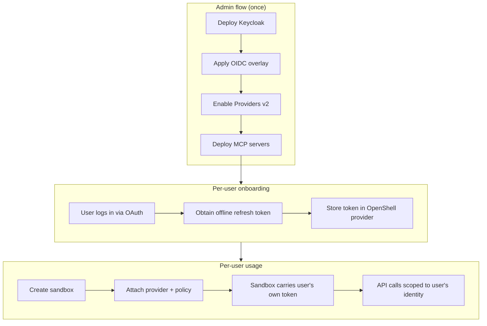
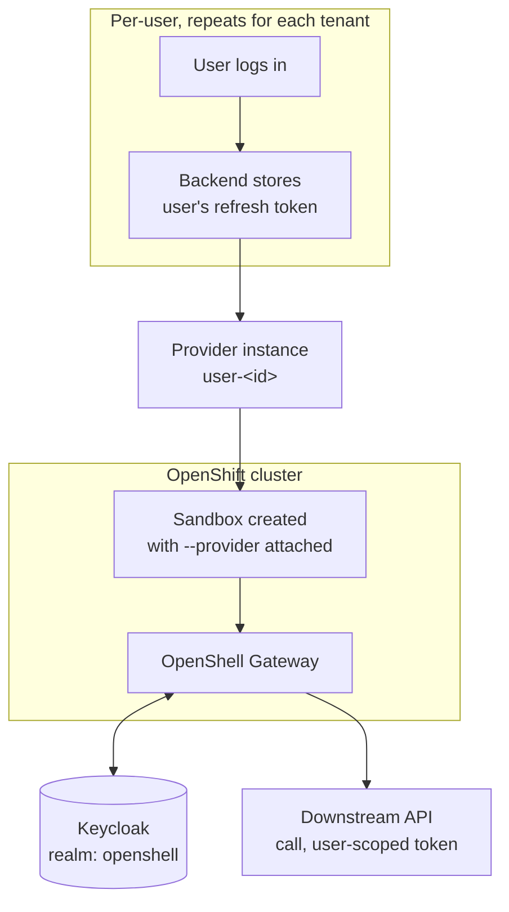

# Keycloak OIDC — per-user credential isolation on OpenShell

## Overview

This demo deploys OpenShell on OpenShift with **Keycloak as the OIDC identity
provider** and **per-user credential isolation** via Providers v2. Each user
gets their own scoped credential — an offline refresh token issued by
Keycloak — which the OpenShell gateway silently refreshes into short-lived
access tokens on that user's behalf. No shared service account, no
credential sharing between users.

The result is a multi-user setup where:

- An **admin** deploys the infrastructure (Keycloak, OpenShell, MCP servers)
  and onboards users.
- Each **user** connects to a sandbox that automatically carries their own
  identity. Outbound API calls from the sandbox use that user's own
  Keycloak-issued token — scoped, short-lived, and automatically rotated.
- Users are isolated from each other: user A's sandbox cannot access user
  B's credentials or reach services that user B is authorized for.

As a stretch goal, two example MCP servers are deployed behind Envoy
sidecars that enforce Keycloak role-based access — only users holding the
correct realm role can reach a given server.

### How to follow this guide

One person runs the entire demo, playing three roles: **admin** (steps 1-2),
**user1**, and **user2** (steps 3-4). A few practical tips:

- **Use separate terminal tabs** — one for admin work, one per user sandbox.
  The isolation check in step 4 requires user1's sandbox to stay running
  while you test user2, so you need both open at the same time.
- **Keycloak sessions are per-browser.** When onboarding multiple users with
  Option B (the `onboard` tool), log out of Keycloak between users —
  otherwise the browser reuses the previous session and you get the same
  user's token again. The tool's success page includes a logout link, or
  use a private/incognito window for each user.
- With Option A (password grant) there is no browser session to worry about
  — just change `USER_ID` and `USER_PASS` in the same terminal.

## RBAC setup

This demo uses four Keycloak realm roles to separate admin and user
capabilities:

| Role | Who holds it | What it grants |
|---|---|---|
| `openshell-admin` | The demo admin | Full OpenShell gateway admin operations (deploy providers, manage sandboxes, set policies) |
| `openshell-user` | Every onboarded user | Connect to sandboxes, run workloads |
| `mcp-server-a-user` | Users authorized for MCP server A | Access to the Eligibility Engine MCP server |
| `mcp-server-b-user` | Users authorized for MCP server B | Access to the Compatibility Engine MCP server |



## Prerequisites

| Tool / access | Notes |
|---|---|
| `oc` | Logged into the target cluster, with rights to grant SCCs |
| `helm` 3.x | |
| `kubectl` | Compatible with cluster version |
| `openshell` CLI | See [`demos/base/README.md`](../base/README.md#installing-the-cli) for install instructions |
| OpenShift 4.x cluster | |
| Agent Sandbox controller + CRDs | See [`demos/base/README.md`](../base/README.md#installing-agent-sandbox) |
| A Keycloak instance (26+, or current) | Self-hosted via Helm, or existing |
| `jq`, `openssl` | Scripting, secret handling |

## What this demo deploys

- `helm/values.yaml` — OpenShift-compatibility overrides plus OIDC
  configuration (`server.oidc.*`, `allowUnauthenticatedUsers: false`).
- A Keycloak realm (`keycloak/realm-export.template.json`) with CLI and
  gateway clients, admin/user roles, and a few demo users.
- Providers v2 enabled (`providers_v2_enabled=true`).
- A per-user provider profile and onboarding flow.
- Two example MCP servers (`mcp-servers/` chart) fronted by Envoy sidecars
  that gate access by Keycloak realm role.

## Architecture



## Getting started

### Clone the repo and change to the demo directory

```bash
git clone https://github.com/alpha-hack-program/openshell-demos.git
cd openshell-demos/demos/keycloak-oidc
```

### Log into your OpenShift cluster

Make sure you're logged in with a user that has **cluster-admin** rights (or
at least the ability to grant SCCs and create namespaces):

```bash
oc login --server=https://api.<your-cluster>:6443
oc whoami   # confirm you're logged in
```

### Set up your `.env` files

This demo uses two `.env` files:

1. **Root `.env`** (at the repo root) — cluster-wide variables shared across
   all demos:
   - `OPENSHELL_CHART_VERSION` — the Helm chart version to install
   - `CLUSTER_APPS_DOMAIN` — your cluster's apps domain

2. **Demo `.env`** (in this directory) — variables specific to this demo.

Copy the example files and fill in the real values:

```bash
# Root .env — cluster-wide variables
cp ../../.env.example ../../.env
```

Extract `CLUSTER_APPS_DOMAIN` from the cluster:

```bash
CLUSTER_APPS_DOMAIN=$(oc get ingresses.config.openshift.io cluster -o jsonpath='{.spec.domain}')
echo "CLUSTER_APPS_DOMAIN=${CLUSTER_APPS_DOMAIN}"
```

Edit `../../.env` and set `OPENSHELL_CHART_VERSION` and paste the
`CLUSTER_APPS_DOMAIN` value from above.

```bash
# Demo .env — demo-specific variables
cp .env.example .env
# Edit .env — values are listed below
```

The demo `.env` requires these variables:

| Variable | Example | Notes |
|---|---|---|
| `OPENSHELL_NAMESPACE` | `openshell-keycloak-oidc` | OpenShift namespace for this demo's gateway |
| `KEYCLOAK_HOST` | `keycloak.apps.ocp.example.com` | Keycloak hostname (set after deploying Keycloak) |
| `KEYCLOAK_REALM` | `openshell` | Keycloak realm name |
| `KEYCLOAK_CLIENT_ID_CLI` | `openshell-cli` | Public client for CLI/browser login |
| `KEYCLOAK_CLIENT_ID_GATEWAY` | `openshell-gateway` | Confidential gateway client |
| `KEYCLOAK_CLIENT_SECRET` | *(from Keycloak)* | Gateway client secret — never commit |

The `01-deploy-keycloak.sh` script prints the values you need after it runs.

## Steps

### 1. Deploy Keycloak

```bash
source .env
./scripts/01-deploy-keycloak.sh
```

This prepares the realm JSON (substituting the gateway client secret) and
prints import instructions. After importing:

1. Create 2-3 demo users in the `openshell` realm with `offline_access` in
   scope — these represent the users you will onboard in step 3.
2. Assign the `openshell-user` role to each demo user.
3. Copy the values printed by the script into your `.env` file.

### 2. Create the namespace, grant SCCs, and install OpenShell with OIDC

```bash
source .env
source ../../.env

oc create namespace "$OPENSHELL_NAMESPACE" 2>/dev/null || true
oc adm policy add-scc-to-user privileged -z openshell-sandbox -n "$OPENSHELL_NAMESPACE"

helm upgrade --install openshell oci://ghcr.io/nvidia/openshell/helm-chart \
  --version "$OPENSHELL_CHART_VERSION" \
  --namespace "$OPENSHELL_NAMESPACE" \
  -f helm/values.yaml

oc -n "$OPENSHELL_NAMESPACE" rollout status statefulset/openshell

openshell settings set --global --key providers_v2_enabled --value true
```

The namespace must exist before `helm install`, and the `openshell-sandbox`
service account needs the `privileged` SCC — without it, sandbox pods won't
start. The `helm upgrade` applies the OIDC configuration from
`helm/values.yaml`, which points the gateway at your Keycloak realm's issuer
URL and sets `allowUnauthenticatedUsers: false`. The `openshell settings`
command enables the Providers v2 credential management system.

Run `openshell status` afterward — the CLI should now perform a real OIDC
login against Keycloak instead of the default mTLS-only mode.

> The script `scripts/02-apply-oidc-overlay.sh` runs these same commands.

### 3. Onboard a user

User onboarding is a **two-step process by design**. OpenShell's Providers v2
manages the *lifecycle* of a credential (refresh, rotate, inject into
sandboxes) but leaves the *initial acquisition* of that credential to your
identity plumbing. The upstream docs jump straight to
`--material refresh_token=<value>` and assume you already have it — this
section explains how to get it.

You need a long-lived **offline refresh token** (not a short-lived access
token) because the gateway uses it to silently mint fresh access tokens on
the user's behalf over time, without the user being logged in.

Two options for obtaining the token:

- **Option A** uses a direct password grant — fast but demo-only, since the
  operator must know the user's password.
- **Option B** uses the `onboard` CLI tool to automate a browser-based
  OAuth flow — the user logs in directly with Keycloak and the operator
  never sees their password.

#### Step 3a — Obtain the user's refresh token

**Option A — Password grant (demo only)**

Only works because you control both sides and know the demo user's password.
Not viable in production — the operator must never know user credentials.

```bash
source .env

USER_ID="user1"
USER_PASS="<the-users-password>"

REFRESH_TOKEN=$(curl -sk -X POST \
  "https://${KEYCLOAK_HOST}/realms/${KEYCLOAK_REALM}/protocol/openid-connect/token" \
  -d "grant_type=password" \
  -d "client_id=${KEYCLOAK_CLIENT_ID_CLI}" \
  -d "username=${USER_ID}" \
  -d "password=${USER_PASS}" \
  -d "scope=openid offline_access" \
  | jq -r '.refresh_token')
```

Then continue to [step 3b](#step-3b--store-the-refresh-token-in-openshell) to
store the token.

**Option B — `onboard` utility (browser-based OAuth flow)**

The `onboard` CLI tool in [`util/onboard/`](../../util/onboard/) automates
the full flow: opens the browser for the user to log in, listens for the
OAuth callback, exchanges the authorization code for a refresh token, and
runs the OpenShell provider commands from
[step 3b](#step-3b--store-the-refresh-token-in-openshell) automatically.

```bash
source .env

# Build once (requires Rust)
cd ../../util/onboard && cargo build --release && cd -

# Onboard user1 — opens a browser, waits for login, creates the provider
../../util/onboard/target/release/onboard \
  -u user1 \
  --profile providers/user-refresh-profile.yaml
```

Or use the shell wrapper (sources `.env` automatically):

```bash
../../util/onboard/onboard.sh \
  -u user1 \
  --profile providers/user-refresh-profile.yaml
```

The `--profile` flag is required — it tells the tool which provider profile
to import. The profile defines the credential refresh strategy (how the
gateway obtains fresh access tokens from Keycloak on the user's behalf). See
[step 3b](#step-3b--store-the-refresh-token-in-openshell) for what the
profile contains and why it matters.

Pre-built binaries for Linux (x86_64) and macOS (aarch64) are available from
[GitHub Releases](../../releases) — download, `chmod +x`, and run.

Useful flags:
- `--token-only` — stop after obtaining the refresh token, print it to
  stdout, do not call the OpenShell CLI
- `--no-browser` — print the URL instead of opening a browser (for
  headless / SSH sessions)
- `--dry-run` — show the OpenShell CLI commands without executing them
- `--timeout <secs>` — how long to wait for the user to log in (default 120s)

To onboard a second user, log out of Keycloak first (use the link on the
success page or open an incognito window), then run the same command with
`-u user2`.

If you used Option B, step 3b is already done — the tool runs the same
commands shown below. Skip to [step 4](#4-deploy-mcp-servers).

#### Step 3b — Store the refresh token in OpenShell

This is what OpenShell owns. The **provider profile** defines the credential
refresh strategy — how the gateway obtains fresh access tokens from Keycloak
on the user's behalf. The **provider instance** stores each user's refresh
token and is linked to the profile.

The profile handles credential lifecycle only. It does not define network
policies — which in-cluster services a sandbox can reach is controlled
separately via `openshell policy update` (see
[step 5](#5-run-the-demo)), because those endpoints are
deployment-specific (they depend on your namespace and which services you
deploy).

First, import the provider profile. The profile at
`providers/user-refresh-profile.yaml` contains a `<keycloak-host>`
placeholder in its `token_url` — the URL the gateway calls to refresh
tokens. Replace it with your actual Keycloak hostname:

```bash
source .env

sed "s|<keycloak-host>|${KEYCLOAK_HOST}|" providers/user-refresh-profile.yaml \
  | openshell provider profile import -f -
```

Then create a provider for the user and configure automatic token refresh:

```bash
USER_ID="user1"

# Create the provider — this links the user to the profile's refresh strategy
openshell provider create \
  --name "user-${USER_ID}" \
  --type user-scoped-api \
  --credential USER_ACCESS_TOKEN=pending

# Store the user's refresh token and configure automatic rotation
openshell provider refresh configure "user-${USER_ID}" \
  --credential-key USER_ACCESS_TOKEN \
  --strategy oauth2-refresh-token \
  --material client_id="${KEYCLOAK_CLIENT_ID_CLI}" \
  --material refresh_token="${REFRESH_TOKEN}" \
  --secret-material-key refresh_token

# Trigger the first rotation to verify everything works
openshell provider refresh rotate "user-${USER_ID}" \
  --credential-key USER_ACCESS_TOKEN
```

From this point forward, the gateway's refresh worker automatically mints
short-lived access tokens and rotates the refresh token whenever the IdP
returns a new one. The user just does `openshell sandbox connect` and gets a
sandbox with a live credential — they never see a token.

> The script `scripts/03-onboard-user.sh <user-id> <refresh-token>` wraps
> these same commands.

### 4. Deploy MCP servers

Two example downstream services (MCP servers) that validate the caller's
Bearer token as a Keycloak-issued OAuth access token — the same token
Providers v2 already mints/refreshes per user in step 3 — and are only
reachable by users holding a specific Keycloak realm role.

Token enforcement is handled by an **Envoy sidecar** in front of each MCP
server. Envoy's `jwt_authn` filter verifies the token's signature against
Keycloak's JWKS and `iss`; its `rbac` filter requires the decoded
`realm_access.roles` claim to contain the server-specific role. The app
itself listens on loopback only (`127.0.0.1:8001`) and is unreachable except
from Envoy in the same pod.

Each server has its own Keycloak realm role (`mcp-server-a-user`,
`mcp-server-b-user`).

```bash
source .env
./scripts/06-deploy-mcp-servers.sh
```

This deploys `mcp-server-a` and `mcp-server-b` into `$OPENSHELL_NAMESPACE`
as two-container pods (Envoy + the app), each with its own ServiceAccount.

Before moving to step 5, assign the MCP server roles to your demo users in
Keycloak (via the admin console or admin API):
- Grant `mcp-server-a-user` to `user1`
- Grant `mcp-server-b-user` to `user2`

### 5. Run the demo

Create a sandbox, verify that outbound calls are blocked by default, then
attach the user's provider and grant access to a real MCP server.

```bash
source .env
USER_ID="user1"
SERVER_NAME="mcp-server-a"
MCP_URL="http://${SERVER_NAME}.${OPENSHELL_NAMESPACE}.svc.cluster.local:8000/mcp"
```

**Create the sandbox** — no provider attached yet, so all outbound calls are
blocked:

```bash
openshell sandbox create --name "demo-${USER_ID}" -- bash
```

Connect to the sandbox and try to reach the MCP server — it should fail:

```bash
openshell sandbox connect "demo-${USER_ID}"
# Inside the sandbox:
curl -sS "$MCP_URL"
# Expected: blocked by policy — the sandbox has no network access
```

Exit the sandbox, then **attach the user's provider and add a network policy**
for the MCP server:

```bash
openshell sandbox provider attach "demo-${USER_ID}" "user-${USER_ID}"

openshell policy update "demo-${USER_ID}" \
  --add-endpoint "${SERVER_NAME}.${OPENSHELL_NAMESPACE}.svc.cluster.local:8000:read-write:rest:enforce" \
  --binary /usr/bin/curl --wait
```

Note that network policies are applied per-sandbox via `openshell policy
update`, not in the provider profile. The profile defines *how* to refresh
credentials; the policy defines *where* the sandbox can connect.

**Authorize the user for the MCP server** — confirm they hold the required
Keycloak realm role, then grant the sandbox endpoint:

```bash
export KEYCLOAK_ADMIN_TOKEN=...   # obtain via your own admin login
./scripts/07-authorize-mcp-user.sh user1 mcp-server-a
```

**Reconnect and verify** — the same curl should now succeed, with the
request carrying this user's own scoped access token:

```bash
openshell sandbox connect "demo-${USER_ID}"
# Inside the sandbox:
curl -sS -H "Authorization: Bearer $USER_ACCESS_TOKEN" "$MCP_URL"
# Expected: success — the MCP server validates the token and returns a response
```

**Isolation check:** open a second terminal, set `USER_ID="user2"` and
`SERVER_NAME="mcp-server-b"`, and repeat the process above (onboard user2
first if you haven't already). Keep user1's sandbox running in the first
terminal. Confirm:
- user1 can reach `mcp-server-a` but gets `403` from `mcp-server-b`
- user2 can reach `mcp-server-b` but gets `403` from `mcp-server-a`

#### Test recipe: Claude Code + BYO LLM + MCP tool

Claude Code (pre-installed in the base sandbox image) calling
`mcp-server-a`'s tool (`evaluate_unpaid_leave_eligibility`) via your own
OpenAI-compatible LLM.

**Prerequisites** beyond steps 1-5 above — set these in your terminal:

```bash
export OPENAI_API_KEY="<your-key>"
export OPENAI_BASE_URL="https://<your-provider>/v1"   # e.g. https://api.openai.com/v1
export OPENAI_MODEL="<model-name>"                     # e.g. gpt-4o
LLM_HOST=$(echo "$OPENAI_BASE_URL" | sed 's|https\?://||;s|/.*||')
```

1. Generate a Claude Code provider profile for your LLM and import it:

   ```bash
   cat > /tmp/byo-claude-profile.yaml << EOF
   id: byo-claude
   display_name: BYO LLM (Claude Code compatible)
   description: OpenAI-compatible LLM for Claude Code
   category: inference
   inference_capable: true
   credentials:
     - name: api_key
       description: LLM API key, injected as ANTHROPIC_API_KEY for Claude Code
       env_vars: [ANTHROPIC_API_KEY]
       required: true
       auth_style: header
       header_name: x-api-key
   EOF

   openshell provider profile import -f /tmp/byo-claude-profile.yaml
   openshell provider create --name byo-claude --type byo-claude \
     --credential "ANTHROPIC_API_KEY=$OPENAI_API_KEY"
   ```

2. Attach the provider and grant network access:

   ```bash
   openshell sandbox provider attach demo-user1 byo-claude
   openshell policy update demo-user1 \
     --add-endpoint "${LLM_HOST}:443:read-write:rest:enforce" \
     --binary /usr/local/bin/claude \
     --add-endpoint "mcp-server-a.$OPENSHELL_NAMESPACE.svc.cluster.local:8000:read-write:rest:enforce" \
     --binary /usr/local/bin/claude \
     --wait
   ```

3. Run the test:

   ```bash
   openshell sandbox exec -n demo-user1 \
     --env "ANTHROPIC_BASE_URL=$OPENAI_BASE_URL" \
     --env "ANTHROPIC_MODEL=$OPENAI_MODEL" \
     -- bash -c '
   MCP_JSON="{\"mcpServers\":{\"eligibility\":{\"type\":\"http\",\"url\":\"http://mcp-server-a.'"$OPENSHELL_NAMESPACE"'.svc.cluster.local:8000/mcp\",\"headers\":{\"Authorization\":\"Bearer $USER_ACCESS_TOKEN\"}}}}"
   claude -p "My mother is at the hospital, can I get an aid while I am on unpaid leave?" \
     --mcp-config "$MCP_JSON" \
     --strict-mcp-config \
     --permission-mode bypassPermissions \
     --output-format text
   '
   ```

> Provider profiles support `config:` fields with `env_vars`, but OpenShell
> only injects *credentials* as environment variables — config values are
> stored metadata, not injected into sandbox processes. Model routing and base
> URL are non-secret config, so `--env` at exec time is the correct mechanism.

#### Alternative: Codex + BYO LLM + MCP tool

Same MCP servers, same per-user credential isolation, but using **OpenAI
Codex CLI** instead of Claude Code. The key architectural difference: Codex
uses `inference.local` — OpenShell's privacy router — which strips caller
credentials at the proxy boundary and injects the real API key server-side.

**Prerequisites:** steps 1-5 above, plus the same `OPENAI_*` exports.

1. Create the inference provider and configure `inference.local` routing
   (only type `openai` providers can drive `inference.local`):

   ```bash
   openshell provider create --name byo-inference --type openai \
     --credential "OPENAI_API_KEY=$OPENAI_API_KEY" \
     --config "OPENAI_BASE_URL=$OPENAI_BASE_URL"

   openshell inference set \
     --provider byo-inference \
     --model "$OPENAI_MODEL" \
     --timeout 120
   ```

2. Generate a Codex policy profile and create a second provider for binary
   permissions:

   ```bash
   cat > /tmp/byo-codex-profile.yaml << EOF
   id: byo-codex
   display_name: BYO LLM (Codex policy)
   description: Network policy and binary permissions for Codex via inference.local
   category: inference
   inference_capable: true
   credentials:
     - name: api_key
       description: LLM API key (injected as OPENAI_API_KEY for Codex)
       env_vars: [OPENAI_API_KEY]
       required: true
       auth_style: bearer
       header_name: authorization
   endpoints:
     - host: inference.local
       port: 443
       protocol: rest
       access: read-write
       enforcement: enforce
   binaries:
     - /usr/bin/codex
     - /usr/local/bin/codex
     - /usr/lib/node_modules/@openai/**
   EOF

   openshell provider profile import -f /tmp/byo-codex-profile.yaml
   openshell provider create --name byo-codex --type byo-codex \
     --credential "OPENAI_API_KEY=$OPENAI_API_KEY"
   ```

3. Create and configure the sandbox:

   ```bash
   openshell sandbox create --name codex-user1 \
     --provider byo-codex \
     --provider user-user1 \
     -- true

   openshell policy update codex-user1 \
     --add-endpoint "mcp-server-a.$OPENSHELL_NAMESPACE.svc.cluster.local:8000:read-write:rest:enforce" \
     --binary /usr/bin/codex \
     --wait
   ```

4. Write the Codex config inside the sandbox:

   ```bash
   openshell sandbox exec -n codex-user1 --no-tty -- bash -c '
   mkdir -p ~/.codex && cat > ~/.codex/config.toml << "TOML"
   model_provider = "openshell-byo"
   model = "'"$OPENAI_MODEL"'"

   [model_providers.openshell-byo]
   name = "OpenShell BYO Router"
   base_url = "https://inference.local/v1"
   env_key = "OPENAI_API_KEY"
   wire_api = "responses"
   TOML
   '
   ```

5. Run the test: [VERIFY]

   ```bash
   openshell sandbox exec -n codex-user1 --no-tty -- bash -c '
   codex mcp add eligibility \
     --transport http \
     --url "http://mcp-server-a.'"$OPENSHELL_NAMESPACE"'.svc.cluster.local:8000/mcp" \
     --header "Authorization: Bearer $USER_ACCESS_TOKEN"

   codex exec --skip-git-repo-check \
     "My mother is at the hospital, can I get an aid while I am on unpaid leave?"
   '
   ```

**Traffic flow:**

```
Codex (in sandbox)
  → inference.local/v1 (model calls)
    → OpenShell privacy router
      → strips credentials, injects real API key
      → forwards to your LLM provider
  → mcp-server-a:8000/mcp (tool calls)
    → Authorization: Bearer $USER_ACCESS_TOKEN
      → supervisor resolves placeholder to real Keycloak token
      → Envoy checks JWT + realm role → app
```

## Configuration reference

| Variable | Where used | Notes |
|---|---|---|
| `KEYCLOAK_HOST` | Helm overlay, provider profiles | e.g. `keycloak.apps.<cluster-domain>` |
| `KEYCLOAK_REALM` | All Keycloak-facing config | `openshell` in this demo |
| `KEYCLOAK_CLIENT_ID_CLI` | `server.oidc.audience` | Must match the Keycloak client ID exactly |
| `KEYCLOAK_CLIENT_ID_GATEWAY` | Confidential gateway client | Used for gateway-to-Keycloak communication |
| `KEYCLOAK_CLIENT_SECRET` | Gateway client secret | Never commit a real value |
| `KEYCLOAK_ADMIN_TOKEN` | `07-authorize-mcp-user.sh` | Short-lived; obtain via your own admin login |

## Secrets and security notes

- Nothing under `keycloak/`, `providers/`, or `.env` should ever contain a real
  secret in git. `keycloak/realm-export.template.json` uses a placeholder that
  `scripts/01-deploy-keycloak.sh` substitutes at deploy time only.
- `openshell provider refresh configure` supports `--secret-material-key` to
  mark values as sensitive at the gateway — used for `refresh_token` in the
  onboarding commands. No `client_secret` is needed because the refresh token
  is bound to the public CLI client (`openshell-cli`), which has no secret.
- Each user's provider uses a distinct name (`user-<id>`). Providers v2
  rejects two providers on one sandbox that expose the same credential
  environment key, which catches naming collisions — but not *misassignment*.
  OpenShell has no built-in concept of "this sandbox belongs to this user";
  getting the right provider attached to the right sandbox is entirely this
  demo's orchestration responsibility.
- The gateway defaults to TLS with mTLS client authentication (see
  [`demos/base/README.md`](../base/README.md) for background). Once this
  demo's values are applied, real OIDC auth is enforced
  (`allowUnauthenticatedUsers: false`), but the transport is still plaintext
  — evaluation-only, never expose to a public network.

## Troubleshooting

**Profile `token_url` substitution.** The provider profile
`providers/user-refresh-profile.yaml` contains `<keycloak-host>` as a
placeholder in `token_url`. This must be replaced before import. If you
imported a profile with the wrong URL, you must delete and recreate any
providers built from it — a plain `profile update` is not enough because
providers snapshot the profile state at creation time.

**`--from-oidc-token` binds to the CLI's own session.** The `--from-oidc-token`
flag on `openshell provider create` binds to the CLI's own current OIDC
session, not an arbitrary token you hand it. The onboarding commands in this
guide use the general `--credential`/refresh-material mechanism instead.

**Envoy sidecar is required for MCP server access control.** The MCP server
images themselves do not enforce the Keycloak role check — tested and
confirmed: requests with no token, garbage tokens, and valid tokens lacking
the required role all reach the tool identically. Do not remove the Envoy
sidecar on the assumption the app image checks anything.

**Envoy JWKS TLS.** The Envoy sidecar's connection to Keycloak's JWKS
endpoint uses `trust_chain_verification: ACCEPT_UNTRUSTED` (skips CA
validation). This matches the demo's `curl -k` pattern — fine for evaluation,
not for production.

**Envoy image tag.** `envoyproxy/envoy:v1.31-latest` is a moving tag. Pin an
exact patch release before relying on this beyond a demo.

## Definition of done

- [ ] Keycloak realm `openshell` live with CLI and gateway clients, admin/user roles
- [ ] OIDC overlay applied; `openshell status` shows the CLI authenticated against Keycloak
- [ ] RBAC mode confirmed: a user-role token cannot perform admin-only operations
- [ ] Providers v2 enabled
- [ ] At least two demo users onboarded, each with their own provider
- [ ] Isolation test passes: user A's sandbox cannot access user B's data
      even when both sandboxes run concurrently
- [x] (Stretch) `mcp-servers` chart deployed; a user holding the required
      Keycloak role can reach their MCP server, a user lacking it cannot
      — verified via the Envoy sidecar (401/403/200 cases all tested live)
- [x] (Stretch) A user authorized for one MCP server's role does not
      thereby gain access to the other — verified both directions
- [ ] (Stretch) Codex variant — [VERIFY] against a live cluster

## Open risks

- **This README is a reconstruction, not a transcription** of NVIDIA's own
  examples. Reconcile every command against the real repo before running it.
- **Provider profile schema** — verified against
  [Providers v2 docs](https://docs.nvidia.com/openshell/sandboxes/providers-v2)
  and a live gateway (CLI 0.0.97). `refresh` (with `token_url`, `scopes`,
  `strategy`) must nest under the specific entry in `credentials[]`, not as a
  top-level profile field.
- **Real user identity federation** (brokering each user's own IdP into
  Keycloak) is a materially bigger project than this demo covers.
- **Per-server token audience** — Keycloak isn't configured with an audience
  mapper per MCP server, so the realm role claim is the *only* thing
  distinguishing access to server A from server B.

## Experimental future work: Path B — SPIRE/SPIFFE token exchange

> **Nothing in this section has ever been deployed or tested.** All commands
> are **[VERIFY]**.

### What Path B would do differently

Instead of storing a user's refresh token and having the gateway refresh it
directly, Path B uses SPIFFE workload identity:

1. SPIRE issues JWT-SVIDs to both the sandbox supervisor and the gateway.
2. The sandbox presents its SVID to the gateway when requesting a provider
   token.
3. The gateway authenticates to Keycloak using its own SVID as a client
   assertion (RFC 7523) and asks for a token exchange (RFC 8693).

This removes the need for a long-lived refresh token per user but requires
SPIRE infrastructure and Keycloak's SPIFFE federated client authentication.

### Prerequisites (beyond the current demo)

- SPIRE server + agent deployed on the cluster
- SPIFFE CSI driver for workload identity injection
- `server.providerTokenGrants.spiffe.enabled=true` in the Helm overlay
- Keycloak token-exchange feature enabled
- Keycloak federated client authentication configured to trust the SPIRE
  trust domain's bundle endpoint

### Steps (all [VERIFY])

```bash
./scripts/04-deploy-spire.sh
./scripts/05-register-spire-entries.sh
```

### Open risks specific to Path B

- **Provider profile schema is unconfirmed.** `token_exchange` is not among
  the five documented refresh strategies. The shape in
  `providers/token-exchange-profile.yaml` is inferred from a GitHub design
  discussion (issue #1987).
- **Nothing in this repo has ever gotten SPIRE running on this cluster.**

### References (Path B)

- Dynamic token grant design discussion: https://github.com/NVIDIA/OpenShell/issues/1987
- Keycloak SPIFFE federated client auth: https://www.keycloak.org/2026/01/federated-client-authentication
- Keycloak SPIFFE playground demo: https://github.com/keycloak/keycloak-playground/tree/main/federated-client-authentication/spiffe
- SPIRE Kubernetes quickstart: https://spiffe.io/docs/latest/try/getting-started-k8s/

## References

- OpenShift install path: https://docs.nvidia.com/openshell/kubernetes/openshift
- Access Control / OIDC: https://docs.nvidia.com/openshell/kubernetes/access-control
- Providers v2: https://docs.nvidia.com/openshell/sandboxes/providers-v2
- Manage Providers: https://docs.nvidia.com/openshell/sandboxes/manage-providers
- Helm chart README: https://github.com/NVIDIA/OpenShell/blob/main/deploy/helm/openshell/README.md
- OpenShift SCC restriction discussion: https://github.com/NVIDIA/OpenShell/issues/899
