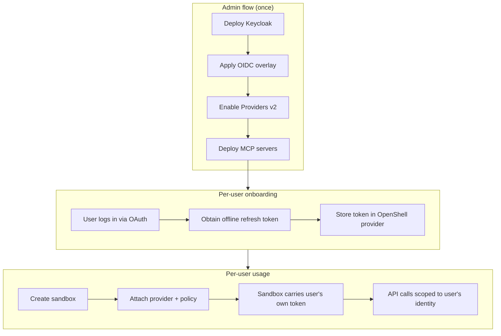
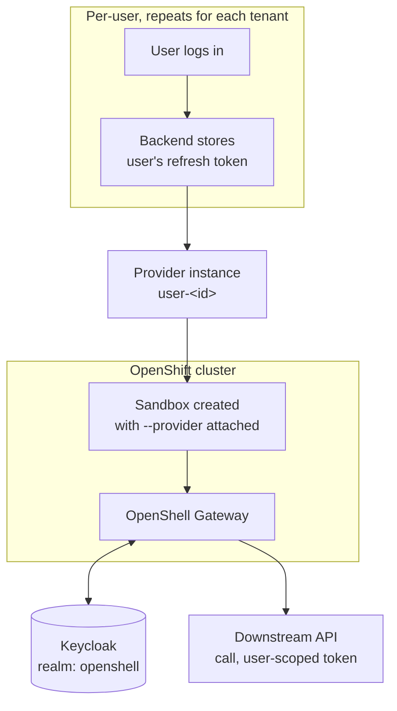

# Keycloak OIDC — per-user credential isolation on OpenShell

## Overview

This demo deploys OpenShell on OpenShift with **Keycloak as the OIDC identity
provider** and **per-user credential isolation** via Providers v2. Each user
gets their own scoped credential — an offline refresh token issued by
Keycloak — which the OpenShell gateway silently refreshes into short-lived
access tokens on that user's behalf. No shared service account, no
credential sharing between users.

The result is a multi-user setup where:

- An **admin** deploys the infrastructure (Keycloak, OpenShell, MCP servers)
  and onboards users.
- Each **user** connects to a sandbox that automatically carries their own
  identity. Outbound API calls from the sandbox use that user's own
  Keycloak-issued token — scoped, short-lived, and automatically rotated.
- Users are isolated from each other: user A's sandbox cannot access user
  B's credentials or reach services that user B is authorized for.

As a stretch goal, two example MCP servers are deployed behind Envoy
sidecars that enforce Keycloak role-based access — only users holding the
correct realm role can reach a given server.

### How to follow this guide

One person runs the entire demo, playing three roles: **admin** (steps 1-2),
**user1**, and **user2** (steps 3-4). A few practical tips:

- **Use separate terminal tabs** — one for admin work, one per user sandbox.
  The isolation check in step 4 requires user1's sandbox to stay running
  while you test user2, so you need both open at the same time.
- **Keycloak sessions are per-browser.** When onboarding multiple users with
  Option B (the `onboard` tool), log out of Keycloak between users —
  otherwise the browser reuses the previous session and you get the same
  user's token again. The tool's success page includes a logout link, or
  use a private/incognito window for each user.
- With Option A (password grant) there is no browser session to worry about
  — just change `USER_ID` and `USER_PASS` in the same terminal.

## RBAC setup

This demo uses four Keycloak realm roles to separate admin and user
capabilities:

| Role | Who holds it | What it grants |
|---|---|---|
| `openshell-admin` | The demo admin | Full OpenShell gateway admin operations (deploy providers, manage sandboxes, set policies) |
| `openshell-user` | Every onboarded user | Connect to sandboxes, run workloads |
| `mcp-server-a-user` | Users authorized for MCP server A | Access to the Eligibility Engine MCP server |
| `mcp-server-b-user` | Users authorized for MCP server B | Access to the Compatibility Engine MCP server |



## Prerequisites

| Tool / access | Notes |
|---|---|
| `oc` | Logged into the target cluster, with rights to grant SCCs |
| `helm` 3.x | |
| `kubectl` | Compatible with cluster version |
| `openshell` CLI | See [`demos/base/README.md`](../base/README.md#installing-the-cli) for install instructions |
| OpenShift 4.x cluster | |
| Agent Sandbox controller + CRDs | See [`demos/base/README.md`](../base/README.md#installing-agent-sandbox) |
| A Keycloak instance (26+, or current) | Self-hosted via Helm, or existing |
| `jq`, `openssl` | Scripting, secret handling |

## What this demo deploys

- `helm/values.yaml` — OpenShift-compatibility overrides plus OIDC
  configuration (`server.oidc.*`, `allowUnauthenticatedUsers: false`).
- A Keycloak realm (`keycloak/realm-export.json`) with CLI and
  gateway clients, admin/user roles, and a few demo users. The gateway
  client secret is hardcoded (`openshell-gateway-demo-secret`) — in a
  production setup you would generate a unique secret per environment.
- Providers v2 enabled (`providers_v2_enabled=true`).
- A per-user provider profile and onboarding flow.
- Two example MCP servers (`mcp-servers/` chart) fronted by Envoy sidecars
  that gate access by Keycloak realm role.

## Architecture



## Getting started

### Clone the repo and change to the demo directory

```bash
git clone https://github.com/alpha-hack-program/openshell-demos.git
cd openshell-demos/demos/keycloak-oidc
```

### Log into your OpenShift cluster

Make sure you're logged in with a user that has **cluster-admin** rights (or
at least the ability to grant SCCs and create namespaces):

```bash
oc login --server=https://api.<your-cluster>:6443
oc whoami   # confirm you're logged in
```

### Set up your `.env` files

This demo uses two `.env` files:

1. **Root `.env`** (at the repo root) — cluster-wide variables shared across
   all demos:
   - `OPENSHELL_CHART_VERSION` — the Helm chart version to install
   - `CLUSTER_APPS_DOMAIN` — your cluster's apps domain

2. **Demo `.env`** (in this directory) — variables specific to this demo.

Copy the example files and fill in the real values:

```bash
# Root .env — cluster-wide variables
cp ../../.env.example ../../.env
```

Extract `CLUSTER_APPS_DOMAIN` from the cluster:

```bash
CLUSTER_APPS_DOMAIN=$(oc get ingresses.config.openshift.io cluster -o jsonpath='{.spec.domain}')
echo "CLUSTER_APPS_DOMAIN=${CLUSTER_APPS_DOMAIN}"
```

To find the latest chart version, check the
[OpenShell releases page](https://github.com/NVIDIA/OpenShell/releases) — the
tag uses a `v` prefix (e.g. `v0.0.97`) but the chart version does **not**
(e.g. `0.0.97`). You can also query it directly:

```bash
helm show chart oci://ghcr.io/nvidia/openshell/helm-chart | grep ^version
```

Edit `../../.env` and set `OPENSHELL_CHART_VERSION` (without the `v` prefix)
and paste the `CLUSTER_APPS_DOMAIN` value from above.

```bash
# Demo .env — demo-specific variables
cp .env.example .env
# Edit .env — values are listed below
```

The demo `.env` requires these variables. Don't worry about filling them all
in now — the `01-deploy-keycloak.sh` script in step 1 prints the
Keycloak-related values (`KEYCLOAK_HOST`, `KEYCLOAK_CLIENT_SECRET`, etc.)
after it runs, so you'll come back and complete your `.env` then.

| Variable | Example | Notes |
|---|---|---|
| `OPENSHELL_NAMESPACE` | `openshell-keycloak-oidc` | OpenShift namespace for this demo's gateway |
| `KEYCLOAK_HOST` | `keycloak.apps.ocp.example.com` | Keycloak hostname (set after deploying Keycloak) |
| `KEYCLOAK_REALM` | `openshell` | Keycloak realm name |
| `KEYCLOAK_CLIENT_ID_CLI` | `openshell-cli` | Public client for CLI/browser login |
| `KEYCLOAK_CLIENT_ID_GATEWAY` | `openshell-gateway` | Confidential gateway client |
| `KEYCLOAK_CLIENT_SECRET` | *(from Keycloak)* | Gateway client secret — never commit |

## Steps

### 1. Deploy Keycloak

#### 1a. Check the realm JSON

The realm JSON at `keycloak/realm-export.json` is ready to import as-is —
no substitution needed. The gateway client secret is hardcoded as
`openshell-gateway-demo-secret` (along with demo user passwords
`user1`/`user1`, `user2`/`user2`). This keeps the demo simple; in
production you would generate a unique secret per environment.

Optionally, run the helper script to verify your `.env` values match:

```bash
./scripts/01-deploy-keycloak.sh
```

#### 1b. Deploy Keycloak on the cluster

We use the **Red Hat build of Keycloak** (RHBK) Operator, available from
OperatorHub on OpenShift.

1. Create the namespace first, then install the Operator into it:

   ```bash
   oc create namespace keycloak 2>/dev/null || true
   ```

   In the OpenShift web console, go to **Operators > OperatorHub**, search
   for **Keycloak**, and install the **Red Hat build of Keycloak** Operator.
   Select **A specific namespace on the cluster** and choose `keycloak`.

2. Wait for the Operator to be ready:

   ```bash
   oc -n keycloak get csv | grep -i keycloak
   # Should show a row with "Succeeded" for the keycloak-operator
   ```

3. Source your root `.env` (for `CLUSTER_APPS_DOMAIN`) and create a Keycloak
   instance. Note the heredoc uses `<<EOF` (no quotes) so the variable is
   expanded:

   ```bash
   source ../../.env

   oc -n keycloak apply -f - <<EOF
   apiVersion: k8s.keycloak.org/v2beta1
   kind: Keycloak
   metadata:
     name: keycloak
   spec:
     instances: 1
     hostname:
       hostname: keycloak.${CLUSTER_APPS_DOMAIN}
     proxy:
       headers: xforwarded
     http:
       httpEnabled: true
   EOF
   ```

   The `proxy.headers` and `http.httpEnabled` settings are needed because the
   OpenShift Route handles TLS termination — Keycloak itself runs behind the
   Route over plain HTTP.

   > If `keycloak.${CLUSTER_APPS_DOMAIN}` is already taken on your cluster,
   > change the hostname in the CR above (e.g.
   > `keycloak-openshell.${CLUSTER_APPS_DOMAIN}`) and update `KEYCLOAK_HOST`
   > in your `.env` to match.

4. Wait for the pod to become ready:

   ```bash
   oc -n keycloak get pods
   # keycloak-0   1/1   Running
   ```

5. Grab the admin credentials created by the Operator — you'll need them
   to log into the admin console in the next step:

   ```bash
   oc -n keycloak get secret keycloak-initial-admin \
     -o jsonpath='{.data.username}' | base64 -d; echo
   oc -n keycloak get secret keycloak-initial-admin \
     -o jsonpath='{.data.password}' | base64 -d; echo
   ```

#### 1c. Import the realm JSON

Import the realm JSON into Keycloak via the admin console or the Admin
REST API.

**Option A — Admin console (browser):**

1. Open `https://<KEYCLOAK_HOST>/admin` in your browser (use the admin
   credentials you extracted in step 1b).
2. In the left sidebar, click **Manage realms**, then click **Create realm**.
3. Click **Browse**, select `keycloak/realm-export.json`, and click
   **Create**.

**Option B — Admin REST API (CLI):**

```bash
source .env

ADMIN_TOKEN=$(curl -sk -X POST \
  "https://${KEYCLOAK_HOST}/realms/master/protocol/openid-connect/token" \
  -d "grant_type=password" \
  -d "client_id=admin-cli" \
  -d "username=${KEYCLOAK_ADMIN_USER}" \
  -d "password=${KEYCLOAK_ADMIN_PASSWORD}" \
  | jq -r '.access_token')

curl -sk -X POST \
  "https://${KEYCLOAK_HOST}/admin/realms" \
  -H "Authorization: Bearer ${ADMIN_TOKEN}" \
  -H "Content-Type: application/json" \
  -d @keycloak/realm-export.json
```

The realm template includes two demo users (`user1` / `user2`) with the
`openshell-user` role and `offline_access` scope — they're created
automatically when you import the realm. Their passwords match their
usernames (e.g. `user1` / `user1`) — demo only, never do this in production.

### 2. Create the namespace, grant SCCs, and install OpenShell with OIDC

This step installs the OpenShell gateway into its own namespace via Helm
(2a), exposes it outside the cluster with an OpenShift passthrough Route so
the CLI can reach it (2b), and then extracts the mTLS client certificates
and registers the gateway endpoint with the `openshell` CLI (2c).

> **If you already have another OpenShell installation** on the same cluster
> (the base demo, a previous run of this demo in a different namespace, etc.),
> the Helm install below will fail because the chart creates cluster-scoped
> resources (`openshell-node-reader` ClusterRole **and** ClusterRoleBinding)
> that are already owned by the other release. **Tear down the previous
> installation first** — e.g. `demos/base/scripts/99-teardown.sh` for the
> base demo, or `demos/keycloak-oidc/scripts/99-teardown.sh` for a prior run
> of this demo.

#### 2a. Helm install

This demo provides two Helm values files:

- **`helm/values.yaml`** — uses the PKI init job to generate TLS certificates
  (default, no extra dependencies).
- **`helm/values-certmanager.yaml`** — uses the OpenShift cert-manager
  Operator to manage TLS certificates. Requires the cert-manager Operator to
  be installed on the cluster. Set `CERT_MANAGER=true` in your `.env` to use
  this path.

Both files contain a `<keycloak-host>` placeholder in the OIDC issuer URL.
Use `--set` to substitute it with your real Keycloak hostname at install
time.

```bash
source .env
source ../../.env

oc create namespace "$OPENSHELL_NAMESPACE" 2>/dev/null || true
oc adm policy add-scc-to-user privileged -z openshell-sandbox -n "$OPENSHELL_NAMESPACE"

if [[ "${CERT_MANAGER:-false}" == "true" ]]; then
  VALUES_FILE=helm/values-certmanager.yaml
else
  VALUES_FILE=helm/values.yaml
fi

helm upgrade --install openshell oci://ghcr.io/nvidia/openshell/helm-chart \
  --version "$OPENSHELL_CHART_VERSION" \
  --namespace "$OPENSHELL_NAMESPACE" \
  -f "$VALUES_FILE" \
  --set "server.oidc.issuer=https://${KEYCLOAK_HOST}/realms/${KEYCLOAK_REALM}"
```

Wait for the gateway to come up:

```bash
oc -n "$OPENSHELL_NAMESPACE" rollout status statefulset/openshell
```

#### 2b. Expose the gateway via a passthrough Route

This is the same experimental approach used in the
[base demo](../base/README.md#exposing-the-gateway-via-passthrough-route) —
not supported by NVIDIA or Red Hat, but more practical than port-forwarding
for multi-user demos. See the base demo README for background.

Derive the Route hostname and create the passthrough Route:

```bash
ROUTE_HOST="openshell-${OPENSHELL_NAMESPACE}.${CLUSTER_APPS_DOMAIN}"

oc -n "$OPENSHELL_NAMESPACE" create route passthrough openshell \
  --service=openshell \
  --port=8080 \
  --hostname="${ROUTE_HOST}" 2>/dev/null || true
```

The gateway's TLS cert was generated at install time without this hostname in
the SANs. Delete the TLS secrets so the gateway regenerates them with the
Route hostname included:

```bash
oc -n "$OPENSHELL_NAMESPACE" delete secret \
  openshell-server-tls openshell-client-tls openshell-jwt-keys

# Re-deploy so the gateway generates new certs that include the Route hostname
if [[ "${CERT_MANAGER:-false}" == "true" ]]; then
  VALUES_FILE=helm/values-certmanager.yaml
  SAN_SET=(
    --set "certManager.serverDnsNames[2]=openshell.${OPENSHELL_NAMESPACE}.svc"
    --set "certManager.serverDnsNames[3]=openshell.${OPENSHELL_NAMESPACE}.svc.cluster.local"
    --set "certManager.serverDnsNames[4]=${ROUTE_HOST}"
  )
else
  VALUES_FILE=helm/values.yaml
  SAN_SET=(--set "pkiInitJob.serverDnsNames[0]=${ROUTE_HOST}")
fi

helm upgrade openshell oci://ghcr.io/nvidia/openshell/helm-chart \
  --version "$OPENSHELL_CHART_VERSION" \
  --namespace "$OPENSHELL_NAMESPACE" \
  -f "$VALUES_FILE" \
  --set "server.oidc.issuer=https://${KEYCLOAK_HOST}/realms/${KEYCLOAK_REALM}" \
  "${SAN_SET[@]}"

oc -n "$OPENSHELL_NAMESPACE" rollout status statefulset/openshell
```

#### 2c. Register the gateway with the CLI

Extract the client mTLS certificates and register the gateway:

```bash
GATEWAY_NAME="${GATEWAY_NAME:-openshift}"
MTLS_DIR=~/.config/openshell/gateways/${GATEWAY_NAME}/mtls
mkdir -p "$MTLS_DIR"

oc -n "$OPENSHELL_NAMESPACE" get secret openshell-client-tls \
  -o jsonpath='{.data.ca\.crt}'  | base64 -d > "$MTLS_DIR/ca.crt"
oc -n "$OPENSHELL_NAMESPACE" get secret openshell-client-tls \
  -o jsonpath='{.data.tls\.crt}' | base64 -d > "$MTLS_DIR/tls.crt"
oc -n "$OPENSHELL_NAMESPACE" get secret openshell-client-tls \
  -o jsonpath='{.data.tls\.key}' | base64 -d > "$MTLS_DIR/tls.key"

openshell gateway remove "$GATEWAY_NAME" 2>/dev/null || true
openshell gateway add "https://${ROUTE_HOST}:443" \
  --name "$GATEWAY_NAME" \
  --oidc-issuer "https://${KEYCLOAK_HOST}/realms/${KEYCLOAK_REALM}" \
  --oidc-client-id "$KEYCLOAK_CLIENT_ID_CLI" \
  --oidc-scopes "openid offline_access"
```

#### 2d. Log in to the gateway

The gateway requires OIDC authentication — you must log in before you can
run any admin commands. This opens a browser and redirects you to Keycloak:

```bash
openshell gateway login
```

Log in as the admin user (the one with the `openshell-admin` realm role).

#### 2e. Enable Providers v2

```bash
openshell settings set --global --key providers_v2_enabled --value true
```

#### Verify the gateway

```bash
openshell status
openshell gateway list
```

`openshell status` should show the gateway as connected and authenticated.

> The script `scripts/02-apply-oidc-overlay.sh` runs the helm install
> commands from step 2a. The Route, mTLS, and gateway registration steps
> (2b–2c) follow the same pattern as the base demo — refer to
> [`demos/base/README.md`](../base/README.md) for details.

### 3. Onboard a user

User onboarding is a **two-step process by design**. OpenShell's Providers v2
manages the *lifecycle* of a credential (refresh, rotate, inject into
sandboxes) but leaves the *initial acquisition* of that credential to your
identity plumbing. The upstream docs jump straight to
`--material refresh_token=<value>` and assume you already have it — this
section explains how to get it.

You need a long-lived **offline refresh token** (not a short-lived access
token) because the gateway uses it to silently mint fresh access tokens on
the user's behalf over time, without the user being logged in.

Two options for obtaining the token:

- **Option A** uses a direct password grant — fast but demo-only, since the
  operator must know the user's password.
- **Option B** uses the `onboard` CLI tool to automate a browser-based
  OAuth flow — the user logs in directly with Keycloak and the operator
  never sees their password.

#### Step 3a — Obtain the user's refresh token

**Option A — Password grant (demo only)**

Only works because you control both sides and know the demo user's password.
Not viable in production — the operator must never know user credentials.

```bash
source .env

USER_ID="user1"
USER_PASS="<the-users-password>"

REFRESH_TOKEN=$(curl -sk -X POST \
  "https://${KEYCLOAK_HOST}/realms/${KEYCLOAK_REALM}/protocol/openid-connect/token" \
  -d "grant_type=password" \
  -d "client_id=${KEYCLOAK_CLIENT_ID_CLI}" \
  -d "username=${USER_ID}" \
  -d "password=${USER_PASS}" \
  -d "scope=openid offline_access" \
  | jq -r '.refresh_token')
```

Then continue to [step 3b](#step-3b--store-the-refresh-token-in-openshell) to
store the token.

**Option B — `onboard` utility (browser-based OAuth flow)**

The `onboard` CLI tool in [`util/onboard/`](../../util/onboard/) automates
the full flow: opens the browser for the user to log in, listens for the
OAuth callback, exchanges the authorization code for a refresh token, and
runs the OpenShell provider commands from
[step 3b](#step-3b--store-the-refresh-token-in-openshell) automatically.

```bash
source .env

# Build once (requires Rust)
cd ../../util/onboard && cargo build --release && cd -

# Onboard user1 — opens a browser, waits for login, creates the provider
../../util/onboard/target/release/onboard \
  -u user1 \
  --profile providers/user-refresh-profile.yaml
```

Or use the shell wrapper (sources `.env` automatically):

```bash
../../util/onboard/onboard.sh \
  -u user1 \
  --profile providers/user-refresh-profile.yaml
```

The `--profile` flag is required — it tells the tool which provider profile
to import. The profile defines the credential refresh strategy (how the
gateway obtains fresh access tokens from Keycloak on the user's behalf). See
[step 3b](#step-3b--store-the-refresh-token-in-openshell) for what the
profile contains and why it matters.

Pre-built binaries for Linux (x86_64) and macOS (aarch64) are available from
[GitHub Releases](../../releases) — download, `chmod +x`, and run.

Useful flags:
- `--token-only` — stop after obtaining the refresh token, print it to
  stdout, do not call the OpenShell CLI
- `--no-browser` — print the URL instead of opening a browser (for
  headless / SSH sessions)
- `--dry-run` — show the OpenShell CLI commands without executing them
- `--timeout <secs>` — how long to wait for the user to log in (default 120s)

To onboard a second user, log out of Keycloak first (use the link on the
success page or open an incognito window), then run the same command with
`-u user2`.

If you used Option B, step 3b is already done — the tool runs the same
commands shown below. Skip to [step 4](#4-deploy-mcp-servers).

#### Step 3b — Store the refresh token in OpenShell

This is what OpenShell owns. The **provider profile** defines the credential
refresh strategy — how the gateway obtains fresh access tokens from Keycloak
on the user's behalf. The **provider instance** stores each user's refresh
token and is linked to the profile.

The profile handles credential lifecycle only. It does not define network
policies — which in-cluster services a sandbox can reach is controlled
separately via `openshell policy update` (see
[step 5](#5-run-the-demo)), because those endpoints are
deployment-specific (they depend on your namespace and which services you
deploy).

First, import the provider profile. The profile at
`providers/user-refresh-profile.yaml` contains a `<keycloak-host>`
placeholder in its `token_url` — the URL the gateway calls to refresh
tokens. Replace it with your actual Keycloak hostname:

```bash
source .env

sed "s|<keycloak-host>|${KEYCLOAK_HOST}|" providers/user-refresh-profile.yaml \
  | openshell provider profile import -f -
```

Then create a provider for the user and configure automatic token refresh:

```bash
USER_ID="user1"

# Create the provider — this links the user to the profile's refresh strategy
openshell provider create \
  --name "user-${USER_ID}" \
  --type user-scoped-api \
  --credential USER_ACCESS_TOKEN=pending

# Store the user's refresh token and configure automatic rotation
openshell provider refresh configure "user-${USER_ID}" \
  --credential-key USER_ACCESS_TOKEN \
  --strategy oauth2-refresh-token \
  --material client_id="${KEYCLOAK_CLIENT_ID_CLI}" \
  --material refresh_token="${REFRESH_TOKEN}" \
  --secret-material-key refresh_token

# Trigger the first rotation to verify everything works
openshell provider refresh rotate "user-${USER_ID}" \
  --credential-key USER_ACCESS_TOKEN
```

From this point forward, the gateway's refresh worker automatically mints
short-lived access tokens and rotates the refresh token whenever the IdP
returns a new one. The user just does `openshell sandbox connect` and gets a
sandbox with a live credential — they never see a token.

> **Why three separate commands?** A provider profile can define *multiple*
> credentials, each with its own refresh strategy, token endpoint, and
> timing. `provider create` registers the credential keys the provider will
> manage. `refresh configure` binds a specific strategy and the per-user
> material (the actual refresh token) to each credential key — one call per
> key. `refresh rotate` triggers the first token exchange to verify the
> wiring. The `--strategy` flag on `refresh configure` is not redundant
> with the profile: when a profile declares several credentials with
> different strategies, the flag tells the gateway which strategy applies to
> which credential key on this particular provider instance.

> The script `scripts/03-onboard-user.sh <user-id> <refresh-token>` wraps
> these same commands.

### 4. Deploy MCP servers

Two example downstream services (MCP servers) that validate the caller's
Bearer token as a Keycloak-issued OAuth access token — the same token
Providers v2 already mints/refreshes per user in step 3 — and are only
reachable by users holding a specific Keycloak realm role.

Token enforcement is handled by an **Envoy sidecar** in front of each MCP
server. Envoy's `jwt_authn` filter verifies the token's signature against
Keycloak's JWKS and `iss`; its `rbac` filter requires the decoded
`realm_access.roles` claim to contain the server-specific role. The app
itself listens on loopback only (`127.0.0.1:8001`) and is unreachable except
from Envoy in the same pod.

Each server has its own Keycloak realm role (`mcp-server-a-user`,
`mcp-server-b-user`).

```bash
source .env
./scripts/06-deploy-mcp-servers.sh
```

This deploys `mcp-server-a` and `mcp-server-b` into `$OPENSHELL_NAMESPACE`
as two-container pods (Envoy + the app), each with its own ServiceAccount.

The MCP server roles are already assigned to the demo users in the realm
JSON imported in step 1c (`mcp-server-a-user` → `user1`,
`mcp-server-b-user` → `user2`). To onboard additional users beyond the
two pre-configured ones, see
[Onboarding additional users](docs/onboard-additional-users.md).

### 5. Run the demo

Create a sandbox, attach the user's provider and network policy, then
verify that MCP calls succeed with the user's own scoped token — and that
cross-user isolation holds.

```bash
source .env
USER_ID="user1"
SERVER_NAME="mcp-server-a"
MCP_URL="http://${SERVER_NAME}.${OPENSHELL_NAMESPACE}.svc.cluster.local:8000/mcp"
```

**Create the sandbox.** The `-- true` creates the sandbox without entering
an interactive shell — we use `exec` to run commands inside it. Host-side
variables like `$MCP_URL` are not available inside the sandbox, so pass
them via `exec --env`:

```bash
openshell sandbox create --name "demo-${USER_ID}" -- true
```

**Attach the user's provider** so the sandbox gets the user's credentials.
This injects `$USER_ACCESS_TOKEN` (a short-lived Keycloak access token,
automatically refreshed by the gateway) as an environment variable inside
the sandbox:

```bash
openshell sandbox provider attach "demo-${USER_ID}" "user-${USER_ID}"
```

**Test without the Authorization header** — the request reaches the MCP
server but Envoy's RBAC filter rejects it:

```bash
openshell sandbox exec -n "demo-${USER_ID}" --env "MCP_URL=${MCP_URL}" \
  -- bash -c 'curl -so /dev/null -w "%{http_code}" \
    -X POST \
    -H "Content-Type: application/json" \
    -H "Accept: application/json, text/event-stream" \
    -d "{\"jsonrpc\":\"2.0\",\"id\":1,\"method\":\"initialize\",\"params\":{\"protocolVersion\":\"2025-03-26\",\"capabilities\":{},\"clientInfo\":{\"name\":\"test\",\"version\":\"0.1\"}}}" \
    "$MCP_URL"'
# Expected: 403 — request rejected by Envoy
```

**Add a network policy** so the sandbox can reach the MCP server. The
Keycloak roles are already assigned via the realm import (step 1c) — this
step only needs to tell OpenShell which endpoint the sandbox is allowed to
connect to:

```bash
openshell policy update "demo-${USER_ID}" \
  --add-endpoint "${SERVER_NAME}.${OPENSHELL_NAMESPACE}.svc.cluster.local:8000:read-write:rest:enforce" \
  --binary /usr/bin/curl --wait
```

Note that network policies are applied per-sandbox via `openshell policy
update`, not in the provider profile. The profile defines *how* to refresh
credentials; the policy defines *where* the sandbox can connect.

**Verify** — the same request with the user's token should now succeed.
`$USER_ACCESS_TOKEN` is injected into the sandbox by the provider:

```bash
openshell sandbox exec -n "demo-${USER_ID}" --env "MCP_URL=${MCP_URL}" \
  -- bash -c 'curl -sS \
    -X POST \
    -H "Authorization: Bearer $USER_ACCESS_TOKEN" \
    -H "Content-Type: application/json" \
    -H "Accept: application/json, text/event-stream" \
    -d "{\"jsonrpc\":\"2.0\",\"id\":1,\"method\":\"initialize\",\"params\":{\"protocolVersion\":\"2025-03-26\",\"capabilities\":{},\"clientInfo\":{\"name\":\"test\",\"version\":\"0.1\"}}}" \
    "$MCP_URL"'
# Expected: 200 — MCP server returns its capabilities
```

**Isolation check** — user1 should not be able to reach `mcp-server-b`
(different realm role required). Note: use `--env` to pass host-side
variables into the sandbox — they are not available inside single quotes:

```bash
OTHER_MCP_URL="http://mcp-server-b.${OPENSHELL_NAMESPACE}.svc.cluster.local:8000/mcp"

openshell sandbox exec -n "demo-${USER_ID}" --env "OTHER_MCP_URL=${OTHER_MCP_URL}" \
  -- bash -c 'curl -so /dev/null -w "%{http_code}" \
    -X POST \
    -H "Authorization: Bearer $USER_ACCESS_TOKEN" \
    -H "Content-Type: application/json" \
    -H "Accept: application/json, text/event-stream" \
    -d "{\"jsonrpc\":\"2.0\",\"id\":1,\"method\":\"initialize\",\"params\":{\"protocolVersion\":\"2025-03-26\",\"capabilities\":{},\"clientInfo\":{\"name\":\"test\",\"version\":\"0.1\"}}}" \
    "$OTHER_MCP_URL"'
# Expected: 403 — valid token, but user1 lacks the mcp-server-b-user role
```

To test the other direction, open a second terminal and repeat with
`USER_ID="user2"` and `SERVER_NAME="mcp-server-b"` (onboard user2 first
if you haven't already). Confirm user2 can reach `mcp-server-b` (`200`)
but gets `403` from `mcp-server-a`.

#### Test recipe: Codex + BYO LLM + MCP tool

Codex CLI (pre-installed in the base sandbox image) calling
`mcp-server-a`'s tool (`evaluate_unpaid_leave_eligibility`) via your own
OpenAI-compatible LLM. Codex uses `inference.local` — OpenShell's privacy
router — which strips caller credentials at the proxy boundary and injects
the real API key server-side. This works with **any OpenAI-compatible
endpoint** (vLLM, LiteLLM, OpenAI, DeepSeek, etc.).

**Prerequisites** beyond steps 1-5 above — set these in your terminal:

```bash
USER_ID="user1"
SERVER_NAME="mcp-server-a"
QUESTION="My mother is at the hospital, can I get an aid while I am on unpaid leave?"
export OPENAI_API_KEY="<your-key>"
export OPENAI_BASE_URL="https://<your-provider>/v1"   # e.g. https://api.openai.com/v1
export OPENAI_MODEL="<model-name>"                     # e.g. gpt-4o
```

1. Create the inference provider and configure `inference.local` routing
   (only type `openai` providers can drive `inference.local`):

   ```bash
   openshell provider create --name byo-inference --type openai \
     --credential "OPENAI_API_KEY=$OPENAI_API_KEY" \
     --config "OPENAI_BASE_URL=$OPENAI_BASE_URL"

   openshell inference set \
     --provider byo-inference \
     --model "$OPENAI_MODEL" \
     --timeout 120
   ```

2. Import the Codex policy profile and create a second provider for binary
   permissions.

   The profile ([`providers/byo-codex-profile.yaml`](providers/byo-codex-profile.yaml))
   defines which binaries Codex needs (`codex`, its Node modules), locks
   network access to `inference.local:443` (the OpenShell privacy router),
   and injects the API key as `OPENAI_API_KEY`:

   ```yaml
   id: byo-codex
   display_name: BYO LLM (Codex policy)
   description: Network policy and binary permissions for Codex via inference.local
   category: inference
   inference_capable: true

   credentials:
     - name: api_key
       description: LLM API key (injected as OPENAI_API_KEY for Codex)
       env_vars: [OPENAI_API_KEY]
       required: true
       auth_style: bearer
       header_name: authorization

   endpoints:
     - host: inference.local
       port: 443
       protocol: rest
       access: read-write
       enforcement: enforce

   binaries:
     - /usr/bin/codex
     - /usr/local/bin/codex
     - /usr/lib/node_modules/@openai/**
   ```

   Import it and create the provider:

   ```bash
   openshell provider profile import -f providers/byo-codex-profile.yaml
   openshell provider create --name byo-codex --type byo-codex \
     --credential "OPENAI_API_KEY=$OPENAI_API_KEY"
   ```

3. Create and configure the sandbox:

   ```bash
   openshell sandbox create --name "codex-${USER_ID}" \
     --provider byo-codex \
     --provider "user-${USER_ID}" \
     -- true

   openshell policy update "codex-${USER_ID}" \
     --add-endpoint "${SERVER_NAME}.${OPENSHELL_NAMESPACE}.svc.cluster.local:8000:read-write:rest:enforce" \
     --binary /usr/bin/codex \
     --wait
   ```

4. Write the Codex config inside the sandbox:

   ```bash
   openshell sandbox exec -n "codex-${USER_ID}" -- bash -c '
   mkdir -p ~/.codex && printf "model_provider = \"openshell-byo\"\nmodel = \"'"$OPENAI_MODEL"'\"\n\n[model_providers.openshell-byo]\nname = \"OpenShell BYO Router\"\nbase_url = \"https://inference.local/v1\"\nenv_key = \"OPENAI_API_KEY\"\nwire_api = \"responses\"\n" > ~/.codex/config.toml
   cat ~/.codex/config.toml
   '
   ```

5. Run the test:

   ```bash
   openshell sandbox exec -n "codex-${USER_ID}" -- bash -c '
   codex mcp add eligibility \
     --url "http://'"${SERVER_NAME}.${OPENSHELL_NAMESPACE}"'.svc.cluster.local:8000/mcp" \
     --bearer-token-env-var USER_ACCESS_TOKEN

   codex exec --skip-git-repo-check \
     "'"${QUESTION}"'"
   '
   ```

**Traffic flow:**

```
Codex (in sandbox)
  → inference.local/v1 (model calls)
    → OpenShell privacy router
      → strips credentials, injects real API key
      → forwards to your LLM provider
  → mcp-server-a:8000/mcp (tool calls)
    → Authorization: Bearer $USER_ACCESS_TOKEN
      → supervisor resolves placeholder to real Keycloak token
      → Envoy checks JWT + realm role → app
```

**Now repeat with user2.** User2 is authorized for `mcp-server-b` (the
Compatibility Engine — tax calculation, housing grants, voting eligibility,
etc.). Set the variables and run steps 3-5 again:

```bash
USER_ID="user2"
SERVER_NAME="mcp-server-b"
QUESTION="What is the tax liability for an income of 90000?"
```

Confirm user2's sandbox can reach `mcp-server-b` (`200`) but **not**
`mcp-server-a` (`403`), proving that the per-user credential isolation
works end to end through the agentic coding tool.

Alternatively, run the isolation verification script to test all four
user/server combinations automatically:

```bash
./scripts/08-verify-isolation.sh
```

Expected output:

```
PASS  user1 → mcp-server-a (evaluate_unpaid_leave_eligibility)  HTTP 200 (expected 200)
PASS  user1 → mcp-server-b  HTTP 403 (expected 403)
PASS  user2 → mcp-server-a  HTTP 403 (expected 403)
PASS  user2 → mcp-server-b (calc_tax)  HTTP 200 (expected 200)

Results: 4 passed, 0 failed
```

#### Alternative: Claude Code + BYO LLM + MCP tool

> **Requires an Anthropic Messages API endpoint.** Claude Code uses the
> Anthropic Messages API format, not OpenAI. This recipe only works if your
> LLM provider exposes an Anthropic-compatible endpoint (e.g.
> DeepSeek's `https://api.deepseek.com/anthropic`, or a LiteLLM proxy
> configured with an `/anthropic` route). Standard OpenAI-compatible
> endpoints (vLLM, OpenAI, etc.) will **not** work — use the Codex recipe
> above instead.

Claude Code (pre-installed in the base sandbox image) calling
`mcp-server-a`'s tool (`evaluate_unpaid_leave_eligibility`) via an
Anthropic-compatible LLM endpoint.

**Prerequisites** beyond steps 1-5 above — set these in your terminal:

```bash
USER_ID="user1"
SERVER_NAME="mcp-server-a"
QUESTION="My mother is at the hospital, can I get an aid while I am on unpaid leave?"
export OPENAI_API_KEY="<your-key>"
export ANTHROPIC_BASE_URL="https://<your-anthropic-compatible-endpoint>"  # e.g. https://api.deepseek.com/anthropic
export ANTHROPIC_MODEL="<model-name>"                                     # e.g. deepseek-v4-pro
LLM_HOST=$(echo "$ANTHROPIC_BASE_URL" | sed 's|https\?://||;s|/.*||')
```

1. Import the Claude Code provider profile and create the provider.

   The profile ([`providers/byo-claude-profile.yaml`](providers/byo-claude-profile.yaml))
   tells OpenShell to inject your LLM API key into the sandbox as
   `ANTHROPIC_API_KEY` — the environment variable Claude Code expects.
   Base URL and model name are passed via `--env` at exec time (step 3),
   since OpenShell only injects **credentials**, not config values:

   ```yaml
   id: byo-claude
   display_name: BYO LLM (Claude Code compatible)
   description: OpenAI-compatible LLM for Claude Code
   category: inference
   inference_capable: true

   credentials:
     - name: api_key
       description: LLM API key, injected as ANTHROPIC_API_KEY for Claude Code
       env_vars: [ANTHROPIC_API_KEY]
       required: true
       auth_style: header
       header_name: x-api-key
   ```

   Import it and create a provider instance with your key:

   ```bash
   openshell provider profile import -f providers/byo-claude-profile.yaml
   openshell provider create --name byo-claude --type byo-claude \
     --credential "ANTHROPIC_API_KEY=$OPENAI_API_KEY"
   ```

2. Attach the provider and grant network access:

   ```bash
   openshell sandbox provider attach "demo-${USER_ID}" byo-claude
   openshell policy update "demo-${USER_ID}" \
     --add-endpoint "${LLM_HOST}:443:read-write:rest:enforce" \
     --binary /usr/local/bin/claude \
     --add-endpoint "${SERVER_NAME}.${OPENSHELL_NAMESPACE}.svc.cluster.local:8000:read-write:rest:enforce" \
     --binary /usr/local/bin/claude \
     --wait
   ```

3. Run the test. The provider injects `ANTHROPIC_API_KEY` automatically.
   Base URL and model overrides are non-secret config, so we pass them via
   `--env` — OpenShell only injects **credentials** as environment
   variables, not `--config` values:

   ```bash
   openshell sandbox exec -n "demo-${USER_ID}" \
     --env "ANTHROPIC_BASE_URL=$ANTHROPIC_BASE_URL" \
     --env "ANTHROPIC_MODEL=$ANTHROPIC_MODEL" \
     --env "ANTHROPIC_DEFAULT_OPUS_MODEL=$ANTHROPIC_MODEL" \
     --env "ANTHROPIC_DEFAULT_SONNET_MODEL=$ANTHROPIC_MODEL" \
     --env "ANTHROPIC_DEFAULT_HAIKU_MODEL=$ANTHROPIC_MODEL" \
     -- bash -c '
   MCP_JSON="{\"mcpServers\":{\"eligibility\":{\"type\":\"http\",\"url\":\"http://'"${SERVER_NAME}.${OPENSHELL_NAMESPACE}"'.svc.cluster.local:8000/mcp\",\"headers\":{\"Authorization\":\"Bearer $USER_ACCESS_TOKEN\"}}}}"
   claude -p "'"${QUESTION}"'" \
     --mcp-config "$MCP_JSON" \
     --strict-mcp-config \
     --permission-mode bypassPermissions \
     --output-format text
   '
   ```

## Configuration reference

| Variable | Where used | Notes |
|---|---|---|
| `KEYCLOAK_HOST` | Helm overlay, provider profiles | e.g. `keycloak.apps.<cluster-domain>` |
| `KEYCLOAK_REALM` | All Keycloak-facing config | `openshell` in this demo |
| `KEYCLOAK_CLIENT_ID_CLI` | `server.oidc.audience` | Must match the Keycloak client ID exactly |
| `KEYCLOAK_CLIENT_ID_GATEWAY` | Confidential gateway client | Used for gateway-to-Keycloak communication |
| `KEYCLOAK_CLIENT_SECRET` | Gateway client secret | Never commit a real value |
| `KEYCLOAK_ADMIN_TOKEN` | `07-authorize-mcp-user.sh` | Short-lived; obtain via your own admin login |

## Secrets and security notes

- The gateway client secret in `keycloak/realm-export.json` is a hardcoded
  demo value (`openshell-gateway-demo-secret`). In production, generate a
  unique secret per environment and never commit it to git.
- `openshell provider refresh configure` supports `--secret-material-key` to
  mark values as sensitive at the gateway — used for `refresh_token` in the
  onboarding commands. No `client_secret` is needed because the refresh token
  is bound to the public CLI client (`openshell-cli`), which has no secret.
- Each user's provider uses a distinct name (`user-<id>`). Providers v2
  rejects two providers on one sandbox that expose the same credential
  environment key, which catches naming collisions — but not *misassignment*.
  OpenShell has no built-in concept of "this sandbox belongs to this user";
  getting the right provider attached to the right sandbox is entirely this
  demo's orchestration responsibility.
- The gateway defaults to TLS with mTLS client authentication (see
  [`demos/base/README.md`](../base/README.md) for background). Once this
  demo's values are applied, real OIDC auth is enforced
  (`allowUnauthenticatedUsers: false`), but the transport is still plaintext
  — evaluation-only, never expose to a public network.

## Troubleshooting

**Profile `token_url` substitution.** The provider profile
`providers/user-refresh-profile.yaml` contains `<keycloak-host>` as a
placeholder in `token_url`. This must be replaced before import. If you
imported a profile with the wrong URL, you must delete and recreate any
providers built from it — a plain `profile update` is not enough because
providers snapshot the profile state at creation time.

**`--from-oidc-token` binds to the CLI's own session.** The `--from-oidc-token`
flag on `openshell provider create` binds to the CLI's own current OIDC
session, not an arbitrary token you hand it. The onboarding commands in this
guide use the general `--credential`/refresh-material mechanism instead.

**Envoy sidecar is required for MCP server access control.** The MCP server
images themselves do not enforce the Keycloak role check — tested and
confirmed: requests with no token, garbage tokens, and valid tokens lacking
the required role all reach the tool identically. Do not remove the Envoy
sidecar on the assumption the app image checks anything.

**Envoy JWKS TLS.** The Envoy sidecar's connection to Keycloak's JWKS
endpoint uses `trust_chain_verification: ACCEPT_UNTRUSTED` (skips CA
validation). This matches the demo's `curl -k` pattern — fine for evaluation,
not for production.

**Envoy image tag.** `envoyproxy/envoy:v1.31-latest` is a moving tag. Pin an
exact patch release before relying on this beyond a demo.

## Definition of done

- [ ] Keycloak realm `openshell` live with CLI and gateway clients, admin/user roles
- [ ] OIDC overlay applied; `openshell status` shows the CLI authenticated against Keycloak
- [ ] RBAC mode confirmed: a user-role token cannot perform admin-only operations
- [ ] Providers v2 enabled
- [ ] At least two demo users onboarded, each with their own provider
- [ ] Isolation test passes: user A's sandbox cannot access user B's data
      even when both sandboxes run concurrently
- [x] (Stretch) `mcp-servers` chart deployed; a user holding the required
      Keycloak role can reach their MCP server, a user lacking it cannot
      — verified via the Envoy sidecar (401/403/200 cases all tested live)
- [x] (Stretch) A user authorized for one MCP server's role does not
      thereby gain access to the other — verified both directions
- [ ] (Stretch) Codex variant — [VERIFY] against a live cluster

## Open risks

- **This README is a reconstruction, not a transcription** of NVIDIA's own
  examples. Reconcile every command against the real repo before running it.
- **Provider profile schema** — verified against
  [Providers v2 docs](https://docs.nvidia.com/openshell/sandboxes/providers-v2)
  and a live gateway (CLI 0.0.97). `refresh` (with `token_url`, `scopes`,
  `strategy`) must nest under the specific entry in `credentials[]`, not as a
  top-level profile field.
- **Real user identity federation** (brokering each user's own IdP into
  Keycloak) is a materially bigger project than this demo covers.
- **Per-server token audience** — Keycloak isn't configured with an audience
  mapper per MCP server, so the realm role claim is the *only* thing
  distinguishing access to server A from server B.

## Experimental future work: Path B — SPIRE/SPIFFE token exchange

> **Nothing in this section has ever been deployed or tested.** All commands
> are **[VERIFY]**.

### What Path B would do differently

Instead of storing a user's refresh token and having the gateway refresh it
directly, Path B uses SPIFFE workload identity:

1. SPIRE issues JWT-SVIDs to both the sandbox supervisor and the gateway.
2. The sandbox presents its SVID to the gateway when requesting a provider
   token.
3. The gateway authenticates to Keycloak using its own SVID as a client
   assertion (RFC 7523) and asks for a token exchange (RFC 8693).

This removes the need for a long-lived refresh token per user but requires
SPIRE infrastructure and Keycloak's SPIFFE federated client authentication.

### Prerequisites (beyond the current demo)

- SPIRE server + agent deployed on the cluster
- SPIFFE CSI driver for workload identity injection
- `server.providerTokenGrants.spiffe.enabled=true` in the Helm overlay
- Keycloak token-exchange feature enabled
- Keycloak federated client authentication configured to trust the SPIRE
  trust domain's bundle endpoint

### Steps (all [VERIFY])

```bash
./scripts/04-deploy-spire.sh
./scripts/05-register-spire-entries.sh
```

### Open risks specific to Path B

- **Provider profile schema is unconfirmed.** `token_exchange` is not among
  the five documented refresh strategies. The shape in
  `providers/token-exchange-profile.yaml` is inferred from a GitHub design
  discussion (issue #1987).
- **Nothing in this repo has ever gotten SPIRE running on this cluster.**

### References (Path B)

- Dynamic token grant design discussion: https://github.com/NVIDIA/OpenShell/issues/1987
- Keycloak SPIFFE federated client auth: https://www.keycloak.org/2026/01/federated-client-authentication
- Keycloak SPIFFE playground demo: https://github.com/keycloak/keycloak-playground/tree/main/federated-client-authentication/spiffe
- SPIRE Kubernetes quickstart: https://spiffe.io/docs/latest/try/getting-started-k8s/

## References

- OpenShift install path: https://docs.nvidia.com/openshell/kubernetes/openshift
- Access Control / OIDC: https://docs.nvidia.com/openshell/kubernetes/access-control
- Providers v2: https://docs.nvidia.com/openshell/sandboxes/providers-v2
- Manage Providers: https://docs.nvidia.com/openshell/sandboxes/manage-providers
- Helm chart README: https://github.com/NVIDIA/OpenShell/blob/main/deploy/helm/openshell/README.md
- OpenShift SCC restriction discussion: https://github.com/NVIDIA/OpenShell/issues/899
