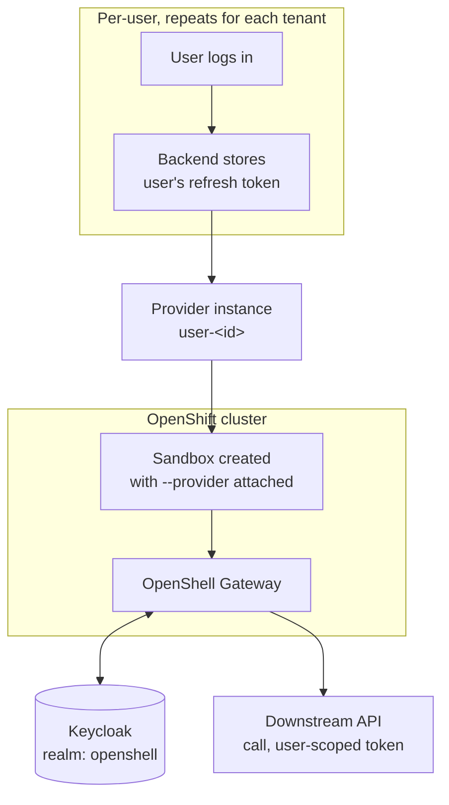
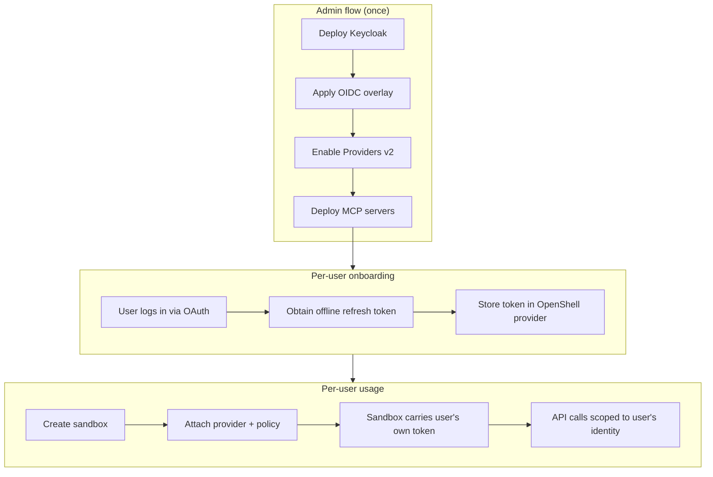

# Keycloak OIDC — per-user credential isolation on OpenShell

## Table of contents

- [Overview](#overview)
  - [Demo personas — Alice, Bob, and Charlie](#demo-personas--alice-bob-and-charlie)
  - [How to follow this guide](#how-to-follow-this-guide)
  - [Architecture](#architecture)
  - [RBAC setup](#rbac-setup)
  - [Workspace isolation](#workspace-isolation)
- [Part I — OIDC RBAC demo](#part-i--oidc-rbac-demo)
  - [Prerequisites](#prerequisites)
  - [What this demo deploys](#what-this-demo-deploys)
  - [Getting started](#getting-started)
    - [Clone the repo and change to the demo directory](#clone-the-repo-and-change-to-the-demo-directory)
    - [Log into your OpenShift cluster](#log-into-your-openshift-cluster)
    - [Set up your `.env` files](#set-up-your-env-files)
  - [1. Deploy Keycloak](#1-deploy-keycloak)
  - [2. Create the namespace, grant SCCs, and install OpenShell with OIDC](#2-create-the-namespace-grant-sccs-and-install-openshell-with-oidc)
  - [3. Onboard a banker](#3-onboard-a-banker)
  - [4. Deploy MCP servers](#4-deploy-mcp-servers)
  - [5. Run the demo](#5-run-the-demo)
  - [Definition of done](#definition-of-done)
- [Part II — Red-team evaluation (EvalHub + Garak)](#part-ii--red-team-evaluation-evalhub--garak)
- [Annexes](#annexes)
  - [A. Alternate test clients](#a-alternate-test-clients)
    - [Codex + BYO LLM + MCP tool](#codex--byo-llm--mcp-tool)
    - [Claude Code + BYO LLM + MCP tool](#claude-code--byo-llm--mcp-tool)
  - [B. Configuration reference](#b-configuration-reference)
  - [C. Secrets and security notes](#c-secrets-and-security-notes)
  - [D. Troubleshooting](#d-troubleshooting)
  - [E. Open risks](#e-open-risks)
  - [F. References](#f-references)

## Overview

**Meridian Private Bank** is a boutique wealth management firm where a
small team of private bankers each run their own book of clients — no two
bankers share a client, and no banker sees a colleague's book by default.
Meridian rolled out a shared AI agent platform to every relationship
manager: the same underlying agent, the same banking data services behind
it, but each banker's session is bound to their own identity the moment
they log in. This demo shows that shared platform behaving, in every
respect, as if each banker had their own private system — even though
underneath it's one set of services doing the enforcing, not three separate
deployments.

Technically, this demo deploys OpenShell on OpenShift with **Keycloak as
the OIDC identity provider** and **per-user credential isolation** via
Providers v2. Each banker gets their own scoped credential — an offline
refresh token issued by Keycloak — which the OpenShell gateway silently
refreshes into short-lived access tokens on that banker's behalf. No shared
service account, no credential sharing between bankers.

The result is a multi-user setup where:

- An **admin** deploys the infrastructure (Keycloak, OpenShell, MCP servers)
  and onboards bankers.
- Each **banker** connects to a sandbox that automatically carries their
  own identity. Outbound API calls from the sandbox use that banker's own
  Keycloak-issued token — scoped, short-lived, and automatically rotated.
- Bankers are isolated from each other: Bob's sandbox cannot access Alice's
  or Charlie's credentials, reach services they aren't authorized for, or
  read their clients' data even through a service all three share.

Five MCP servers back the agent: `mcp-portfolio`, `mcp-crm-calendar`,
`mcp-market-news`, and `mcp-kyc-compliance` are shared by every banker
(gated by the composite `banker` realm role); `mcp-compatibility` is an
extra, narrower permission held only by Alice (gated by
`compatibility-user`, granted through the `compatibility-users` Keycloak
group). See [Demo personas](#demo-personas--alice-bob-and-charlie) below
for who's who and [What this demo deploys](#what-this-demo-deploys) for
the server list.

### Demo personas — Alice, Bob, and Charlie

Three of Meridian's private bankers, used throughout this guide as three
distinct lenses on the same platform: same job, same tool, different books.

| Banker | Book | Realm roles | What they exercise |
|---|---|---|---|
| **Alice** | Elena Duarte (moderate risk, technology) | `banker`, `compatibility-user` | Smallest book, one extra permission — proves the platform behaves correctly even for a low-traffic user with an unusual second permission |
| **Bob** | Clara Fontán (moderate, logistics), Grupo Delta Textil (aggressive, textiles), Marcus Wren (conservative, importer) | `banker` | Largest, most varied book — multi-hop scenarios (biggest client by AUM, meeting prep, performance diagnosis) and, with a promotion decision looming, the one who probes the isolation boundary |
| **Charlie** | Fundación Iris (conservative, KYC pending, PEP) | `banker` | One delicate relationship — leans on regulatory reasoning more than his colleagues |

Each banker authenticates against Keycloak; the `preferred_username` claim
(`alice`/`bob`/`charlie`) becomes `banker_id` everywhere in the five
banking MCP servers. An Envoy sidecar validates the JWT signature before a
request ever reaches an MCP pod — the MCP itself never re-verifies the
signature, it only base64-decodes the payload to read `preferred_username`
and `realm_access.roles`.

### How to follow this guide

One person conceptually plays four roles — **admin**, **alice**, **bob**,
**charlie** — but that does **not** mean you run four equally-privileged
CLI sessions against a shared pool of resources. Read this before
copy-pasting anything below; it explains who actually runs each command and
why, and it's the result of testing the alternative (a shared workspace)
and finding it breaks isolation. See
[Workspace isolation](#workspace-isolation) above for the full mechanics.

**Admin's terminal does steps 1, 2, and 4, plus the provider/policy-setting
parts of steps 3 and 5** — deploying infrastructure, and anything that
creates or configures a *provider* or a *policy* (`provider create`,
`provider refresh configure/rotate`, `policy update`). This is deliberate,
not incidental: in this demo's RBAC model, provider and policy management
are Workspace-Admin-or-above operations (see the roles table in
[Workspace isolation](#workspace-isolation)), and admin is the only
Platform Admin identity. Every one of these commands passes
`--workspace "${USER_ID}"` to target the right banker's workspace — admin
can reach into any workspace, so this is how one admin session provisions
all three bankers without them sharing anything.

**alice/bob/charlie can legitimately self-service `sandbox create`/`sandbox
exec`/`sandbox list` inside their own workspace once onboarded** —
confirmed live, this is the one part of the RBAC table's original claim
("`openshell-user`: connect to sandboxes, run workloads") that holds up
once each banker has their own workspace. If you want to actually run
step 5 as alice/bob/charlie themselves rather than from admin's terminal,
you can — see the optional per-terminal setup below. The guide's own
command blocks stay written from admin's terminal throughout, both options
work identically because workspace scoping doesn't care who's asking, only
whose membership they hold.

**The one place a real second identity is unavoidable is the Keycloak login
screen:**
- Step 2c: **admin** logs in via browser — the admin's own authentication.
- Step 3, Option B (the `onboard` tool): the browser login inside the tool
  is **alice/bob/charlie authenticating as themselves** — that's the whole
  point of Option B, the operator's admin session never sees their
  password. Workspace creation (before the tool runs) and the token
  exchange itself still happen from admin's terminal / the tool's own
  process.
- Step 3, Option A (password grant): no separate login at all — admin's
  script authenticates *as* the banker directly via the token endpoint,
  using a password the operator was handed. This is why Option A is
  marked demo-only.

Practical tips:

- **Keycloak sessions are per-browser.** When onboarding multiple bankers
  with Option B, log out of Keycloak between them — otherwise the browser
  reuses the previous session and you get the same banker's token again.
  The tool's success page includes a logout link, or use a
  private/incognito window for each banker.
- With Option A there is no browser session to worry about — just change
  `USER_ID` and `USER_PASS` in the same terminal.
- Keep alice's and bob's sandboxes running while you set up and test the
  others' — the isolation check in step 5 needs all three alive at once.

**Optional: run each identity in its own real terminal, scoped with
`XDG_CONFIG_HOME`/`XDG_STATE_HOME`, and use it to verify the workspace
isolation claim above yourself instead of taking it on faith:**

```bash
# Terminal A — admin
export XDG_CONFIG_HOME=/tmp/oc-admin/config XDG_STATE_HOME=/tmp/oc-admin/state
mkdir -p "$XDG_CONFIG_HOME" "$XDG_STATE_HOME"

# Terminal B — alice (separate window/tab)
export XDG_CONFIG_HOME=/tmp/oc-alice/config XDG_STATE_HOME=/tmp/oc-alice/state
mkdir -p "$XDG_CONFIG_HOME" "$XDG_STATE_HOME"

# Terminal C — bob (separate window/tab)
export XDG_CONFIG_HOME=/tmp/oc-bob/config XDG_STATE_HOME=/tmp/oc-bob/state
mkdir -p "$XDG_CONFIG_HOME" "$XDG_STATE_HOME"
```

This is entirely optional — skip it and just run every command from one
terminal as admin, which is exactly equivalent since workspace scoping is
about membership, not which terminal you typed in. If you do set it up: run
step 2b/2c's `gateway add` in Terminal A logging in as admin, Terminal B as
alice, Terminal C as bob (each triggers its own Keycloak login). After
step 3 has created alice's and bob's workspaces and granted their
membership, try from Terminal B:

```bash
openshell sandbox exec -n demo-alice --workspace alice -- echo works  # succeeds — own workspace
openshell sandbox exec -n demo-bob --workspace bob -- echo blocked    # denied — not a member of workspace 'bob'
openshell provider create --name probe --type user-scoped-api --credential USER_ACCESS_TOKEN=pending --workspace alice  # denied — workspace role 'admin' required
```

The first succeeds (self-service within their own workspace), the second
is denied (cross-workspace access blocked — this is the fix for the bug
this guide used to have, where all users shared one workspace), and the
third is denied (provider management stays admin-only even in your own
workspace). That's the full RBAC boundary this guide relies on, made
concrete instead of asserted. Charlie follows the exact same pattern (a
third terminal, a third `XDG_*` pair) — omitted above only because two
identities are enough to demonstrate the cross-workspace block.

Verified on Linux with openshell CLI 0.0.106 — three concurrent identities
(admin, alice, bob), no state bleed between them, nothing written outside
the chosen directories, and the cross-workspace block confirmed in both
directions.
**[VERIFY on macOS]** — the `XDG_CONFIG_HOME`/`XDG_STATE_HOME` mechanism is
standard, but this session only tested Linux. See
[`docs/headless-browser-automation.md`](../../docs/headless-browser-automation.md#running-multiple-cli-identities-concurrently-on-one-machine)
for the full pattern, including how to drive the login headlessly.

### Architecture


<details>
<summary>Mermaid source</summary>



</details>

### RBAC setup

This demo uses eight Keycloak realm roles to separate admin and banker
capabilities:

| Role | Who holds it | What it grants |
|---|---|---|
| `openshell-admin` | The demo admin | Full OpenShell gateway admin operations (deploy providers, manage sandboxes, set policies) |
| `openshell-user` | Every onboarded banker | Connect to sandboxes, run workloads |
| `banker` | Alice, Bob, Charlie | Baseline banking role — composite over the four roles below, so holding `banker` alone is enough to reach all four shared data services |
| `mcp-portfolio-user` | Composited into `banker` | Access to `mcp-portfolio` (client holdings/performance) |
| `mcp-crm-calendar-user` | Composited into `banker` | Access to `mcp-crm-calendar` (banker's own meetings) |
| `mcp-market-news-user` | Composited into `banker` | Access to `mcp-market-news` (public market news) |
| `mcp-kyc-compliance-user` | Composited into `banker` | Access to `mcp-kyc-compliance` (risk profile, suitability, regulatory-guidance search) |
| `compatibility-user` | Alice only, via the `compatibility-users` group | Access to `mcp-compatibility` — Alice's one extra permission, deliberately not shared with Bob or Charlie |


<details>
<summary>Mermaid source</summary>



</details>

### Workspace isolation

The table above is about **Keycloak realm roles** — who's allowed to call
which OpenShell gateway operations at all. That's a separate axis from
**OpenShell workspaces** — the gateway's own multi-tenancy boundary, which
this demo relies on just as much and which is easy to get wrong.

A workspace is where sandboxes, providers, provider profiles, policies, and
inference routes actually live. Per
[NVIDIA's docs](https://docs.nvidia.com/openshell/sandboxes/manage-workspaces):
*"Sandboxes, providers, services, policies, settings, and inference routes
belong to a workspace and are not visible to members of other workspaces"*
and *"Membership does not grant access to another workspace."* Three roles
exist:

| Role | Scope | Grants |
|---|---|---|
| Platform Admin | Whole gateway | Bypasses workspace membership checks entirely; manages any workspace. Tied to the OIDC `adminRole` claim — this is `openshell-admin` in this demo |
| Workspace Admin | One workspace | Manage providers, provider profiles, policies, settings, and members **in that workspace only** |
| Workspace User | One workspace | Create/use sandboxes and services, read providers, use provider attachments — **in that workspace only** |

**The critical, verified consequence: workspace membership is not
per-sandbox, it's per-workspace.** A `user`-role member of a workspace can
`sandbox exec`/`sandbox get`/`sandbox list` on *every* sandbox in that
workspace — not just ones tied to their own provider. Confirmed live: two
users both granted plain `user` membership in the same shared workspace
could each `sandbox exec` into the *other's* sandbox and successfully call
an MCP server using the other user's real, working injected credential —
completely bypassing the Envoy/Keycloak-role isolation described above.

**This is why each banker in this guide gets their own dedicated workspace**
(named after their `USER_ID` — `alice`, `bob`, `charlie`), not membership
in a shared one. Step 3 creates it. Every subsequent command that touches a
banker's provider or sandbox passes `--workspace "${USER_ID}"` explicitly —
don't drop that flag when adapting these commands, and don't grant a second
banker membership in a workspace that already has one.

## Part I — OIDC RBAC demo

### Prerequisites

| Tool / access | Notes |
|---|---|
| `oc` | Logged into the target cluster, with rights to grant SCCs |
| `helm` 3.x | |
| `kubectl` | Compatible with cluster version |
| `openshell` CLI | See [`demos/base/README.md`](../base/README.md#installing-the-cli) for install instructions |
| OpenShift 4.x cluster | |
| Agent Sandbox controller + CRDs | See [`demos/base/README.md`](../base/README.md#installing-agent-sandbox) |
| A Keycloak instance (26+, or current) | Self-hosted via Helm, or existing |
| `jq`, `openssl` | Scripting, secret handling |
| Red Hat OpenShift AI (RHOAI) operator, with KServe/ModelServing enabled | Needed for the `mcp-servers` chart's embeddings `InferenceService` (vLLM CPU serving `jinaai/jina-embeddings-v3`), shared by `mcp-market-news` and `mcp-kyc-compliance` for semantic search — see `demos/keycloak-oidc/mcp-servers/templates/embeddings.yaml`. Enabling and configuring a `DataScienceCluster`/hardware profile is cluster-specific and out of scope for this doc — see [Red Hat OpenShift AI documentation](https://docs.redhat.com/en/documentation/red_hat_openshift_ai). The `hardwareProfile` value in `mcp-servers/values.yaml` (`default-profile`) is cluster-specific — it was confirmed against one real cluster's RHOAI install, but yours may expose a different name; check `oc get hardwareprofiles -n redhat-ods-applications` before deploying. |

### What this demo deploys

- `helm/values.yaml` — OpenShift-compatibility overrides plus OIDC
  configuration (`server.oidc.*`, `allowUnauthenticatedUsers: false`).
- A Keycloak realm (`keycloak/realm-export.json`) with CLI and gateway
  clients, admin/banker roles (including the composite `banker` role and
  the `compatibility-users` group), and Meridian's three demo bankers
  (alice, bob, charlie). The gateway client secret is hardcoded
  (`openshell-gateway-demo-secret`) — in a production setup you would
  generate a unique secret per environment.
- Providers v2 enabled (`providers_v2_enabled=true`).
- A per-banker provider profile and onboarding flow.
- Five MCP servers (`mcp-servers/` chart) fronted by Envoy sidecars that
  gate access by Keycloak realm role: `mcp-portfolio`, `mcp-crm-calendar`,
  `mcp-market-news`, and `mcp-kyc-compliance` — the theme's four shared
  data services, all gated by the composite `banker` role — plus
  `mcp-compatibility` (Alice only, via `compatibility-user`). A shared
  ephemeral Postgres backs `mcp-portfolio`/`mcp-crm-calendar`/
  `mcp-kyc-compliance`.
- A KServe `InferenceService` running `jinaai/jina-embeddings-v3` via vLLM
  CPU inference (`mcp-servers/templates/embeddings.yaml`), shared by
  `mcp-market-news` and `mcp-kyc-compliance` for semantic search — requires
  the RHOAI prerequisite above.

### Getting started

#### Clone the repo and change to the demo directory

```bash
git clone https://github.com/alpha-hack-program/openshell-demos.git
cd openshell-demos/demos/keycloak-oidc
```

#### Log into your OpenShift cluster

Make sure you're logged in with a user that has **cluster-admin** rights (or
at least the ability to grant SCCs and create namespaces):

```bash
oc login --server=https://api.<your-cluster>:6443
oc whoami   # confirm you're logged in
```

#### Set up your `.env` files

This demo uses two `.env` files:

1. **Root `.env`** (at the repo root) — cluster-wide variables shared across
   all demos:
   - `OPENSHELL_CHART_VERSION` — the Helm chart version to install
   - `CLUSTER_APPS_DOMAIN` — your cluster's apps domain

2. **Demo `.env`** (in this directory) — variables specific to this demo.

Copy the example files and fill in the real values:

```bash
# Root .env — cluster-wide variables
cp ../../.env.example ../../.env
```

Extract `CLUSTER_APPS_DOMAIN` from the cluster:

```bash
CLUSTER_APPS_DOMAIN=$(oc get ingresses.config.openshift.io cluster -o jsonpath='{.spec.domain}')
echo "CLUSTER_APPS_DOMAIN=${CLUSTER_APPS_DOMAIN}"
```

To find the latest chart version, check the
[OpenShell releases page](https://github.com/NVIDIA/OpenShell/releases) — the
tag uses a `v` prefix (e.g. `v0.0.106`) but the chart version does **not**
(e.g. `0.0.106`). You can also query it directly:

```bash
helm show chart oci://ghcr.io/nvidia/openshell/helm-chart | grep ^version
```

Edit `../../.env` and set `OPENSHELL_CHART_VERSION` (without the `v` prefix)
and paste the `CLUSTER_APPS_DOMAIN` value from above.

```bash
# Demo .env — demo-specific variables
cp .env.example .env
# Edit .env — values are listed below
```

The demo `.env` requires these variables. Don't worry about filling them all
in now — the `01-deploy-keycloak.sh` script in step 1 prints the
Keycloak-related values (`KEYCLOAK_HOST`, `KEYCLOAK_CLIENT_SECRET`, etc.)
after it runs, so you'll come back and complete your `.env` then.

| Variable | Example | Notes |
|---|---|---|
| `OPENSHELL_NAMESPACE` | `keycloak-oidc-demo` | OpenShift namespace for this demo's gateway. Must **not** start with `openshell-` — the Route FQDN is derived as `openshell-${OPENSHELL_NAMESPACE}.${CLUSTER_APPS_DOMAIN}`, and a redundant prefix can push it over the 64-byte X.509 CommonName limit when using `LETSENCRYPT_CLUSTER_ISSUER` (see AGENTS.md) |
| `CERT_MANAGER` | `false` | Set `true` to use cert-manager for TLS (requires the Operator) |
| `LETSENCRYPT_CLUSTER_ISSUER` | *(empty)* | Name of a Let's Encrypt `ClusterIssuer` for CA-signed Route cert (requires `CERT_MANAGER=true`) |
| `KEYCLOAK_HOST` | `keycloak.apps.ocp.example.com` | Keycloak hostname (set after deploying Keycloak) |
| `KEYCLOAK_REALM` | `openshell` | Keycloak realm name |
| `KEYCLOAK_CLIENT_ID_CLI` | `openshell-cli` | Public client for CLI/browser login |
| `KEYCLOAK_CLIENT_ID_GATEWAY` | `openshell-gateway` | Confidential gateway client |
| `KEYCLOAK_CLIENT_SECRET` | *(from Keycloak)* | Gateway client secret — never commit |

### 1. Deploy Keycloak

#### 1a. Check the realm JSON

The realm JSON at `keycloak/realm-export.json` is ready to import as-is —
no substitution needed. The gateway client secret is hardcoded as
`openshell-gateway-demo-secret` (along with the three demo bankers'
passwords — `alice`/`alice`, `bob`/`bob`, `charlie`/`charlie`). This keeps
the demo simple; in production you would generate a unique secret per
environment.

Optionally, run the helper script to verify your `.env` values match:

```bash
./scripts/01-deploy-keycloak.sh
```

#### 1b. Deploy Keycloak on the cluster

We use the **Red Hat build of Keycloak** (RHBK) Operator, available from
OperatorHub on OpenShift. The package name is **`rhbk-operator`** (in the
**Red Hat Operators** catalog) — do **not** use the community
`keycloak-operator` from Community Operators.

1. Create the namespace first, then install the Operator into it:

   ```bash
   oc create namespace keycloak 2>/dev/null || true
   ```

   **Via the web console:** go to **Operators > OperatorHub**, search for
   **`rhbk`**, and install the **Red Hat build of Keycloak** Operator.
   Select **A specific namespace on the cluster** and choose `keycloak`.

   **Via the CLI:**

   ```bash
   # Verify the package is available
   oc get packagemanifests -n openshift-marketplace | grep rhbk-operator

   # Create OperatorGroup + Subscription
   oc apply -f - <<'EOF'
   apiVersion: operators.coreos.com/v1
   kind: OperatorGroup
   metadata:
     name: keycloak-og
     namespace: keycloak
   spec:
     targetNamespaces:
       - keycloak
   ---
   apiVersion: operators.coreos.com/v1alpha1
   kind: Subscription
   metadata:
     name: rhbk-operator
     namespace: keycloak
   spec:
     channel: stable-v26.6
     name: rhbk-operator
     source: redhat-operators
     sourceNamespace: openshift-marketplace
     installPlanApproval: Automatic
   EOF
   ```

2. Wait for the Operator to be ready:

   ```bash
   oc -n keycloak get csv | grep rhbk
   # Should show a row with "Succeeded" for the rhbk-operator
   ```

3. Source your root `.env` (for `CLUSTER_APPS_DOMAIN`) and create a Keycloak
   instance. Note the heredoc uses `<<EOF` (no quotes) so the variable is
   expanded:

   ```bash
   source ../../.env

   oc -n keycloak apply -f - <<EOF
   apiVersion: k8s.keycloak.org/v2beta1
   kind: Keycloak
   metadata:
     name: keycloak
   spec:
     instances: 1
     hostname:
       hostname: keycloak.${CLUSTER_APPS_DOMAIN}
     proxy:
       headers: xforwarded
     http:
       httpEnabled: true
   EOF
   ```

   The `proxy.headers` and `http.httpEnabled` settings are needed because the
   OpenShift Route handles TLS termination — Keycloak itself runs behind the
   Route over plain HTTP.

   > If `keycloak.${CLUSTER_APPS_DOMAIN}` is already taken on your cluster,
   > change the hostname in the CR above (e.g.
   > `keycloak-openshell.${CLUSTER_APPS_DOMAIN}`) and update `KEYCLOAK_HOST`
   > in your `.env` to match.

4. Wait for the pod to become ready:

   ```bash
   oc -n keycloak get pods
   # keycloak-0   1/1   Running
   ```

5. Grab the admin credentials created by the Operator — you'll need them
   to log into the admin console in the next step:

   ```bash
   oc -n keycloak get secret keycloak-initial-admin \
     -o jsonpath='{.data.username}' | base64 -d; echo
   oc -n keycloak get secret keycloak-initial-admin \
     -o jsonpath='{.data.password}' | base64 -d; echo
   ```

#### 1c. Import the realm JSON

Import the realm JSON into Keycloak via the admin console or the Admin
REST API.

**Option A — Admin console (browser):**

1. Open `https://<KEYCLOAK_HOST>/admin` in your browser (use the admin
   credentials you extracted in step 1b).
2. In the left sidebar, click **Manage realms**, then click **Create realm**.
3. Click **Browse**, select `keycloak/realm-export.json`, and click
   **Create**.

**Option B — Admin REST API (CLI):**

```bash
source .env

ADMIN_TOKEN=$(curl -sk -X POST \
  "https://${KEYCLOAK_HOST}/realms/master/protocol/openid-connect/token" \
  -d "grant_type=password" \
  -d "client_id=admin-cli" \
  -d "username=${KEYCLOAK_ADMIN_USER}" \
  -d "password=${KEYCLOAK_ADMIN_PASSWORD}" \
  | jq -r '.access_token')

curl -sk -X POST \
  "https://${KEYCLOAK_HOST}/admin/realms" \
  -H "Authorization: Bearer ${ADMIN_TOKEN}" \
  -H "Content-Type: application/json" \
  -d @keycloak/realm-export.json
```

The realm template includes Meridian's three demo bankers (`alice`,
`bob`, `charlie`) with the `openshell-user` + `banker` roles and
`offline_access` scope — they're created automatically when you import the
realm. Alice additionally belongs to the `compatibility-users` group,
which projects the `compatibility-user` role into her token only. Their
passwords match their usernames (e.g. `alice` / `alice`) — demo only,
never do this in production.

### 2. Create the namespace, grant SCCs, and install OpenShell with OIDC

This step installs the OpenShell gateway with OIDC and a passthrough Route
in a single Helm install (2a), then extracts the mTLS client certificates
and registers the gateway endpoint with the `openshell` CLI (2b).

> **If you already have another OpenShell installation** on the same cluster
> (the base demo, a previous run of this demo in a different namespace, etc.),
> the Helm install below will fail because the chart creates cluster-scoped
> resources (`openshell-node-reader` ClusterRole **and** ClusterRoleBinding)
> that are already owned by the other release. **Tear down the previous
> installation first** — e.g. `demos/base/scripts/99-teardown.sh` for the
> base demo, or `demos/keycloak-oidc/scripts/99-teardown.sh full` (or
> `keep-keycloak` to leave Keycloak in place) for a prior run of this demo.

#### 2a. Helm install

This demo provides two Helm values files:

- **`helm/values.yaml`** — uses the PKI init job to generate TLS certificates
  (default, no extra dependencies).
- **`helm/values-certmanager.yaml`** — uses the OpenShift cert-manager
  Operator to manage TLS certificates. Requires the cert-manager Operator to
  be installed on the cluster. Set `CERT_MANAGER=true` in your `.env` to use
  this path.

Both files contain a `<keycloak-host>` placeholder in the OIDC issuer URL
and `openshiftRoute.enabled: true`. Use `--set` to fill in your Keycloak
hostname and the Route FQDN at install time. The chart creates the
passthrough Route automatically — no manual `oc create route` needed.

The Route hostname must also be in the server certificate's SANs — without
it, TLS handshakes will fail. The `--set` overrides below add it alongside
the namespace-specific service DNS names.

##### Let's Encrypt TLS (optional)

When using the cert-manager path (`CERT_MANAGER=true`), you can get a
publicly-trusted CA-signed certificate for the Route instead of the default
self-signed CA. The chart's `serverIssuerRef` creates a **second** server
certificate signed by your ACME issuer (for the Route FQDN) while the
**internal** certificate stays signed by the chart's own CA — mTLS client
auth keeps working unchanged. The gateway serves the right certificate via
SNI.

To use this:

1. Set `LETSENCRYPT_CLUSTER_ISSUER` in your `.env` to the name of an
   existing Let's Encrypt `ClusterIssuer` on your cluster (e.g.
   `letsencrypt-prod`).

2. If you don't have a ClusterIssuer yet, create one. DNS-01 is recommended
   for passthrough Routes (HTTP-01 needs port 80, which passthrough doesn't
   expose). The solver configuration depends on your DNS provider — this
   example uses Route53, but cert-manager supports
   [many providers](https://cert-manager.io/docs/configuration/acme/dns01/):

   ```bash
   oc apply -f - <<'EOF'
   apiVersion: cert-manager.io/v1
   kind: ClusterIssuer
   metadata:
     name: letsencrypt-prod
   spec:
     acme:
       server: https://acme-v02.api.letsencrypt.org/directory
       email: your-email@example.com        # Let's Encrypt notifications
       privateKeySecretRef:
         name: letsencrypt-prod-account-key
       solvers:
         - dns01:
             route53:                        # replace with your DNS provider
               region: us-east-1
               # accessKeyID / secretAccessKeySecretRef or IRSA — see
               # cert-manager docs for your provider
   EOF

   # Verify the issuer is ready
   oc get clusterissuer letsencrypt-prod
   ```

The helm install snippet below automatically passes `serverIssuerRef` when
`LETSENCRYPT_CLUSTER_ISSUER` is set. If left empty, the chart uses its own
self-signed CA for all certificates (the default).

When `serverIssuerRef` is set, `certManager.serverDnsNames` feeds **only**
the external (ACME) certificate — the internal certificate's SANs come
from the chart's own defaults automatically, regardless of this value. The
external certificate's `dnsNames` are used as-is, with no filtering, so
the list must contain **only** the externally-resolvable Route FQDN — no
internal names (rejected by the chart's own guard), no IPs, and no bare
single-label names (both silently accepted by the chart but rejected by
ACME). That's why the two branches below differ: the self-signed-CA branch
appends the Route host to the base internal-SAN list, while the Let's
Encrypt branch replaces `serverDnsNames` wholesale with just the Route
host. Also see the `OPENSHELL_NAMESPACE` naming constraint above — the
Route host doubles the `openshell-` prefix if the namespace already starts
with it, which can push the Let's Encrypt certificate's CommonName over
the 64-byte X.509 limit.

```bash
source .env
source ../../.env

oc create namespace "$OPENSHELL_NAMESPACE" 2>/dev/null || true
oc adm policy add-scc-to-user privileged -z openshell-sandbox -n "$OPENSHELL_NAMESPACE"

ROUTE_HOST="openshell-${OPENSHELL_NAMESPACE}.${CLUSTER_APPS_DOMAIN}"

if [[ "${CERT_MANAGER:-false}" == "true" ]]; then
  VALUES_FILE=helm/values-certmanager.yaml
  ISSUER_SET=()
  if [[ -n "${LETSENCRYPT_CLUSTER_ISSUER:-}" ]]; then
    # serverDnsNames feeds ONLY the external (ACME) certificate when
    # serverIssuerRef is set — replace it wholesale with just the
    # externally-resolvable Route host (no internal names, no IPs, no
    # bare names; ACME rejects all three).
    SAN_SET=(--set "certManager.serverDnsNames={${ROUTE_HOST}}")
    ISSUER_SET=(
      --set "certManager.serverIssuerRef.name=${LETSENCRYPT_CLUSTER_ISSUER}"
      --set "certManager.serverIssuerRef.kind=ClusterIssuer"
      --set "certManager.serverIssuerRef.group=cert-manager.io"
    )
  else
    SAN_SET=(
      --set "certManager.serverDnsNames[2]=openshell.${OPENSHELL_NAMESPACE}.svc"
      --set "certManager.serverDnsNames[3]=openshell.${OPENSHELL_NAMESPACE}.svc.cluster.local"
      --set "certManager.serverDnsNames[4]=${ROUTE_HOST}"
    )
  fi
else
  VALUES_FILE=helm/values.yaml
  SAN_SET=(--set "pkiInitJob.serverDnsNames[0]=${ROUTE_HOST}")
  ISSUER_SET=()
fi

helm upgrade --install openshell oci://ghcr.io/nvidia/openshell/helm-chart \
  --version "$OPENSHELL_CHART_VERSION" \
  --namespace "$OPENSHELL_NAMESPACE" \
  -f "$VALUES_FILE" \
  --set "server.oidc.issuer=https://${KEYCLOAK_HOST}/realms/${KEYCLOAK_REALM}" \
  --set "openshiftRoute.host=${ROUTE_HOST}" \
  "${SAN_SET[@]}" \
  "${ISSUER_SET[@]}"
```

Wait for the gateway to come up:

```bash
oc -n "$OPENSHELL_NAMESPACE" rollout status statefulset/openshell
```

Verify the Route was created:

```bash
oc -n "$OPENSHELL_NAMESPACE" get route openshell
```

#### 2b. Register the gateway with the CLI

Extract the client mTLS certificates and register the gateway:

```bash
GATEWAY_NAME="${GATEWAY_NAME:-openshift}"
MTLS_DIR=~/.config/openshell/gateways/${GATEWAY_NAME}/mtls
mkdir -p "$MTLS_DIR"

oc -n "$OPENSHELL_NAMESPACE" get secret openshell-client-tls \
  -o jsonpath='{.data.ca\.crt}'  | base64 -d > "$MTLS_DIR/ca.crt"
oc -n "$OPENSHELL_NAMESPACE" get secret openshell-client-tls \
  -o jsonpath='{.data.tls\.crt}' | base64 -d > "$MTLS_DIR/tls.crt"
oc -n "$OPENSHELL_NAMESPACE" get secret openshell-client-tls \
  -o jsonpath='{.data.tls\.key}' | base64 -d > "$MTLS_DIR/tls.key"

# If using the Let's Encrypt path (LETSENCRYPT_CLUSTER_ISSUER set), the CLI's
# gRPC control channel pins trust to this ca.crt bundle and does NOT fall back
# to the system trust store. Since $ROUTE_HOST now serves a Let's
# Encrypt-signed certificate (via SNI) instead of the chart's own CA, append
# its issuing chain — otherwise every CLI command fails with
# "invalid peer certificate: UnknownIssuer".
if [[ -n "${LETSENCRYPT_CLUSTER_ISSUER:-}" ]]; then
  echo | openssl s_client -connect "${ROUTE_HOST}:443" -servername "${ROUTE_HOST}" -showcerts 2>/dev/null \
    | awk '/-----BEGIN CERTIFICATE-----/{n++} n>=2' >> "$MTLS_DIR/ca.crt"
fi

openshell gateway remove "$GATEWAY_NAME" 2>/dev/null || true
openshell gateway add "https://${ROUTE_HOST}:443" \
  --name "$GATEWAY_NAME" \
  --oidc-issuer "https://${KEYCLOAK_HOST}/realms/${KEYCLOAK_REALM}" \
  --oidc-client-id "$KEYCLOAK_CLIENT_ID_CLI" \
  --oidc-scopes "openid offline_access"
```

#### 2c. Log in to the gateway

The gateway requires OIDC authentication — you must log in before you can
run any admin commands. This opens a browser and redirects you to Keycloak:

```bash
openshell gateway login
```

Log in as the admin user (the one with the `openshell-admin` realm role).

#### 2d. Enable Providers v2

```bash
openshell settings set --global --key providers_v2_enabled --value true
```

#### Verify the gateway

```bash
openshell status
openshell gateway list
```

`openshell status` should show the gateway as connected and authenticated.

### 3. Onboard a banker

Onboarding is a **two-step process by design**. OpenShell's Providers v2
manages the *lifecycle* of a credential (refresh, rotate, inject into
sandboxes) but leaves the *initial acquisition* of that credential to your
identity plumbing. The upstream docs jump straight to
`--material refresh_token=<value>` and assume you already have it — this
section explains how to get it.

You need a long-lived **offline refresh token** (not a short-lived access
token) because the gateway uses it to silently mint fresh access tokens on
the user's behalf over time, without the user being logged in.

Two options for obtaining the token:

- **Option A** uses a direct password grant — fast but demo-only, since the
  operator must know the user's password.
- **Option B** uses the `onboard` CLI tool to automate a browser-based
  OAuth flow — the user logs in directly with Keycloak and the operator
  never sees their password.

#### Step 3.0 — Create the user's own workspace (do this first, either option)

**Every banker needs their own OpenShell workspace before onboarding.** See
[Workspace isolation](#workspace-isolation) above for why: workspace
membership grants access to *every* sandbox in that workspace, not just
your own, so putting multiple bankers in one shared workspace (including
`default`) breaks the per-banker isolation this whole demo is about —
confirmed live. This step is admin-only (creating a workspace and granting
membership are Platform Admin operations) and only needs to run once per
banker, before either Option A or B below:

```bash
source .env

USER_ID="alice"

# Look up the banker's Keycloak subject (OIDC 'sub' claim = Keycloak user ID)
KEYCLOAK_ADMIN_TOKEN=$(curl -sk -X POST \
  "https://${KEYCLOAK_HOST}/realms/master/protocol/openid-connect/token" \
  -d "grant_type=password" \
  -d "client_id=admin-cli" \
  -d "username=${KEYCLOAK_ADMIN_USER}" \
  -d "password=${KEYCLOAK_ADMIN_PASSWORD}" \
  | jq -r '.access_token')

USER_SUBJECT=$(curl -sk \
  -H "Authorization: Bearer ${KEYCLOAK_ADMIN_TOKEN}" \
  "https://${KEYCLOAK_HOST}/admin/realms/${KEYCLOAK_REALM}/users?username=${USER_ID}&exact=true" \
  | jq -r '.[0].id')

openshell workspace create --name "${USER_ID}"
openshell workspace member add --workspace "${USER_ID}" --subject "${USER_SUBJECT}" --role user
```

Repeat with `USER_ID="bob"` and `USER_ID="charlie"`. From here on, every
`provider`/`sandbox`/`policy` command for a banker carries
`--workspace "${USER_ID}"` — don't drop it, and don't reuse one banker's
workspace for another.

#### Step 3a — Obtain the user's refresh token

**Option A — Password grant (demo only)**

Only works because you control both sides and know the demo banker's
password. Not viable in production — the operator must never know user
credentials.

```bash
source .env

USER_ID="alice"
USER_PASS="<the-bankers-password>"

REFRESH_TOKEN=$(curl -sk -X POST \
  "https://${KEYCLOAK_HOST}/realms/${KEYCLOAK_REALM}/protocol/openid-connect/token" \
  -d "grant_type=password" \
  -d "client_id=${KEYCLOAK_CLIENT_ID_CLI}" \
  -d "username=${USER_ID}" \
  -d "password=${USER_PASS}" \
  -d "scope=openid offline_access" \
  | jq -r '.refresh_token')
```

Then continue to [step 3b](#step-3b--store-the-refresh-token-in-openshell) to
store the token.

**Option B — `onboard` utility (browser-based OAuth flow)**

The `onboard` CLI tool in [`util/onboard/`](../../util/onboard/) automates
the full flow: opens the browser for the banker to log in, listens for the
OAuth callback, exchanges the authorization code for a refresh token, and
runs the OpenShell provider commands from
[step 3b](#step-3b--store-the-refresh-token-in-openshell) automatically.

```bash
source .env

# Build once (requires Rust)
cd ../../util/onboard && cargo build --release && cd -

# Onboard alice — opens a browser, waits for login, creates the provider
../../util/onboard/target/release/onboard \
  -u alice \
  --profile providers/user-refresh-profile.yaml
```

Or use the shell wrapper (sources `.env` automatically):

```bash
../../util/onboard/onboard.sh \
  -u alice \
  --profile providers/user-refresh-profile.yaml
```

The `--profile` flag is required — it tells the tool which provider profile
to import. The profile defines the credential refresh strategy (how the
gateway obtains fresh access tokens from Keycloak on the user's behalf). See
[step 3b](#step-3b--store-the-refresh-token-in-openshell) for what the
profile contains and why it matters.

> The profile at `providers/user-refresh-profile.yaml` contains two
> placeholders (`<keycloak-host>` and `<openshell-namespace>`) — unlike the
> manual [step 3b](#step-3b--store-the-refresh-token-in-openshell) flow,
> **you do not need to `sed` them yourself**: `onboard` substitutes both
> before importing, reading the namespace from `--namespace` or the
> `OPENSHELL_NAMESPACE` env var (`onboard.sh` already sources this from
> `.env`). Verified live: running `onboard` unmodified against this demo's
> `.env` produces a correctly-substituted profile with real endpoint hosts,
> not literal placeholder text.

> **Workspace targeting.** `onboard` defaults `--workspace` to the user ID
> (`-u alice` → workspace `alice`), matching
> [step 3.0](#step-30--create-the-users-own-workspace-do-this-first-either-option)
> above. It does not create the workspace or grant membership itself — that
> must already exist, or `provider create` will fail with `"not a member of
> workspace"`. Override with `--workspace <name>` or `OPENSHELL_WORKSPACE`
> if you're using a different naming scheme.

Pre-built binaries for Linux (x86_64) and macOS (aarch64) are available from
[GitHub Releases](../../releases) — download, `chmod +x`, and run.

Useful flags:
- `--token-only` — stop after obtaining the refresh token, print it to
  stdout, do not call the OpenShell CLI
- `--no-browser` — print the URL instead of opening a browser (for
  headless / SSH sessions)
- `--dry-run` — show the OpenShell CLI commands without executing them
- `--timeout <secs>` — how long to wait for the user to log in (default 120s)

To onboard the next banker, log out of Keycloak first (use the link on the
success page or open an incognito window), then run the same command with
`-u bob`, then again with `-u charlie`.

If you used Option B, step 3b is already done — the tool runs the same
commands shown below. Skip to [step 4](#4-deploy-mcp-servers).

#### Step 3b — Store the refresh token in OpenShell

This is what OpenShell owns. The **provider profile** defines the credential
refresh strategy — how the gateway obtains fresh access tokens from Keycloak
on the user's behalf. The **provider instance** stores each user's refresh
token and is linked to the profile.

The profile defines both the credential refresh strategy and the
**endpoint binding** — which endpoints the proxy is allowed to inject the
credential for. In 0.0.106+, credentials are only delivered to sandboxes
when the profile includes matching endpoints (this is a security
enhancement that prevents credentials from leaking to unintended
destinations). Envoy RBAC at each MCP server still enforces role-based
access — the endpoint binding only tells the proxy "you may inject this
credential for requests to these hosts."

First, import the provider profile. The profile at
`providers/user-refresh-profile.yaml` contains two placeholders:
`<keycloak-host>` in `token_url` and `<openshell-namespace>` in the MCP
server endpoint hostnames. Replace both with your actual values:

```bash
source .env

USER_ID="alice"

TMPFILE=$(mktemp --suffix=.yaml)
sed -e "s|<keycloak-host>|${KEYCLOAK_HOST}|" \
    -e "s|<openshell-namespace>|${OPENSHELL_NAMESPACE}|" \
    providers/user-refresh-profile.yaml > "$TMPFILE"
openshell provider profile import -f "$TMPFILE" --workspace "${USER_ID}"
rm -f "$TMPFILE"
```

Then create a provider for the user and configure automatic token refresh —
note `--workspace "${USER_ID}"` on every command, targeting the workspace
created in [step 3.0](#step-30--create-the-users-own-workspace-do-this-first-either-option):

```bash
# Create the provider — this links the user to the profile's refresh strategy
openshell provider create \
  --name "user-${USER_ID}" \
  --type user-scoped-api \
  --credential USER_ACCESS_TOKEN=pending \
  --workspace "${USER_ID}"

# Store the user's refresh token and configure automatic rotation
openshell provider refresh configure "user-${USER_ID}" \
  --credential-key USER_ACCESS_TOKEN \
  --strategy oauth2-refresh-token \
  --material client_id="${KEYCLOAK_CLIENT_ID_CLI}" \
  --material refresh_token="${REFRESH_TOKEN}" \
  --secret-material-key refresh_token \
  --workspace "${USER_ID}"

# Trigger the first rotation to verify everything works
openshell provider refresh rotate "user-${USER_ID}" \
  --credential-key USER_ACCESS_TOKEN \
  --workspace "${USER_ID}"
```

From this point forward, the gateway's refresh worker automatically mints
short-lived access tokens and rotates the refresh token whenever the IdP
returns a new one. The user just does `openshell sandbox connect` and gets a
sandbox with a live credential — they never see a token.

> **Why three separate commands?** A provider profile can define *multiple*
> credentials, each with its own refresh strategy, token endpoint, and
> timing. `provider create` registers the credential keys the provider will
> manage. `refresh configure` binds a specific strategy and the per-user
> material (the actual refresh token) to each credential key — one call per
> key. `refresh rotate` triggers the first token exchange to verify the
> wiring. The `--strategy` flag on `refresh configure` is not redundant
> with the profile: when a profile declares several credentials with
> different strategies, the flag tells the gateway which strategy applies to
> which credential key on this particular provider instance.

> The script `scripts/03-onboard-user.sh <user-id> <refresh-token>` wraps
> these same commands — and also does
> [step 3.0](#step-30--create-the-users-own-workspace-do-this-first-either-option)
> for you (workspace create + membership), so it's safe to run standalone.

### 4. Deploy MCP servers

Five downstream services (MCP servers) back Meridian's agent, each
validating the caller's Bearer token as a Keycloak-issued OAuth access
token — the same token Providers v2 already mints/refreshes per banker in
step 3 — and each only reachable by bankers holding a specific Keycloak
realm role:

| Server | Required role | What it does |
|---|---|---|
| `mcp-portfolio` | `mcp-portfolio-user` (via `banker`) | Client holdings, performance, biggest client by AUM |
| `mcp-crm-calendar` | `mcp-crm-calendar-user` (via `banker`) | The authenticated banker's own upcoming meetings and notes |
| `mcp-market-news` | `mcp-market-news-user` (via `banker`) | Public market news filtered by ticker/sector — no per-client isolation, it's public data |
| `mcp-kyc-compliance` | `mcp-kyc-compliance-user` (via `banker`) | Client risk profile/KYC/PEP status, product suitability, and semantic search over a fictional regulatory corpus (cites the source clause) |
| `mcp-compatibility` | `compatibility-user` (Alice only, via the `compatibility-users` group) | Alice's one extra permission, unrelated to the shared `banker` role |

Token enforcement is handled by an **Envoy sidecar** in front of each MCP
server. Envoy's `jwt_authn` filter verifies the token's signature against
Keycloak's JWKS and `iss`; its `rbac` filter requires the decoded
`realm_access.roles` claim to contain the server-specific role. The app
itself listens on loopback only and is unreachable except from Envoy in the
same pod. `mcp-portfolio`, `mcp-crm-calendar`, and `mcp-kyc-compliance`
additionally enforce *tenant* isolation inside the app itself
(`assert_owns_client`/`assert_owns_meeting`) — a banker who holds the right
role can still only see their own clients' data, never a colleague's, even
though all three bankers call the same service. `mcp-portfolio`,
`mcp-crm-calendar`, and `mcp-kyc-compliance` share one ephemeral Postgres
instance, seeded once per `helm install`/`upgrade` with Meridian's demo
data (Alice/Bob/Charlie and their clients). `mcp-market-news` and
`mcp-kyc-compliance` additionally call a shared, in-namespace KServe
`InferenceService` (vLLM CPU, `jinaai/jina-embeddings-v3`) for semantic
search — see [Prerequisites](#prerequisites) for the RHOAI requirement.

```bash
source .env
./scripts/06-deploy-mcp-servers.sh
```

This deploys all five servers into `$OPENSHELL_NAMESPACE` as two-container
pods (Envoy + the app), each with its own ServiceAccount, plus the shared
Postgres and the shared embeddings `InferenceService`.

The MCP server roles are already assigned to the demo bankers in the realm
JSON imported in step 1c: `banker` (and therefore `mcp-portfolio-user`,
`mcp-crm-calendar-user`, `mcp-market-news-user`, `mcp-kyc-compliance-user`)
→ alice, bob, charlie; `compatibility-user` → alice only. To onboard
additional bankers beyond the three pre-configured ones, see
[Onboarding additional users](docs/onboard-additional-users.md).

### 5. Run the demo

Create a sandbox per banker with their provider attached, grant the policy
permissions each one needs, then walk through what a day actually looks
like for Alice, Bob, and Charlie — proving along the way that role-based
isolation (Envoy, HTTP-level) and tenant isolation (each service's own
ownership check, JSON-RPC-level) both hold even though all three call the
same services.

```bash
source .env
```

**Create a sandbox for each banker, with their own provider attached.**
The `--provider` flag injects `$USER_ACCESS_TOKEN` as a resolve placeholder
that the supervisor's proxy resolves to a real Keycloak access token on
matching outbound requests. `-- true` creates the sandbox without entering
an interactive shell:

```bash
for USER_ID in alice bob charlie; do
  openshell sandbox create --name "demo-${USER_ID}" \
    --provider "user-${USER_ID}" \
    --workspace "${USER_ID}" \
    -- true
done
```

**Add binary permissions** so curl can reach the servers each banker is
authorized for. The provider profile already contributes the MCP server
endpoints to the sandbox's network policy (endpoint binding), but does not
grant binary-level permissions — those are deployment-specific and applied
per-sandbox:

```bash
for USER_ID in alice bob charlie; do
  for SERVER_NAME in mcp-portfolio mcp-crm-calendar mcp-market-news mcp-kyc-compliance; do
    openshell policy update "demo-${USER_ID}" \
      --add-endpoint "${SERVER_NAME}.${OPENSHELL_NAMESPACE}.svc.cluster.local:8000:read-write:rest:enforce" \
      --binary /usr/bin/curl --wait \
      --workspace "${USER_ID}"
  done
done

# Alice's extra permission — nobody else gets this endpoint added
openshell policy update "demo-alice" \
  --add-endpoint "mcp-compatibility.${OPENSHELL_NAMESPACE}.svc.cluster.local:8000:read-write:rest:enforce" \
  --binary /usr/bin/curl --wait \
  --workspace "alice"
```

#### Alice: the one extra permission

Alice's book is small (just Elena Duarte), but she's the only banker who
can reach `mcp-compatibility` — the platform has to get this right for a
low-traffic user with an unusual second permission just as reliably as for
Bob's much busier book:

```bash
MCP_URL="http://mcp-compatibility.${OPENSHELL_NAMESPACE}.svc.cluster.local:8000/mcp"

openshell sandbox exec -n demo-alice --workspace alice --env "MCP_URL=${MCP_URL}" \
  -- bash -c 'curl -sS -X POST \
    -H "Authorization: Bearer $USER_ACCESS_TOKEN" \
    -H "Content-Type: application/json" \
    -H "Accept: application/json, text/event-stream" \
    -d "{\"jsonrpc\":\"2.0\",\"id\":1,\"method\":\"initialize\",\"params\":{\"protocolVersion\":\"2025-03-26\",\"capabilities\":{},\"clientInfo\":{\"name\":\"test\",\"version\":\"0.1\"}}}" \
    "$MCP_URL"'

openshell sandbox exec -n demo-alice --workspace alice --env "MCP_URL=${MCP_URL}" \
  -- bash -c 'curl -sS -X POST \
    -H "Authorization: Bearer $USER_ACCESS_TOKEN" \
    -H "Content-Type: application/json" \
    -H "Accept: application/json, text/event-stream" \
    -d "{\"jsonrpc\":\"2.0\",\"id\":2,\"method\":\"tools/call\",\"params\":{\"name\":\"calc_tax\",\"arguments\":{\"income\":\"90000\"}}}" \
    "$MCP_URL"'
# Expected: 200 both times — Alice holds compatibility-user via the
# compatibility-users group; nobody else in this demo does.
```

#### Bob: biggest client, meeting prep, performance diagnosis

Bob's book is the largest and most varied — this is where the multi-hop
work happens. First, who's his biggest client by AUM:

```bash
MCP_URL="http://mcp-portfolio.${OPENSHELL_NAMESPACE}.svc.cluster.local:8000/mcp"

openshell sandbox exec -n demo-bob --workspace bob --env "MCP_URL=${MCP_URL}" \
  -- bash -c 'curl -sS -X POST \
    -H "Authorization: Bearer $USER_ACCESS_TOKEN" \
    -H "Content-Type: application/json" \
    -H "Accept: application/json, text/event-stream" \
    -d "{\"jsonrpc\":\"2.0\",\"id\":1,\"method\":\"initialize\",\"params\":{\"protocolVersion\":\"2025-03-26\",\"capabilities\":{},\"clientInfo\":{\"name\":\"test\",\"version\":\"0.1\"}}}" \
    "$MCP_URL"'

openshell sandbox exec -n demo-bob --workspace bob --env "MCP_URL=${MCP_URL}" \
  -- bash -c 'curl -sS -X POST \
    -H "Authorization: Bearer $USER_ACCESS_TOKEN" \
    -H "Content-Type: application/json" \
    -H "Accept: application/json, text/event-stream" \
    -d "{\"jsonrpc\":\"2.0\",\"id\":2,\"method\":\"tools/call\",\"params\":{\"name\":\"get_top_client_by_aum\",\"arguments\":{}}}" \
    "$MCP_URL"'
# Expected: 200 — Clara Fontán (cli-001), highest combined market_value
# across her positions in Bob's book.
```

Then meeting prep — resolve the next meeting via `mcp-crm-calendar`, then
pull that client's notes:

```bash
CRM_URL="http://mcp-crm-calendar.${OPENSHELL_NAMESPACE}.svc.cluster.local:8000/mcp"

openshell sandbox exec -n demo-bob --workspace bob --env "MCP_URL=${CRM_URL}" \
  -- bash -c 'curl -sS -X POST \
    -H "Authorization: Bearer $USER_ACCESS_TOKEN" \
    -H "Content-Type: application/json" \
    -H "Accept: application/json, text/event-stream" \
    -d "{\"jsonrpc\":\"2.0\",\"id\":1,\"method\":\"initialize\",\"params\":{\"protocolVersion\":\"2025-03-26\",\"capabilities\":{},\"clientInfo\":{\"name\":\"test\",\"version\":\"0.1\"}}}" \
    "$MCP_URL"'

openshell sandbox exec -n demo-bob --workspace bob --env "MCP_URL=${CRM_URL}" \
  -- bash -c 'curl -sS -X POST \
    -H "Authorization: Bearer $USER_ACCESS_TOKEN" \
    -H "Content-Type: application/json" \
    -H "Accept: application/json, text/event-stream" \
    -d "{\"jsonrpc\":\"2.0\",\"id\":2,\"method\":\"tools/call\",\"params\":{\"name\":\"get_upcoming_meetings\",\"arguments\":{}}}" \
    "$MCP_URL"'
# Expected: 200 — mtg-001 (Clara Fontán, cli-001) and mtg-002 (Grupo Delta
# Textil, cli-002), Bob's own meetings only.
```

Finally, performance diagnosis: Grupo Delta Textil's MTD return (`perf-002`)
is -3.4% against a +1.5% benchmark — a real underperformance worth
explaining before the meeting, not after. `get_performance` surfaces the
number; `get_relevant_news` (filtered by that client's sector) is how the
agent correlates it with an actual market event instead of guessing:

```bash
NEWS_URL="http://mcp-market-news.${OPENSHELL_NAMESPACE}.svc.cluster.local:8000/mcp"

openshell sandbox exec -n demo-bob --workspace bob --env "MCP_URL=${NEWS_URL}" \
  -- bash -c 'curl -sS -X POST \
    -H "Authorization: Bearer $USER_ACCESS_TOKEN" \
    -H "Content-Type: application/json" \
    -H "Accept: application/json, text/event-stream" \
    -d "{\"jsonrpc\":\"2.0\",\"id\":1,\"method\":\"initialize\",\"params\":{\"protocolVersion\":\"2025-03-26\",\"capabilities\":{},\"clientInfo\":{\"name\":\"test\",\"version\":\"0.1\"}}}" \
    "$MCP_URL"'

openshell sandbox exec -n demo-bob --workspace bob --env "MCP_URL=${NEWS_URL}" \
  -- bash -c 'curl -sS -X POST \
    -H "Authorization: Bearer $USER_ACCESS_TOKEN" \
    -H "Content-Type: application/json" \
    -H "Accept: application/json, text/event-stream" \
    -d "{\"jsonrpc\":\"2.0\",\"id\":2,\"method\":\"tools/call\",\"params\":{\"name\":\"get_relevant_news\",\"arguments\":{\"tickers\":[],\"sectors\":[\"textile\"]}}}" \
    "$MCP_URL"'
# Expected: 200 — public news, no per-client isolation on this server, but
# still requires mcp-market-news-user (composited into banker).
```

#### Bob probes the boundary

With a promotion decision looming and his numbers looking thin next to
Alice's and Charlie's, Bob tries to look at their books. Two different
mechanisms have to both hold for this to fail safely:

```bash
# Role-based (Envoy rbac filter) — Bob legitimately lacks compatibility-user
COMPAT_URL="http://mcp-compatibility.${OPENSHELL_NAMESPACE}.svc.cluster.local:8000/mcp"
openshell sandbox exec -n demo-bob --workspace bob --env "MCP_URL=${COMPAT_URL}" \
  -- bash -c 'curl -so /dev/null -w "%{http_code}" -X POST \
    -H "Authorization: Bearer $USER_ACCESS_TOKEN" \
    -H "Content-Type: application/json" \
    -H "Accept: application/json, text/event-stream" \
    -d "{\"jsonrpc\":\"2.0\",\"id\":1,\"method\":\"initialize\",\"params\":{\"protocolVersion\":\"2025-03-26\",\"capabilities\":{},\"clientInfo\":{\"name\":\"test\",\"version\":\"0.1\"}}}" \
    "$MCP_URL"'
# Expected: 403 — valid token, but Bob lacks compatibility-user entirely.

# Tenant-based (mcp-portfolio's assert_owns_client) — Bob legitimately
# holds mcp-portfolio-user, so this reaches the app; the app itself has to
# refuse. cli-004 is Alice's Elena Duarte. [VERIFY]: expected HTTP code
# assumed 200 with a JSON-RPC-level error — not confirmed against a live
# cluster.
PORTFOLIO_URL="http://mcp-portfolio.${OPENSHELL_NAMESPACE}.svc.cluster.local:8000/mcp"
openshell sandbox exec -n demo-bob --workspace bob --env "MCP_URL=${PORTFOLIO_URL}" \
  -- bash -c 'curl -sS -X POST \
    -H "Authorization: Bearer $USER_ACCESS_TOKEN" \
    -H "Content-Type: application/json" \
    -H "Accept: application/json, text/event-stream" \
    -d "{\"jsonrpc\":\"2.0\",\"id\":2,\"method\":\"tools/call\",\"params\":{\"name\":\"get_positions\",\"arguments\":{\"client_id\":\"cli-004\"}}}" \
    "$MCP_URL"'
# Expected: the same deliberately-ambiguous "client_id no encontrado para
# el llamante autenticado" error Bob would get for a client_id that
# doesn't exist at all — never Elena Duarte's actual positions.
```

#### Charlie: KYC-aware reasoning

Charlie's one client, Fundación Iris, carries a pending KYC review and a
PEP flag. Two servers back this up with real data: `mcp-portfolio`'s
`list_my_clients` surfaces the flags themselves (also requires
mcp-portfolio-v0.1.4+ — 0.1.3 returns id/name only); `mcp-kyc-compliance`
is the dedicated tool — it can look up the flags directly
(`get_risk_profile`) and, more importantly, search the actual regulatory
text and cite the clause instead of giving a flat yes/no
(`search_regulatory_guidance`):

```bash
MCP_URL="http://mcp-kyc-compliance.${OPENSHELL_NAMESPACE}.svc.cluster.local:8000/mcp"

openshell sandbox exec -n demo-charlie --workspace charlie --env "MCP_URL=${MCP_URL}" \
  -- bash -c 'curl -sS -X POST \
    -H "Authorization: Bearer $USER_ACCESS_TOKEN" \
    -H "Content-Type: application/json" \
    -H "Accept: application/json, text/event-stream" \
    -d "{\"jsonrpc\":\"2.0\",\"id\":1,\"method\":\"initialize\",\"params\":{\"protocolVersion\":\"2025-03-26\",\"capabilities\":{},\"clientInfo\":{\"name\":\"test\",\"version\":\"0.1\"}}}" \
    "$MCP_URL"'

openshell sandbox exec -n demo-charlie --workspace charlie --env "MCP_URL=${MCP_URL}" \
  -- bash -c 'curl -sS -X POST \
    -H "Authorization: Bearer $USER_ACCESS_TOKEN" \
    -H "Content-Type: application/json" \
    -H "Accept: application/json, text/event-stream" \
    -d "{\"jsonrpc\":\"2.0\",\"id\":2,\"method\":\"tools/call\",\"params\":{\"name\":\"get_risk_profile\",\"arguments\":{\"client_id\":\"cli-005\"}}}" \
    "$MCP_URL"'
# Expected: 200 — Fundación Iris, kyc_status "pending", pep_flag true.

openshell sandbox exec -n demo-charlie --workspace charlie --env "MCP_URL=${MCP_URL}" \
  -- bash -c 'curl -sS -X POST \
    -H "Authorization: Bearer $USER_ACCESS_TOKEN" \
    -H "Content-Type: application/json" \
    -H "Accept: application/json, text/event-stream" \
    -d "{\"jsonrpc\":\"2.0\",\"id\":3,\"method\":\"tools/call\",\"params\":{\"name\":\"search_regulatory_guidance\",\"arguments\":{\"query\":\"What approval is required before a PEP client transaction can proceed?\"}}}" \
    "$MCP_URL"'
# Expected: 200 — a fragment from the (fictional) corpus's PEP doc: prior
# compliance-officer approval plus a documented source-of-funds review,
# with the source document named — Charlie can cite the rule, not just
# assert an answer.
```

> `check_suitability(client_id, product_id)` is the third tool on this
> server, but `product_id` refers to the `products` table, which this
> chart's schema-init job creates but never seeds — there's no product row
> to reference yet. **[Open item]**, not exercised in this walkthrough.

Alternatively, run the isolation verification script to test every
banker/server combination — including Bob's boundary probe — automatically:

```bash
./scripts/08-verify-isolation.sh
```

Expected output:

```
PASS  alice → mcp-compatibility (calc_tax)  HTTP 200 (expected 200)
PASS  alice → mcp-portfolio (list_my_clients)  HTTP 200 (expected 200)
PASS  alice → mcp-crm-calendar (get_upcoming_meetings)  HTTP 200 (expected 200)
PASS  alice → mcp-market-news (get_relevant_news)  HTTP 200 (expected 200)
PASS  alice → mcp-kyc-compliance (get_risk_profile)  HTTP 200 (expected 200)
PASS  bob → mcp-compatibility  HTTP 403 (expected 403)
PASS  bob → mcp-portfolio (list_my_clients)  HTTP 200 (expected 200)
PASS  bob → mcp-crm-calendar (get_upcoming_meetings)  HTTP 200 (expected 200)
PASS  bob → mcp-market-news (get_relevant_news)  HTTP 200 (expected 200)
PASS  bob → mcp-kyc-compliance (get_risk_profile)  HTTP 200 (expected 200)
PASS  charlie → mcp-compatibility  HTTP 403 (expected 403)
PASS  charlie → mcp-portfolio (list_my_clients)  HTTP 200 (expected 200)
PASS  charlie → mcp-crm-calendar (get_upcoming_meetings)  HTTP 200 (expected 200)
PASS  charlie → mcp-market-news (get_relevant_news)  HTTP 200 (expected 200)
PASS  charlie → mcp-kyc-compliance (get_risk_profile)  HTTP 200 (expected 200)
PASS  bob probing cli-004 (Alice's Elena Duarte) via mcp-portfolio.get_positions — denied, no cross-tenant data leaked
PASS  bob probing cli-005 (Charlie's Fundación Iris) via mcp-portfolio.get_positions — denied, no cross-tenant data leaked
PASS  bob probing cli-004 (Alice's Elena Duarte) via mcp-kyc-compliance.get_risk_profile — denied, no cross-tenant data leaked
PASS  bob probing cli-005 (Charlie's Fundación Iris) via mcp-kyc-compliance.get_risk_profile — denied, no cross-tenant data leaked

Results: 19 passed, 0 failed
```

> For alternate ways to exercise this same RBAC boundary through a real
> coding agent (Codex or Claude Code) instead of raw `curl`, see
> [Annex A](#a-alternate-test-clients).

### Definition of done

- [x] Keycloak realm `openshell` live with CLI and gateway clients, admin/banker roles
- [x] OIDC overlay applied; `openshell status` shows the CLI authenticated against Keycloak
- [x] RBAC mode confirmed: a user-role token cannot perform admin-only
      operations — verified live: two bankers' CLI sessions (role
      `openshell-user`, `user`-role members of their own workspace) are
      denied `provider create`/`policy update` in their own workspace with
      `"workspace role 'admin' required"`, while the `openshell-admin`
      (Platform Admin) session succeeds at both
- [x] Each banker isolated to their own OpenShell **workspace**, not just
      their own provider — verified live, and only after fixing a real bug
      found in this session: putting both bankers in a shared workspace (even
      with correct Keycloak roles) let either one `sandbox exec` into the
      *other's* sandbox and use their real credentials (`200` on an MCP call
      that should've been `403`). Confirmed blocked both directions once
      each banker got their own workspace (`"not a member of workspace"`).
      See [Workspace isolation](#workspace-isolation)
- [x] Providers v2 enabled
- [x] At least two demo bankers onboarded, each with their own provider in
      their own workspace — verified via **Option B** (the `onboard` tool):
      admin's CLI session created the workspace, ran the tool, and executed
      the provider commands, while the OAuth browser login was driven as the
      actual target banker, exercising the real admin/user identity split
      instead of the password-grant shortcut

**Pending re-verification against a live cluster** — the checklist above
was verified live against this demo's previous two-user/two-server shape.
The Meridian Private Bank re-theme (Alice/Bob/Charlie, the `banker`/
`compatibility-user` roles, and the five-MCP-server topology in
[step 4](#4-deploy-mcp-servers), including the separately-added
`mcp-kyc-compliance` server) is a documentation/configuration change that
hasn't been re-run against a live cluster yet:

- [ ] Isolation test passes: no banker's sandbox can access another's data
      even when all three sandboxes run concurrently —
      `08-verify-isolation.sh` (workspace- and tenant-aware): expect 19
      passed, 0 failed
- [ ] (Stretch) `mcp-servers` chart deployed with all five servers; a
      banker holding the required Keycloak role can reach their server,
      one lacking it cannot — via the Envoy sidecar
- [ ] (Stretch) A banker holding `banker` (and therefore all four data-
      service roles) does not thereby gain `compatibility-user` — verified
      both directions (Alice reaches `mcp-compatibility`, Bob and Charlie
      get 403)
- [ ] (Stretch) Tenant isolation inside `mcp-portfolio` and
      `mcp-kyc-compliance` holds under a real probe: Bob's `get_positions`/
      `get_risk_profile` calls against Alice's and Charlie's `client_id`s
      are denied with the same ambiguous error a nonexistent `client_id`
      gets
- [ ] (Stretch) `mcp-kyc-compliance`'s `search_regulatory_guidance` returns
      a real, cited fragment from the fictional corpus (depends on the
      shared vLLM/KServe embeddings `InferenceService` being up)
- [ ] (Stretch) Codex variant — all three bankers, all five MCP servers
- [ ] (Stretch) Claude Code variant — all three bankers, all five MCP servers

## Part II — Red-team evaluation (EvalHub + Garak)

Run repeatable, auditable adversarial evaluations against agents running
inside OpenShell sandboxes — using EvalHub as the orchestrator, Garak as
the adversarial probe engine, and `agent-proxy` (a small Rust server) to
bridge Garak's OpenAI-compatible API to the CLI-based agent inside the
sandbox. The proxy runs **inside** the sandbox, so probes hit the agent in
the exact same environment a real user would have (network policies,
binary permissions, MCP RBAC all live, not simulated). This part builds on
the RBAC infrastructure deployed in [Part I](#part-i--oidc-rbac-demo) — run
that first.

**Validated end-to-end on a live cluster**: Claude Code + real MCP tool
calls through agent-proxy, a full EvalHub/Garak benchmark run (via a small
Envoy proxy that works around an EvalHub/Garak routing limitation), and
MLflow experiment tracking for the results.

See [`docs/evalhub-redteam.md`](docs/evalhub-redteam.md) for the full
walkthrough — architecture, prerequisites, step-by-step admin/secops
instructions for both Claude Code (recommended) and Codex (optional)
agents, validated findings, and the production role model (representative
service-account profiles instead of named users).

## Annexes

### A. Alternate test clients

Optional recipes that exercise the same RBAC boundary verified in
[Part I, step 5](#5-run-the-demo) through a real coding agent instead of
raw `curl`.

#### Codex + BYO LLM + MCP tool

Codex CLI calling an MCP server's tool via your own OpenAI-compatible LLM.
Codex uses `inference.local` — OpenShell's privacy router — which strips
caller credentials at the proxy boundary and injects the real API key
server-side.

> **LLM endpoint requirements.** Codex 0.146.0+ only supports
> `wire_api = "responses"` (the OpenAI Responses API). It sends MCP tools
> as `"type": "namespace"` tools — a Responses API extension that groups
> MCP tools under a named scope. This means your LLM endpoint must support
> the Responses API **with namespace tools**, which requires **vLLM >=
> 0.25.0** (or OpenAI's own API). Older vLLM versions accept the Responses
> API but reject `namespace` tools with a 400 error. See
> [`docs/inference-api-compatibility.md`](docs/inference-api-compatibility.md)
> for the full compatibility matrix and a test script.

**Prerequisites** beyond Part I, steps 1-5 — set `OPENAI_API_KEY`,
`OPENAI_BASE_URL`, and `OPENAI_MODEL` in your `.env` (see `.env.example`),
then in your **admin terminal**:

```bash
source .env
USER_ID="bob"
SERVER_NAME="mcp-portfolio"
QUESTION="Who is my biggest client by assets under management?"
```

1. Create the inference provider and configure `inference.local` routing
   (only type `openai` providers can drive `inference.local`):

   ```bash
   openshell provider create --name byo-inference --type openai \
     --credential "OPENAI_API_KEY=$OPENAI_API_KEY" \
     --config "OPENAI_BASE_URL=$OPENAI_BASE_URL" \
     --workspace "${USER_ID}"

   openshell inference set \
     --provider byo-inference \
     --model "$OPENAI_MODEL" \
     --timeout 120 \
     --workspace "${USER_ID}"
   ```

   `inference.local` routing is workspace-scoped like everything else (see
   [Workspace isolation](#workspace-isolation)) — this runs once per
   banker's workspace. Repeating this recipe for alice means repeating this
   step too, inside `alice`'s own workspace; there's no shared/global
   inference route across workspaces in this demo.

2. Import the Codex policy profile and create a second provider for binary
   permissions.

   The profile ([`providers/byo-codex-profile.yaml`](providers/byo-codex-profile.yaml))
   defines which binaries Codex needs (`codex`, its Node modules), locks
   network access to `inference.local:443` (the OpenShell privacy router),
   and injects the API key as `OPENAI_API_KEY`:

   ```yaml
   id: byo-codex
   display_name: BYO LLM (Codex policy)
   description: Network policy and binary permissions for Codex via inference.local
   category: inference
   inference_capable: true

   credentials:
     - name: api_key
       description: LLM API key (injected as OPENAI_API_KEY for Codex)
       env_vars: [OPENAI_API_KEY]
       required: true
       auth_style: bearer
       header_name: authorization

   endpoints:
     - host: inference.local
       port: 443
       protocol: rest
       access: read-write
       enforcement: enforce

   binaries:
     - /usr/bin/codex
     - /usr/local/bin/codex
   ```

   Import it and create the provider:

   ```bash
   openshell provider profile import -f providers/byo-codex-profile.yaml --workspace "${USER_ID}"
   openshell provider create --name byo-codex --type byo-codex \
     --credential "OPENAI_API_KEY=$OPENAI_API_KEY" \
     --workspace "${USER_ID}"
   ```

3. Create and configure the sandbox. Use a custom image with Codex >=
   0.146.0 if the chart's default sandbox image ships an older version.

   Generate the Codex config locally (model provider + MCP server
   registration), then inject it at sandbox creation time with `--upload`
   so the sandbox starts ready — no `sandbox exec` needed:

   ```bash
   CODEX_IMAGE="quay.io/aipcc/base-images/agentic/codex:0.0.1-1786355012"  # Codex 0.146.0
   MCP_URL="http://${SERVER_NAME}.${OPENSHELL_NAMESPACE}.svc.cluster.local:8000/mcp"

   CODEX_CONFIG=$(mktemp)
   cat > "$CODEX_CONFIG" <<EOF
   model_provider = "openshell-byo"
   model = "${OPENAI_MODEL}"

   [model_providers.openshell-byo]
   name = "OpenShell BYO Router"
   base_url = "https://inference.local/v1"
   env_key = "OPENAI_API_KEY"
   wire_api = "responses"

   [mcp_servers.${SERVER_NAME}]
   url = "${MCP_URL}"
   bearer_token_env_var = "USER_ACCESS_TOKEN"

   [projects."/sandbox"]
   trust_level = "trusted"
   EOF

   openshell sandbox create --name "codex-${USER_ID}" \
     --provider byo-codex \
     --provider "user-${USER_ID}" \
     --from "${CODEX_IMAGE}" \
     --upload "${CODEX_CONFIG}:/sandbox/.codex/config.toml" \
     --workspace "${USER_ID}" \
     -- true

   rm -f "$CODEX_CONFIG"

   openshell policy update "codex-${USER_ID}" \
     --add-endpoint "${SERVER_NAME}.${OPENSHELL_NAMESPACE}.svc.cluster.local:8000:read-write:rest:enforce" \
     --binary /usr/local/bin/codex \
     --workspace "${USER_ID}" \
     --wait
   ```

   > The `--upload` flag takes `<LOCAL_PATH>:<SANDBOX_PATH>` — specify the
   > full file path on both sides (uploading a directory nests it as a
   > subdirectory inside the target). The sandbox home is `/sandbox`, so
   > Codex's config directory is `/sandbox/.codex/`.

4. Run the test — from admin's terminal, or from `bob`'s own CLI session
   scoped to workspace `bob` (either works identically now that bob has
   their own workspace — see
   [How to follow this guide](#how-to-follow-this-guide)):

   ```bash
   source .env
   USER_ID="bob"
   QUESTION="Who is my biggest client by assets under management?"

   # The OpenShell sandbox provides the security boundary (network policy,
   # credential isolation, binary permissions). Codex's built-in sandbox
   # is redundant and incompatible with the container environment, so we
   # disable it with --dangerously-bypass-approvals-and-sandbox.
   openshell sandbox exec -n "codex-${USER_ID}" --workspace "${USER_ID}" -- bash -c '
   codex exec --skip-git-repo-check --dangerously-bypass-approvals-and-sandbox \
     "'"${QUESTION}"'"
   '
   ```

   > **Note on `--dangerously-bypass-approvals-and-sandbox`:** The flag
   > name is alarming, but it's the intended mode for externally-sandboxed
   > environments. Codex's built-in bubblewrap sandbox cannot create user
   > namespaces inside the OpenShell container, and its interactive approval
   > prompts don't work in non-interactive `codex exec` mode. The OpenShell
   > sandbox already enforces network policy (only declared endpoints are
   > reachable), binary permissions, and credential isolation — the real
   > security boundary. Disabling Codex's inner sandbox removes the
   > redundant layer that would otherwise block execution.

**Traffic flow:**

```
Codex (in sandbox)
  → inference.local/v1 (model calls)
    → OpenShell privacy router
      → strips credentials, injects real API key
      → forwards to your LLM provider
  → ${SERVER_NAME}:8000/mcp (tool calls)
    → Authorization: Bearer $USER_ACCESS_TOKEN
      → supervisor resolves placeholder to real Keycloak token
      → Envoy checks JWT + realm role → app
```

**Now repeat with alice.** Alice is the only banker authorized for
`mcp-compatibility` (the Compatibility Engine — tax calculation). Set the
variables and run steps 3-4 again:

```bash
USER_ID="alice"
SERVER_NAME="mcp-compatibility"
QUESTION="I live in Lysmark. What is the tax liability for an income of 90000?"
```

Confirm alice's sandbox can reach `mcp-compatibility` (`200`). For the
reverse — Bob's sandbox getting `403` from `mcp-compatibility` — see
[Bob probes the boundary](#bob-probes-the-boundary) in step 5; the same
Envoy check applies whether the request comes from `curl` or from Codex,
proving per-banker credential isolation works end to end through the
agentic coding tool too.

Alternatively, run the isolation verification script to test every
banker/server combination automatically:

```bash
./scripts/08-verify-isolation.sh
```

Expected output — see [step 5](#5-run-the-demo) for the full annotated
listing (19 passed, 0 failed).

#### Claude Code + BYO LLM + MCP tool

> **Requires an Anthropic Messages API endpoint.** Claude Code uses the
> Anthropic Messages API format, not OpenAI. This recipe only works if your
> LLM provider exposes an Anthropic-compatible endpoint (e.g.
> DeepSeek's `https://api.deepseek.com/anthropic`, or a LiteLLM proxy
> configured with an `/anthropic` route). Standard OpenAI-compatible
> endpoints (vLLM, OpenAI, etc.) will **not** work — use the Codex recipe
> above instead.
>
> **DeepSeek note:** the Anthropic-compatible endpoint uses a different
> base URL (`https://api.deepseek.com/anthropic`) than the OpenAI endpoint
> (`https://api.deepseek.com`). Both use model name `deepseek-v4-flash`
> (or `deepseek-v4-pro`) and the same API key. See `.env.example` for the
> correct values.

Claude Code (pre-installed in the base sandbox image) calling
`mcp-portfolio`'s tool (`get_top_client_by_aum`) via an Anthropic-compatible
LLM endpoint.

**Prerequisites** beyond Part I, steps 1-5 — set `ANTHROPIC_API_KEY`,
`ANTHROPIC_BASE_URL`, and `ANTHROPIC_MODEL` in your `.env` (see
`.env.example`), then, from admin's terminal (provider/policy management
stays admin-only regardless of workspace — see
[How to follow this guide](#how-to-follow-this-guide)):

```bash
source .env
USER_ID="bob"
SERVER_NAME="mcp-portfolio"
QUESTION="Who is my biggest client by assets under management?"
LLM_HOST=$(echo "$ANTHROPIC_BASE_URL" | sed 's|https\?://||;s|/.*||')
```

1. Import the Claude Code provider profile and create the provider.

   The profile ([`providers/byo-claude-profile.yaml`](providers/byo-claude-profile.yaml))
   tells OpenShell to inject your LLM API key into the sandbox as
   `ANTHROPIC_API_KEY` — the environment variable Claude Code expects.
   It also includes an endpoint binding for `<llm-host>` (your LLM
   provider's hostname), which must be substituted before import — in
   0.0.106, the proxy only injects credentials for matching endpoints.
   Base URL and model name are passed via `--env` at exec time (step 3),
   since OpenShell only injects **credentials**, not config values.

   Substitute the LLM host placeholder, import, and create the provider:

   ```bash
   TMPFILE=$(mktemp --suffix=.yaml)
   sed "s/<llm-host>/${LLM_HOST}/" providers/byo-claude-profile.yaml > "$TMPFILE"
   openshell provider profile import -f "$TMPFILE" --workspace "${USER_ID}"
   rm -f "$TMPFILE"

   openshell provider create --name byo-claude --type byo-claude \
     --credential "ANTHROPIC_API_KEY=$ANTHROPIC_API_KEY" \
     --workspace "${USER_ID}"
   ```

   Like `inference.local` in the Codex recipe, this provider is
   workspace-scoped — repeating this recipe for alice means repeating this
   import/create step inside `alice`'s own workspace too.

2. Attach the provider and grant network access:

   ```bash
   openshell sandbox provider attach "demo-${USER_ID}" byo-claude --workspace "${USER_ID}"
   openshell policy update "demo-${USER_ID}" \
     --add-endpoint "${LLM_HOST}:443:read-write:rest:enforce" \
     --binary /usr/local/bin/claude \
     --add-endpoint "${SERVER_NAME}.${OPENSHELL_NAMESPACE}.svc.cluster.local:8000:read-write:rest:enforce" \
     --binary /usr/local/bin/claude \
     --workspace "${USER_ID}" \
     --wait
   ```

3. Run the test — from admin's terminal, or from this user's own CLI
   session scoped to their workspace (either works). The provider injects
   `ANTHROPIC_API_KEY` automatically. Base URL and model overrides are
   non-secret config, so we pass them via `--env` — OpenShell only injects
   **credentials** as environment variables, not `--config` values:

   ```bash
   openshell sandbox exec -n "demo-${USER_ID}" --workspace "${USER_ID}" \
     --env "ANTHROPIC_BASE_URL=$ANTHROPIC_BASE_URL" \
     --env "ANTHROPIC_MODEL=$ANTHROPIC_MODEL" \
     --env "ANTHROPIC_DEFAULT_OPUS_MODEL=$ANTHROPIC_MODEL" \
     --env "ANTHROPIC_DEFAULT_SONNET_MODEL=$ANTHROPIC_MODEL" \
     --env "ANTHROPIC_DEFAULT_HAIKU_MODEL=$ANTHROPIC_MODEL" \
     -- bash -c '
   MCP_JSON="{\"mcpServers\":{\"portfolio\":{\"type\":\"http\",\"url\":\"http://'"${SERVER_NAME}.${OPENSHELL_NAMESPACE}"'.svc.cluster.local:8000/mcp\",\"headers\":{\"Authorization\":\"Bearer $USER_ACCESS_TOKEN\"}}}}"
   claude -p "'"${QUESTION}"'" \
     --mcp-config "$MCP_JSON" \
     --strict-mcp-config \
     --permission-mode bypassPermissions \
     --output-format text
   '
   ```

**Now repeat with alice.** Alice is the only banker authorized for
`mcp-compatibility` (the Compatibility Engine — tax calculation). Set the
variables and run steps 2-3 again:

```bash
USER_ID="alice"
SERVER_NAME="mcp-compatibility"
QUESTION="I live in Lysmark. What is the tax liability for an income of 90000?"
```

Confirm alice's sandbox can call `mcp-compatibility`'s `calc_tax` tool
successfully, proving that Alice's one extra permission works end to end
through Claude Code too — the same JWT-carrying mechanism as Bob's
`mcp-portfolio` call above, just gated by `compatibility-user` instead of
`banker`.

### B. Configuration reference

| Variable | Where used | Notes |
|---|---|---|
| `KEYCLOAK_HOST` | Helm overlay, provider profiles | e.g. `keycloak.apps.<cluster-domain>` |
| `KEYCLOAK_REALM` | All Keycloak-facing config | `openshell` in this demo |
| `KEYCLOAK_CLIENT_ID_CLI` | `server.oidc.audience` | Must match the Keycloak client ID exactly |
| `KEYCLOAK_CLIENT_ID_GATEWAY` | Confidential gateway client | Used for gateway-to-Keycloak communication |
| `KEYCLOAK_CLIENT_SECRET` | Gateway client secret | Never commit a real value |
| `KEYCLOAK_ADMIN_TOKEN` | `07-authorize-mcp-user.sh` | Short-lived; obtain via your own admin login |

### C. Secrets and security notes

- The gateway client secret in `keycloak/realm-export.json` is a hardcoded
  demo value (`openshell-gateway-demo-secret`). In production, generate a
  unique secret per environment and never commit it to git.
- `openshell provider refresh configure` supports `--secret-material-key` to
  mark values as sensitive at the gateway — used for `refresh_token` in the
  onboarding commands. No `client_secret` is needed because the refresh token
  is bound to the public CLI client (`openshell-cli`), which has no secret.
- Each user's provider uses a distinct name (`user-<id>`). Providers v2
  rejects two providers on one sandbox that expose the same credential
  environment key, which catches naming collisions — but not *misassignment*.
  OpenShell has no built-in concept of "this sandbox belongs to this user";
  getting the right provider attached to the right sandbox is entirely this
  demo's orchestration responsibility.
- The gateway defaults to TLS with mTLS client authentication (see
  [`demos/base/README.md`](../base/README.md) for background). Once this
  demo's values are applied, real OIDC auth is enforced
  (`allowUnauthenticatedUsers: false`), but the transport is still plaintext
  — evaluation-only, never expose to a public network.

### D. Troubleshooting

**Profile `token_url` substitution.** The provider profile
`providers/user-refresh-profile.yaml` contains `<keycloak-host>` as a
placeholder in `token_url`. This must be replaced before import. If you
imported a profile with the wrong URL, you must delete and recreate any
providers built from it — a plain `profile update` is not enough because
providers snapshot the profile state at creation time.

**`--from-oidc-token` binds to the CLI's own session.** The `--from-oidc-token`
flag on `openshell provider create` binds to the CLI's own current OIDC
session, not an arbitrary token you hand it. The onboarding commands in this
guide use the general `--credential`/refresh-material mechanism instead.

**Envoy sidecar is required for MCP server access control.** The MCP server
images themselves do not enforce the Keycloak role check — tested and
confirmed: requests with no token, garbage tokens, and valid tokens lacking
the required role all reach the tool identically. Do not remove the Envoy
sidecar on the assumption the app image checks anything.

**Envoy JWKS TLS.** The Envoy sidecar's connection to Keycloak's JWKS
endpoint uses `trust_chain_verification: ACCEPT_UNTRUSTED` (skips CA
validation). This matches the demo's `curl -k` pattern — fine for evaluation,
not for production.

**Envoy image tag.** `envoyproxy/envoy:v1.31-latest` is a moving tag. Pin an
exact patch release before relying on this beyond a demo.

### E. Open risks

- **This README is a reconstruction, not a transcription** of NVIDIA's own
  examples. Reconcile every command against the real repo before running it.
- **Provider profile schema** — verified against
  [Providers v2 docs](https://docs.nvidia.com/openshell/sandboxes/providers-v2)
  and a live gateway (CLI 0.0.106). `refresh` (with `token_url`, `scopes`,
  `strategy`) must nest under the specific entry in `credentials[]`, not as a
  top-level profile field.
- **Real user identity federation** (brokering each user's own IdP into
  Keycloak) is a materially bigger project than this demo covers.
- **Per-server token audience** — Keycloak isn't configured with an audience
  mapper per MCP server, so the realm role claim is the *only* thing
  distinguishing access to one banking data service from another.
- **`mcp-kyc-compliance`'s regulatory corpus is small and fictional.**
  `search_regulatory_guidance` does real semantic search, but over four
  short, hand-authored markdown docs (`mcp/mcp-kyc-compliance/data/corpus/`)
  — not real FATF/MiFID II/AML text, and not something to demo as if it
  were. See that server's own README disclaimer.
- **`check_suitability`'s `product_id` has nothing to reference.** The
  `products` table exists in the shared schema but the schema-init job
  never seeds it — the tool works, but every call fails with "product not
  found" until someone adds seed rows. Not exercised in this guide's
  walkthrough for that reason.
- **Workspace scoping is manual and easy to get wrong.** Every command that
  touches a user's provider, sandbox, or policy needs an explicit
  `--workspace` flag pointed at that user's own workspace — there's no
  enforcement that stops you from accidentally reusing another user's
  workspace name, or omitting the flag and silently falling back to
  `default`. This demo shipped for a while with all users sharing `default`
  with no membership at all (accidentally safe, since nobody could do
  anything) — see [Workspace isolation](#workspace-isolation) for what
  actually broke when membership was granted without separate workspaces.
  A production system should not rely on operators remembering this flag on
  every command; wrap it in tooling (as `util/onboard` now defaults
  `--workspace` to the user ID) rather than leaving it to manual discipline.

### F. References

- OpenShift install path: https://docs.nvidia.com/openshell/kubernetes/openshift
- Access Control / OIDC: https://docs.nvidia.com/openshell/kubernetes/access-control
- Providers v2: https://docs.nvidia.com/openshell/sandboxes/providers-v2
- Manage Providers: https://docs.nvidia.com/openshell/sandboxes/manage-providers
- Manage Workspaces and Access: https://docs.nvidia.com/openshell/sandboxes/manage-workspaces
- Helm chart README: https://github.com/NVIDIA/OpenShell/blob/main/deploy/helm/openshell/README.md
- OpenShift SCC restriction discussion: https://github.com/NVIDIA/OpenShell/issues/899
