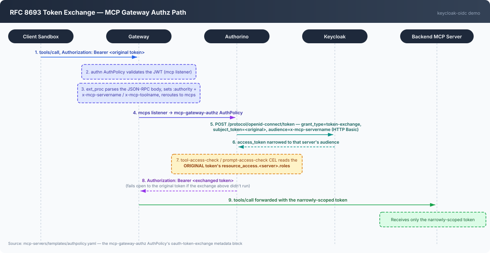

# RFC 8693 token exchange in the MCP Gateway's authz path

The MCP Gateway forwards every `tools/call` to its backend MCP server with a
Bearer token in the `Authorization` header. Without token exchange, that
token is whatever the client originally authenticated with — broad, and
potentially valid for far more than the one server actually being called.
Token exchange narrows it: Authorino swaps the caller's original token for
one scoped to just the target server's audience before forwarding the
request, so a compromised or logged backend never sees more than a
single-server credential.

This is implemented entirely inside the `mcp-gateway-authz` `AuthPolicy` in
[`../mcp-servers/templates/authpolicy.yaml`](../mcp-servers/templates/authpolicy.yaml),
under the `oauth-token-exchange` metadata block, gated by
`mcpGateway.auth.tokenExchange.enabled` in
[`../mcp-servers/values.yaml`](../mcp-servers/values.yaml).

## Flow

Step-by-step

1. The client sandbox sends a `tools/call` request to the gateway's public
   `mcp` listener with `Authorization: Bearer <original token>` — the same
   broad, Keycloak-issued access token used everywhere else in this demo.
2. The `mcp-gateway-authn` `AuthPolicy` validates the JWT's signature and
   issuer on the `mcp` listener.
3. The gateway's ext_proc (MCP router) parses the JSON-RPC body, identifies
   the target server by tool-name prefix, rewrites `:authority` to that
   server's internal hostname, and sets `x-mcp-servername`
   (`<registrationNamespace>/<serverName>`) and `x-mcp-toolname` headers.
   Both are only visible once routing lands on the `mcps` listener — before
   that, ext_proc hasn't parsed the body yet.
4. The re-routed request hits the `mcp-gateway-authz` `AuthPolicy` on the
   `mcps` listener.
5. The `oauth-token-exchange` metadata rule fires whenever `x-mcp-servername`
   is present: a POST to Keycloak's `/protocol/openid-connect/token`
   endpoint with `grant_type=urn:ietf:params:oauth:grant-type:token-exchange`,
   `subject_token=<original token>`, `subject_token_type=access_token`, and
   `audience=<x-mcp-servername value>`, authenticated with HTTP Basic using
   a shared secret referenced by `sharedSecretRef`.
6. Keycloak (with V2 Standard Token Exchange configured on the exchanging
   client) returns a new access token whose `aud`/`resource_access` are
   narrowed to just that target server's client.
7. **The `tool-access-check`/`prompt-access-check` CEL authorization rules
   evaluate against the ORIGINAL token's `resource_access.<servername>.roles`
   — not the exchanged one.** The exchange and the tool/prompt permission
   check are independent: exchanging a token doesn't grant or revoke any
   `tool:<name>` role: the original token's claims are still what decides
   allow/deny.
8. On success, the response rule forwards the **exchanged** (narrowly
   scoped) token as the `Authorization` header sent to the backend — but
   only if the exchange actually produced one. If it didn't run (no
   `x-mcp-servername` on the request) or failed (Keycloak unreachable, bad
   secret), the rule fails open to the original `Authorization` header
   unchanged. This is a deliberate availability-over-strictness choice for
   a defense-in-depth control — the real authz gate is step 7, evaluated
   against the original token either way, not this exchange.
9. The backend MCP server pod receives the request carrying only the
   narrowly-scoped token, even though the caller's own session token could
   reach many more servers.

## What this buys you

Without step 8, every backend MCP server pod would see the caller's full,
multi-server access token in its logs and in any downstream call it makes —
one compromised or misconfigured backend could replay that token against
every other server the caller happens to have roles for. With the exchange,
each backend only ever sees a token scoped to itself.

This is defense-in-depth, not the primary access-control boundary: the
primary boundary is step 7 (evaluated against the original token). A
backend that never makes further calls or logs its inbound token gains
nothing extra from the exchange; a backend that does (or that an attacker
could read logs from) is where this narrowing actually matters.

## Prerequisites on the Keycloak side

Not created by the `mcp-gateway`/`mcp-servers` charts — set up once per
realm:

- `standard.token.exchange.enabled = true` on the exchanging client's
  attributes (Keycloak V2 Standard Token Exchange, not V1 — V1 doesn't
  narrow `resource_access` without also disabling `fullScopeAllowed`
  per-target, which is fragile and unnecessary with V2).
- An audience mapper on the CLI client (`openshell-cli`) that includes the
  exchanging client, so it appears in the subject token's own `aud` (V2
  requires this).
- A Secret holding the exchanging client's Basic-auth credential
  (`base64(clientId:clientSecret)`, pre-encoded — Authorino sends the
  secret's value as-is with `Basic ` prepended, it does not encode it for
  you), in the namespace where Authorino itself runs (`kuadrant-system` on
  this repo's own clusters), matching
  `mcpGateway.auth.tokenExchange.credentialSecretName`/`credentialSecretKey`
  in `mcp-servers/values.yaml`. Putting the secret in
  `registrationNamespace` or `gatewayNamespace` instead produces a
  silent-looking failure only visible in Authorino's own pod logs
  (`Secret ... not found`).

See [`../mcp-gateway/README.md`](../mcp-gateway/README.md) for the rest of
the gateway's cluster-scoped resources, and the main
[README's "What the MCP Gateway does"](../README.md#what-the-mcp-gateway-does)
for how this fits into the broader request path.
