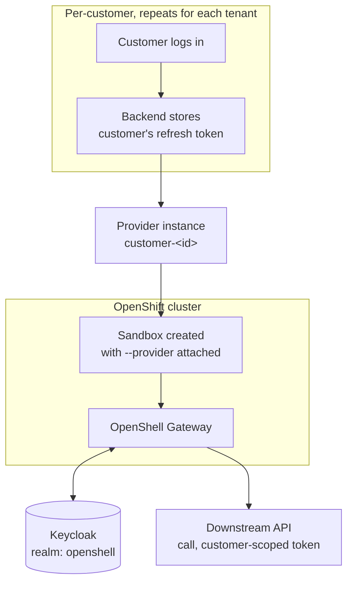

# 01 — SPIFFE token-grant demo with Keycloak, extended to per-customer credentials

Builds on a working [`base/`](../../base/README.md) install. Do not start here —
finish `base/`'s Definition of Done first.

## Purpose

Per-customer credential isolation on OpenShell using Keycloak as the OIDC
identity provider. Each customer's sandbox gets its own scoped credential
via Providers v2's `oauth2_refresh_token` refresh strategy — one provider
instance per customer, each storing that customer's own offline refresh
token. No SPIRE, no SPIFFE, no token exchange — just standard OIDC.

A future direction using SPIFFE JWT-SVID token exchange (matching NVIDIA's
upstream `spiffe-token-grant-demo`) is sketched in
[Experimental future work: Path B — SPIRE/SPIFFE token exchange](#experimental-future-work-path-b--spirespiffe-token-exchange)
at the end of this document. It has never been deployed or tested.

## Prerequisites beyond base

| Tool / access | Notes |
|---|---|
| A Keycloak instance (26+, or current) | Self-hosted via Helm, or existing |
| `jq`, `openssl` | Scripting, secret handling |

## What this demo adds on top of base

- `helm/values-overlay.yaml` — sets `server.oidc.*`, flips
  `server.auth.allowUnauthenticatedUsers` back to `false`. Applied with:
  ```bash
  helm upgrade --install openshell oci://ghcr.io/nvidia/openshell/helm-chart \
    --version "$OPENSHELL_CHART_VERSION" --namespace "$OPENSHELL_NAMESPACE" \
    -f base/helm/values-openshift.yaml \
    -f demos/spire-spiffe-keycloak/helm/values-overlay.yaml
  ```
- A Keycloak realm (`keycloak/realm-export.template.json`) with CLI and
  gateway clients, admin/user roles, and (demo-only) a few "customer" users
- Providers v2 enabled (`providers_v2_enabled=true`)
- A per-customer provider profile and onboarding script
- Two example MCP servers (`mcp-servers/` chart) fronted by an Envoy sidecar
  that gates access by Keycloak realm role, checked against the customer's
  existing OAuth access token, and the scripts to deploy and authorize
  customers against them (stretch,
  no SPIRE dependency — see [step 6](#6-stretch-mcp-servers-gated-by-keycloak-role))

## Architecture



## Steps

### 1. Keycloak

```bash
source .env   # KEYCLOAK_HOST, KEYCLOAK_REALM, KEYCLOAK_CLIENT_ID_CLI, ...
./scripts/01-deploy-keycloak.sh
```

Deploys/imports the realm, roles, and clients. Manually create 2-3 demo
"customer" users with `offline_access` in scope — this script doesn't
automate that part; see the script's own comments.

### 2. Apply the OIDC overlay and enable Providers v2

```bash
source ../../.env   # OPENSHELL_NAMESPACE, OPENSHELL_CHART_VERSION
./scripts/02-apply-oidc-overlay.sh
```

Re-run `openshell status` afterward — the CLI should now be doing a real OIDC
login against Keycloak instead of `base/`'s unauthenticated fallback.

### 3. Onboard a customer (Path A)

Customer onboarding is a **two-step process by design**. OpenShell's
Providers v2 is a pre-provisioning model: it manages the *lifecycle* of a
credential (refresh, rotate, inject into sandboxes) but deliberately leaves
the *initial acquisition* of that credential to whatever identity plumbing
your organization already has. The upstream docs jump straight to
`--material refresh_token=<value>` and assume you already have it — this
section explains how to get it.

#### Step 1 — Obtain the customer's refresh token (outside OpenShell)

This is the part OpenShell does not do for you. You need a long-lived
**offline refresh token** (not a short-lived access token) because the
gateway will use it to silently mint fresh access tokens on the customer's
behalf over time, without the customer being logged in.

The token comes from a standard OAuth 2.0 flow against Keycloak's
`openshell-cli` client with `offline_access` in scope. Two options:

**Option A — Automated (password grant, demo only)**

Only works because you control both sides and know the demo user's password.
Never viable in production — the operator must never know customer
credentials.

```bash
source .env

CUSTOMER_USER="customer2"
CUSTOMER_PASS="${CUSTOMER2_PASSWORD}"

REFRESH_TOKEN=$(curl -sk -X POST \
  "https://${KEYCLOAK_HOST}/realms/${KEYCLOAK_REALM}/protocol/openid-connect/token" \
  -d "grant_type=password" \
  -d "client_id=${KEYCLOAK_CLIENT_ID_CLI}" \
  -d "username=${CUSTOMER_USER}" \
  -d "password=${CUSTOMER_PASS}" \
  -d "scope=openid offline_access" \
  | jq -r '.refresh_token')
```

**Option B — Browser-based authorization code flow (closer to production)**

The customer authenticates on Keycloak's own login page; the operator never
sees their password. Start a one-shot listener to catch the callback, then
open the authorization URL in a browser:

```bash
source .env

# 1. Start a temporary listener (handles one request, then exits)
python3 -c '
import http.server, urllib.parse

class Handler(http.server.BaseHTTPRequestHandler):
    def do_GET(self):
        params = urllib.parse.parse_qs(urllib.parse.urlparse(self.path).query)
        code = params.get("code", ["(none)"])[0]
        print(f"\n=== Authorization code:\n{code}\n")
        self.send_response(200)
        self.send_header("Content-Type", "text/html")
        self.end_headers()
        self.wfile.write(f"""
<html><body style="font-family:sans-serif;text-align:center;margin-top:80px">
<h2>Authorization code received</h2>
<p style="word-break:break-all;max-width:600px;margin:auto;background:#f0f0f0;
padding:16px;border-radius:8px"><code>{code}</code></p>
<p>You can close this tab.</p>
</body></html>""".encode())

http.server.HTTPServer(("127.0.0.1", 9999), Handler).handle_request()
' &

# 2. Open this URL in a browser — log in as the customer
echo "https://${KEYCLOAK_HOST}/realms/${KEYCLOAK_REALM}/protocol/openid-connect/auth?client_id=${KEYCLOAK_CLIENT_ID_CLI}&response_type=code&scope=openid%20offline_access&redirect_uri=http://127.0.0.1:9999/callback"
```

After the customer logs in, the browser shows the code and the terminal
prints it. Exchange it for tokens (within ~60 seconds — codes expire fast):

```bash
AUTH_CODE="<paste-the-code-from-above>"

REFRESH_TOKEN=$(curl -sk -X POST \
  "https://${KEYCLOAK_HOST}/realms/${KEYCLOAK_REALM}/protocol/openid-connect/token" \
  -d "grant_type=authorization_code" \
  -d "client_id=${KEYCLOAK_CLIENT_ID_CLI}" \
  -d "code=${AUTH_CODE}" \
  -d "redirect_uri=http://127.0.0.1:9999/callback" \
  | jq -r '.refresh_token')
```

**In production** there is no manual copy-paste. Your product's web app (a
customer portal, onboarding page, etc.) has a "Connect your account" button
that redirects to the same Keycloak `/auth` URL. After login, Keycloak
redirects back to your backend, which extracts the code, exchanges it for
tokens, and stores the refresh token — all automatically. The customer sees
a success page; the operator sees a new customer appear in their dashboard.

**Option C — `onboard` utility (wraps both steps into one command)**

The `onboard` CLI tool in [`util/onboard/`](../../util/onboard/) automates
the full flow: opens the browser for the customer to log in, listens for the
callback, exchanges the code for a refresh token, and calls the OpenShell
CLI to create and configure the provider — all in one command:

```bash
source .env

# Build once (if not already built)
cd ../../util/onboard && cargo build --release && cd -

# Onboard customer2 — opens a browser, waits for login, creates the provider
../../util/onboard/target/release/onboard -c customer2
```

Or use the shell wrapper (sources `.env` automatically):

```bash
../../util/onboard/onboard.sh -c customer2
```

Useful flags:
- `--token-only` — stop after obtaining the refresh token, print it to
  stdout, do not call the OpenShell CLI (useful for debugging or piping
  into `03-onboard-customer.sh` manually)
- `--no-browser` — don't try to open a browser, just print the URL
  (for headless / SSH sessions)
- `--dry-run` — show the OpenShell CLI commands that would be run without
  executing them
- `--timeout <secs>` — how long to wait for the customer to log in
  (default 120s)

See `onboard --help` for all options. The tool reads `KEYCLOAK_HOST`,
`KEYCLOAK_REALM`, and `KEYCLOAK_CLIENT_ID_CLI` from the environment (or
from flags). No gateway client secret is needed — the refresh token is
bound to the public CLI client that issued it.

#### Step 2 — Store the refresh token in OpenShell (the part OpenShell owns)

If you used **Option A or B** above, you still need to store the token
manually:

```bash
./scripts/03-onboard-customer.sh cust-42 "$REFRESH_TOKEN"
```

If you used **Option C** (`onboard`), this step is already done — the tool
calls the OpenShell CLI for you.

From this point forward, the gateway's refresh worker automatically mints
short-lived access tokens and rotates the refresh token whenever the IdP
returns a new one. The customer just does `openshell sandbox connect` and
gets a sandbox with a live credential — they never see a token.

> **Before running this**, substitute the real Keycloak host into
> `providers/customer-refresh-profile.yaml`'s `token_url` (no script does
> this automatically — unlike `keycloak/realm-export.template.json`, this
> file isn't named `.template.` and isn't substituted at deploy time) and
> import/update it:
> ```bash
> sed "s|<keycloak-host>|${KEYCLOAK_HOST}|" providers/customer-refresh-profile.yaml \
>   > /tmp/customer-refresh-profile.resolved.yaml
> openshell provider profile import -f /tmp/customer-refresh-profile.resolved.yaml
> ```
> Per Providers v2, `token_url` is profile-owned and cannot be overridden by
> `--material` at configure time — confirmed against
> [Providers v2 docs](https://docs.nvidia.com/openshell/sandboxes/providers-v2),
> which is why it must live under `credentials[].refresh` in the profile, not
> as a top-level `refresh:` field or as instance material. If you create a
> provider from this profile *before* the profile has the correct schema, the
> provider snapshots the broken state — delete and recreate it after fixing
> the profile, a plain `profile update` isn't enough.

### 4. Run the demo

```bash
./scripts/demo.sh cust-42
```

Mirrors the blocked → policy applied → allowed pattern from `base/`'s
hello-world test, extended to confirm the allowed call is scoped to customer
42's own identity. Repeat with a second customer id while the first sandbox
is still running to confirm isolation.

### 5. (Stretch) MCP servers gated by Keycloak role

Two example downstream services (MCP servers) that each validate the
caller's Bearer token as a **Keycloak-issued OAuth access token** — the same
token Providers v2 already mints/refreshes per customer in step 3 — and are
only reachable by customers holding a specific Keycloak realm role. This is
**entirely this demo's own design**, not part of upstream OpenShell or any
MCP spec, but unlike an earlier draft of this section it deliberately does
**not** depend on SPIRE/SPIFFE: nothing in this repo has ever gotten SPIRE
running (see the Path B risk notes above), while OIDC/Keycloak is already
deployed and proven working end to end.

**This has been run end to end against real images**
(`quay.io/atarazana/eligibility-engine-mcp-rs`,
`quay.io/atarazana/compatibility-engine-mcp-rs`) with two different MCP
clients — **Claude Code** and **Codex** — both using DeepSeek as the LLM.
See [Verified test recipe: Claude Code](#verified-test-recipe-claude-code--deepseek--mcp-tool)
and [Alternative: Codex](#alternative-codex--deepseek--mcp-tool) below.
Three real problems were found and fixed along the way, in order:

1. **The server binary hardcodes `127.0.0.1:8001` unless told otherwise** —
   without any override it's unreachable from any other pod, full stop, no
   error on either side (the caller just gets `upstream_unreachable`).
   `BIND_ADDRESS` env var controls it.
2. **`MCP_DISABLE_HOST_CHECK=true` does *not* affect the bind address**
   (tested, no effect) — kept anyway since it looked like the intended
   escape hatch for something else (likely `Host:` header validation).
3. **The critical one: the server does not actually check the injected
   token at all.** Confirmed directly — a request with no `Authorization`
   header, a garbage token, *and* `customer2` reached the tool exactly like
   a legitimately role-holding customer would. `MCP_OIDC_ISSUER` /
   `MCP_OIDC_CLIENT_ID` / `MCP_REQUIRED_ROLE` are read into the image's
   environment (confirmed via `oc exec ... env`) but nothing in the binary
   appears to use them.

Problem 3 is the one that actually matters — it means the "gated by
Keycloak role" premise of this whole section was false as originally
shipped. The fix: an **Envoy sidecar** in front of the app container, doing
the actual enforcement, with the app itself reverted to loopback-only
(`127.0.0.1:8001`, no `BIND_ADDRESS` override — the one thing the image
*did* get right by default). Envoy's `jwt_authn` filter verifies the
token's signature against Keycloak's JWKS and `iss`; its `rbac` filter then
requires the decoded `realm_access.roles` claim to contain the
server-specific role. Only requests that pass both reach the app on
`127.0.0.1:8001`; the app-level `MCP_OIDC_*` env vars are left in place as
documentation of intent, not as something to rely on.

```bash
./scripts/06-deploy-mcp-servers.sh
```

This deploys `mcp-server-a` and `mcp-server-b` into `$OPENSHELL_NAMESPACE`
(same namespace as the gateway) as **two-container pods** (`envoy` +
the app), each with its own ServiceAccount, no SPIRE/CSI dependency. Envoy
listens on the port the Service targets (`8000`); the app is unreachable
except from Envoy in the same pod.

Each server has its own Keycloak realm role (`mcp-server-a-user`,
`mcp-server-b-user` — added to `keycloak/realm-export.template.json`).
Role gating is **defense in depth, verified at both layers**:

1. **Orchestration-time**, by `07-authorize-mcp-customer.sh`: before
   granting a customer's sandbox policy permission to reach the server, it
   checks (via the Keycloak admin API) that the customer actually holds the
   required realm role. This is *procedural* gating, the same way
   customer/provider assignment already works elsewhere in this demo (see
   [Secrets and security notes](#secrets-and-security-notes)) — OpenShell
   has no native concept of per-endpoint RBAC, so nothing stops you from
   running this script for an unauthorized customer by hand. **Verified**
   — ran it for real, granting `customer1` the `mcp-server-a-user` role via
   the admin API and confirming the script's role check passes/fails
   correctly.
2. **At the Envoy sidecar, on every request** — **verified against the
   live deployment**, all three cases: no `Authorization` header → `401`;
   a syntactically-valid but garbage token → `401`; a real, correctly
   signed Keycloak token for a user who does *not* hold
   `mcp-server-a-user` (tested with `demo-admin`'s own token, which only
   has `openshell-admin`/`openshell-user`) → `403`; a valid token that
   *does* hold the role → `200` and a working MCP session. This is the
   actual enforcement point now, not the app image.

```bash
# grant the role in Keycloak first (console or admin API), then:
export KEYCLOAK_ADMIN_TOKEN=...   # your own admin login, see script header
./scripts/07-authorize-mcp-customer.sh customer1 mcp-server-a
```

The script assumes a sandbox named `demo-customer1` already exists (i.e.
you've run `./demo.sh customer1` from step 4) and grants it a policy
endpoint for the MCP server — it does not create a sandbox itself.

#### Verified test recipe: Claude Code + DeepSeek + MCP tool

This is the actual sequence that produced a real, correct answer end to
end — Claude Code (pre-installed in the base sandbox image; OpenShell's own
docs confirm `openshell sandbox create -- claude` as a supported pattern),
running DeepSeek as its model, calling `mcp-server-a`'s one tool
(`evaluate_unpaid_leave_eligibility`).

Prerequisites beyond steps 1–3 and this section's deploy/authorize steps:

1. Import the `deepseek-claude` provider profile and create a provider from
   it. This profile injects `ANTHROPIC_API_KEY` with `x-api-key` auth — the
   native format Claude Code expects — instead of the `openai` profile's
   `OPENAI_API_KEY` with `Authorization: Bearer`. The DeepSeek API key is
   the same one used by `base/`'s `deepseek` provider, just injected under
   the right env var name:
   ```bash
   openshell provider profile import -f providers/deepseek-claude-profile.yaml
   openshell provider create --name deepseek-claude --type deepseek-claude \
     --credential "ANTHROPIC_API_KEY=<your-deepseek-key>" \
     --config "base_url=https://api.deepseek.com/anthropic" \
     --config "model=deepseek-v4-pro" \
     --config "opus_model=deepseek-v4-pro" \
     --config "sonnet_model=deepseek-v4-pro" \
     --config "haiku_model=deepseek-v4-flash"
   ```

2. Attach the provider and grant Claude Code network access to DeepSeek and
   the MCP server:
   ```bash
   openshell sandbox provider attach demo-customer1 deepseek-claude
   openshell policy update demo-customer1 \
     --add-endpoint "api.deepseek.com:443:read-write:rest:enforce" \
     --binary /usr/local/bin/claude \
     --add-endpoint "mcp-server-a.$OPENSHELL_NAMESPACE.svc.cluster.local:8000:read-write:rest:enforce" \
     --binary /usr/local/bin/claude \
     --wait
   ```

Then run the test. The `--env` flags set DeepSeek model routing (non-secret
config); the API key itself is injected by the provider — no manual
`export ANTHROPIC_AUTH_TOKEN=...` aliasing needed:

```bash
openshell sandbox exec -n demo-customer1 \
  --env "ANTHROPIC_BASE_URL=https://api.deepseek.com/anthropic" \
  --env "ANTHROPIC_MODEL=deepseek-v4-pro" \
  --env "ANTHROPIC_DEFAULT_OPUS_MODEL=deepseek-v4-pro" \
  --env "ANTHROPIC_DEFAULT_SONNET_MODEL=deepseek-v4-pro" \
  --env "ANTHROPIC_DEFAULT_HAIKU_MODEL=deepseek-v4-flash" \
  -- bash -c '
MCP_JSON="{\"mcpServers\":{\"eligibility\":{\"type\":\"http\",\"url\":\"http://mcp-server-a.'"$OPENSHELL_NAMESPACE"'.svc.cluster.local:8000/mcp\",\"headers\":{\"Authorization\":\"Bearer $CUSTOMER_ACCESS_TOKEN\"}}}}"
claude -p "My mother is at the hospital, can I get an aid while I am on unpaid leave?" \
  --mcp-config "$MCP_JSON" \
  --strict-mcp-config \
  --permission-mode bypassPermissions \
  --output-format text
'
```

> **Why `--env` instead of provider config vars?** Provider profiles support
> `config:` fields with `env_vars`, but OpenShell only injects *credentials*
> as environment variables — config values are stored metadata, not injected
> into sandbox processes. Model routing and base URL are non-secret config,
> so `--env` at exec time is the correct mechanism. With a real Anthropic API
> key (not DeepSeek), none of these `--env` flags are needed at all — Claude
> Code's built-in `claude-code` provider profile handles everything natively.

This produced a correct, well-formatted answer citing **Case A —
Sick/injured family care, 725€/month**, confirming the full chain:
Keycloak role → Providers v2 token injection (the customer's own token
via `customer-scoped-api` *and* the DeepSeek credential via
`deepseek-claude`) → Envoy JWT/role check → MCP tool call → LLM
reasoning.

**Repeated with `customer2` against `mcp-server-b`** (same recipe, only
`demo-customer2`/`customer-customer2`/`mcp-server-b` swapped in) to also
confirm cross-server isolation. `mcp-server-b` ("Compatibility Engine")
exposes five tools (`calc_tax`, `calc_penalty`, `check_housing_grant`,
`check_voting`, `distribute_waterfall`). Asking *"We have a client who is
15 days late on their contractual obligations. What penalty should we
charge them?"* correctly invoked `calc_penalty` and returned: 15 days ×
100/day = 1,500 base, capped at 1,000, + 5% interest = **1,050.00
total**. Cross-server isolation confirmed: **`customer1`'s token against
`mcp-server-b` is `403`, and `customer2`'s token against `mcp-server-a`
is `403`** — role gating is genuinely per-server, not just per-customer.

#### Alternative: Codex + DeepSeek + MCP tool

Same MCP servers, same per-customer credential isolation, but using
**OpenAI Codex CLI** instead of Claude Code. The key architectural
difference: Codex uses `inference.local` — OpenShell's **privacy router**
— which strips caller credentials at the proxy boundary and injects the
real API key server-side. Claude Code goes direct-to-endpoint; Codex goes
through the router. Both approaches are valid; this section shows the
second one.

> **Model limitation:** DeepSeek's Responses API (what `inference.local`
> routes through) currently serves only `deepseek-v4-flash`. For
> `deepseek-v4-pro`, use the Claude Code path above — DeepSeek's
> Anthropic-compatible endpoint auto-maps `claude-opus*` → v4-pro.

**Prerequisites:** steps 1–3 (Keycloak, OIDC overlay, customer onboarding)
and this section's deploy/authorize steps must already be done.

1. Import the `deepseek-codex` provider profile and create both providers.
   The two-provider pattern is needed because custom profiles cannot drive
   `inference.local` routing — only type `openai` providers can:

   ```bash
   # Provider 1 — drives inference.local routing
   openshell provider create --name deepseek-inference --type openai \
     --credential "OPENAI_API_KEY=<your-deepseek-key>" \
     --config "OPENAI_BASE_URL=https://api.deepseek.com/v1"

   # Provider 2 — carries network policy + binary permissions for Codex
   openshell provider profile import -f providers/deepseek-codex-profile.yaml
   openshell provider create --name deepseek-codex --type deepseek-codex \
     --credential "OPENAI_API_KEY=<your-deepseek-key>"
   ```

2. Configure `inference.local` routing:

   ```bash
   openshell inference set \
     --provider deepseek-inference \
     --model deepseek-chat \
     --timeout 120
   ```

3. Create and configure the sandbox. Attach **three** providers: the Codex
   policy provider, the customer's credential provider, and grant Codex
   network access to the MCP server:

   ```bash
   openshell sandbox create --name codex-customer1 \
     --provider deepseek-codex \
     --provider customer-customer1 \
     -- true

   openshell policy update codex-customer1 \
     --add-endpoint "mcp-server-a.$OPENSHELL_NAMESPACE.svc.cluster.local:8000:read-write:rest:enforce" \
     --binary /usr/bin/codex \
     --wait
   ```

4. Write the Codex config inside the sandbox so it uses `inference.local`:

   ```bash
   openshell sandbox exec -n codex-customer1 --no-tty -- bash -c '
   mkdir -p ~/.codex && cat > ~/.codex/config.toml << "TOML"
   model_provider = "openshell-deepseek"
   model = "deepseek-chat"

   [model_providers.openshell-deepseek]
   name = "OpenShell DeepSeek Router"
   base_url = "https://inference.local/v1"
   env_key = "OPENAI_API_KEY"
   wire_api = "responses"
   TOML
   '
   ```

5. Run the test — Codex supports MCP via Streamable HTTP, same transport
   the MCP servers use: [VERIFY]

   ```bash
   openshell sandbox exec -n codex-customer1 --no-tty -- bash -c '
   codex mcp add eligibility \
     --transport http \
     --url "http://mcp-server-a.'"$OPENSHELL_NAMESPACE"'.svc.cluster.local:8000/mcp" \
     --header "Authorization: Bearer $CUSTOMER_ACCESS_TOKEN"

   codex exec --skip-git-repo-check \
     "My mother is at the hospital, can I get an aid while I am on unpaid leave?"
   '
   ```

**Traffic flow:**

```
Codex (in sandbox)
  → inference.local/v1 (model calls)
    → OpenShell privacy router
      → strips credentials, injects real DeepSeek key
      → forwards to api.deepseek.com/v1
  → mcp-server-a:8000/mcp (tool calls)
    → Authorization: Bearer $CUSTOMER_ACCESS_TOKEN
      → supervisor resolves placeholder to real Keycloak token
      → Envoy checks JWT + realm role → app
```

> **Two-provider pattern explained:** `deepseek-inference` (type `openai`)
> exists solely to make `openshell inference set --provider` work — custom
> profile types can't drive routing. `deepseek-codex` (custom profile)
> exists solely to contribute network policy (allow `api.deepseek.com`,
> `inference.local`) and binary permissions (`/usr/bin/codex`) to the
> sandbox. Neither alone is sufficient; together they cover routing + policy.
> See the [kamaji reference](https://github.com/cvicens/kamaji/blob/main/docs/openshell.md)
> for the pattern's origin and a standalone Codex-only walkthrough.

## Configuration reference

| Variable | Where used | Notes |
|---|---|---|
| `KEYCLOAK_HOST` | Helm overlay, provider profiles | e.g. `keycloak.apps.<cluster-domain>` |
| `KEYCLOAK_REALM` | All Keycloak-facing config | `openshell` in this demo |
| `KEYCLOAK_CLIENT_ID_CLI` | `server.oidc.audience` | must match the Keycloak client ID exactly |
| `KEYCLOAK_CLIENT_ID_GATEWAY` | Experimental Path B only | confidential client; not used in this demo — see [Experimental future work](#experimental-future-work-path-b--spirespiffe-token-exchange) |
| `KEYCLOAK_CLIENT_SECRET` | Experimental Path B only | not needed in this demo |
| `SPIRE_TRUST_DOMAIN` | Experimental Path B only | e.g. `openshell.demo` |
| `MCP_SERVER_A_IMAGE` / `MCP_SERVER_A_TAG` etc. | documentation only | present in `.env.example` for reference, but `mcp-servers/values.yaml` pins the actual images used at deploy time — edit that file, not `.env`, to change them |
| `KEYCLOAK_ADMIN_TOKEN` | `07-authorize-mcp-customer.sh` | short-lived; obtain via your own admin login, never persist to `.env` long-term |

## Secrets and security notes

- Nothing under `keycloak/`, `providers/`, or `.env` should ever contain a real
  secret in git. `keycloak/realm-export.template.json` uses a placeholder that
  `scripts/01-deploy-keycloak.sh` substitutes at deploy time only.
- `openshell provider refresh configure` supports `--secret-material-key` to
  mark values as sensitive at the gateway — used for `refresh_token` in
  `scripts/03-onboard-customer.sh`. No `client_secret` is needed for Path A
  because the refresh token is bound to the public CLI client
  (`openshell-cli`), which has no secret.
- Each customer's provider uses a distinct name (`customer-<id>`). Providers
  v2 rejects two providers on one sandbox that expose the same credential
  environment key, which catches naming collisions — but not *misassignment*.
  OpenShell has no built-in concept of "this sandbox belongs to this
  customer"; getting the right provider attached to the right sandbox is
  entirely this demo's orchestration scripts' responsibility.
- `base/`'s gateway is plaintext HTTP by design (see its README). Once this
  demo's overlay is applied, real OIDC auth is enforced
  (`allowUnauthenticatedUsers: false`), but the transport is still plaintext
  — still evaluation-only, still never expose it to a public network.
- `KEYCLOAK_CLIENT_SECRET` in `.env` is only needed for the experimental
  Path B (see end of document). This demo uses the public CLI client for
  token refresh, so no gateway secret is involved.

## Definition of done

- [ ] Keycloak realm `openshell` live with CLI and gateway clients, admin/user roles
- [ ] OIDC overlay applied; `openshell status` shows the CLI authenticated against Keycloak
- [ ] RBAC mode confirmed: a user-role token cannot perform admin-only operations
- [ ] Providers v2 enabled
- [ ] At least two demo customers onboarded via Path A, each with their own provider
- [ ] Isolation test passes: customer A's sandbox cannot access customer B's data
      even when both sandboxes run concurrently
- [ ] `demo.sh` runs end to end and matches the expected blocked → allowed transition
- [x] (Stretch) `mcp-servers` chart deployed; a customer holding the required
      Keycloak role can reach their MCP server, a customer lacking it cannot
      — verified via the Envoy sidecar (401/403/200 cases all tested live)
- [x] (Stretch) A customer authorized for one MCP server's role does not
      thereby gain access to the other — verified both directions:
      `customer1` (`mcp-server-a-user` only) → `mcp-server-b` is `403`;
      `customer2` (`mcp-server-b-user` only) → `mcp-server-a` is `403`
- [ ] (Stretch) Codex variant: same MCP servers + customer isolation, but
      via Codex + `inference.local` privacy router instead of Claude Code
      + direct endpoint — [VERIFY] against a live cluster

## Open risks / things to verify

- **This README is a reconstruction, not a transcription** of NVIDIA's own
  `examples/spiffe-token-grant-demo`. Reconcile every command above against
  the real repo before running it.
- ~~Provider profile schema is unconfirmed~~ — **verified against
  [Providers v2 docs](https://docs.nvidia.com/openshell/sandboxes/providers-v2)
  and a live gateway (CLI 0.0.97).** `refresh` (with `token_url`, `scopes`,
  `strategy`) must nest under the specific entry in `credentials[]`, not as a
  top-level profile field — a top-level `refresh:` block is silently dropped
  on import with no error. `providers/customer-refresh-profile.yaml` reflects
  the correct nesting as of this writing.
- **`--from-oidc-token` binds to the CLI's own current session**, not an
  arbitrary token you hand it. `scripts/03-onboard-customer.sh` routes around
  this using the general `--credential`/refresh-material mechanism instead —
  confirm this still holds against the CLI version you're running.
- **Real customer identity federation** (brokering each customer's own IdP
  into Keycloak, rather than demo users in one realm) is a materially bigger
  project than this demo covers.
- **Resolved: the MCP server images themselves do not enforce the role
  check at all.** Originally flagged here as unverified; then actually
  tested — a request with no token, a garbage token, and a valid token for
  a user *without* the required role (`demo-admin`) all reached the tool
  exactly like an authorized customer would. Fixed with an Envoy sidecar
  that does real JWT signature/issuer verification plus a `realm_access.roles`
  check (see step 5) — confirmed against the live deployment: `401` for
  no/garbage token, `403` for a valid token lacking the role, `200` only for
  a valid, role-holding token. **Do not remove the Envoy sidecar** on the
  assumption the app image checks anything itself — it doesn't.
- **Still unverified**: (a) `07-authorize-mcp-customer.sh` assumes a
  sandbox named `demo-<customer-id>` already exists (from
  `./demo.sh <customer-id>`) — it does not create one; (b) there's no
  per-server token audience (Keycloak isn't configured with an audience
  mapper per MCP server), so the realm role claim is the *only* thing
  distinguishing access to server A from server B — a bug in the shared
  Envoy config template could leak access between servers, though each
  server's ConfigMap does encode its own distinct role; (c) the Envoy JWKS
  TLS connection to Keycloak uses `trust_chain_verification: ACCEPT_UNTRUSTED`
  (skips CA validation, same reasoning as this demo's `curl -k` everywhere)
  — fine for evaluation, never for production; (d) `envoyproxy/envoy:v1.31-latest`
  is a moving tag, not a pinned version — pin an exact patch release before
  relying on this beyond a demo.

## Experimental future work: Path B — SPIRE/SPIFFE token exchange

> **Nothing in this section has ever been deployed or tested.** All commands
> are **[VERIFY]**. The scripts (`04-deploy-spire.sh`,
> `05-register-spire-entries.sh`) and the provider profile
> (`providers/token-exchange-profile.yaml`) exist in the repo but are
> untested reconstructions from NVIDIA docs and GitHub design discussions.

### What Path B would do differently

Instead of storing a customer's refresh token and having the gateway refresh
it directly (what this demo does today), Path B uses SPIFFE workload
identity:

1. SPIRE issues JWT-SVIDs to both the sandbox supervisor and the gateway.
2. The sandbox presents its SVID to the gateway when requesting a provider
   token.
3. The gateway authenticates to Keycloak using its own SVID as a client
   assertion (RFC 7523) and asks for a token exchange (RFC 8693) — trading
   the stored customer token for a narrower-scoped, short-lived access
   token.

This removes the need for a long-lived refresh token per customer but
requires SPIRE infrastructure and Keycloak's newer SPIFFE federated client
authentication capability.

### Prerequisites (beyond the current demo)

- SPIRE server + agent deployed on the cluster — `helm repo add spiffe
  https://spiffe.github.io/helm-charts-hardened/`
- SPIFFE CSI driver for workload identity injection
- `server.providerTokenGrants.spiffe.enabled=true` in the Helm overlay
- Keycloak token-exchange feature enabled, with an exchange policy
  permitting the `openshell-gateway` client to exchange tokens
- Keycloak federated client authentication configured to trust the SPIRE
  trust domain's bundle endpoint
- `KEYCLOAK_CLIENT_ID_GATEWAY` and `KEYCLOAK_CLIENT_SECRET` set in `.env`
  (the confidential gateway client is used for the server-to-server
  exchange)
- `SPIRE_TRUST_DOMAIN` set in `.env` (e.g. `openshell.demo`)

### Steps (all [VERIFY])

```bash
./scripts/04-deploy-spire.sh
./scripts/05-register-spire-entries.sh
```

On the Keycloak side, Path B additionally requires:

- Keycloak's token-exchange feature enabled, with an exchange policy
  permitting the `openshell-gateway` client to exchange a stored customer
  token for a narrower-audience token.
- Federated client authentication configured so Keycloak trusts the
  gateway's own SPIFFE JWT-SVID as a client assertion — register your SPIRE
  trust domain's bundle endpoint with Keycloak and map the gateway's SPIFFE
  ID to its Keycloak client identity.

### Open risks specific to Path B

- **Provider profile schema is unconfirmed.** Providers v2 docs describe
  five refresh strategies (`static`, `external`, `oauth2_refresh_token`,
  `oauth2_client_credentials`, `google_service_account_jwt`) —
  `token_exchange` is not among them. The `token_grant.grant_type:
  token_exchange` field in `providers/token-exchange-profile.yaml` is
  inferred from a GitHub design discussion (issue #1987), not a confirmed
  schema. Run `openshell provider profile lint` against it before trusting
  it.
- **Keycloak's SPIFFE federated client authentication is a newer
  capability.** Confirm your Keycloak version actually has it before
  committing to Path B.
- **SPIRE agent SCC requirements on OpenShift are inferred, not
  confirmed** — `scripts/04-deploy-spire.sh` assumes a service account
  named `spire-agent`; verify against the actual chart before running.
- **Nothing in this repo has ever gotten SPIRE running on this cluster**
  (no `spire` namespace, no `csi.spiffe.io` CSI driver present when
  checked). If you get SPIRE actually running and want workload-identity-
  based validation for the MCP servers (step 5) instead of Keycloak JWTs,
  treat it as a rewrite, not a config flag — the two approaches differ in
  what the server trusts (a bearer token vs. a mTLS-attested workload
  identity), not just in which env vars get set.

### References (Path B specific)

- Dynamic token grant design discussion: https://github.com/NVIDIA/OpenShell/issues/1987
- Keycloak SPIFFE federated client auth: https://www.keycloak.org/2026/01/federated-client-authentication
- Keycloak SPIFFE playground demo: https://github.com/keycloak/keycloak-playground/tree/main/federated-client-authentication/spiffe
- SPIRE Kubernetes quickstart: https://spiffe.io/docs/latest/try/getting-started-k8s/

## References

- OpenShift install path: https://docs.nvidia.com/openshell/kubernetes/openshift
- Access Control / OIDC: https://docs.nvidia.com/openshell/kubernetes/access-control
- Providers v2: https://docs.nvidia.com/openshell/sandboxes/providers-v2
- Manage Providers: https://docs.nvidia.com/openshell/sandboxes/manage-providers
- Helm chart README: https://github.com/NVIDIA/OpenShell/blob/main/deploy/helm/openshell/README.md
- OpenShift SCC restriction discussion: https://github.com/NVIDIA/OpenShell/issues/899
