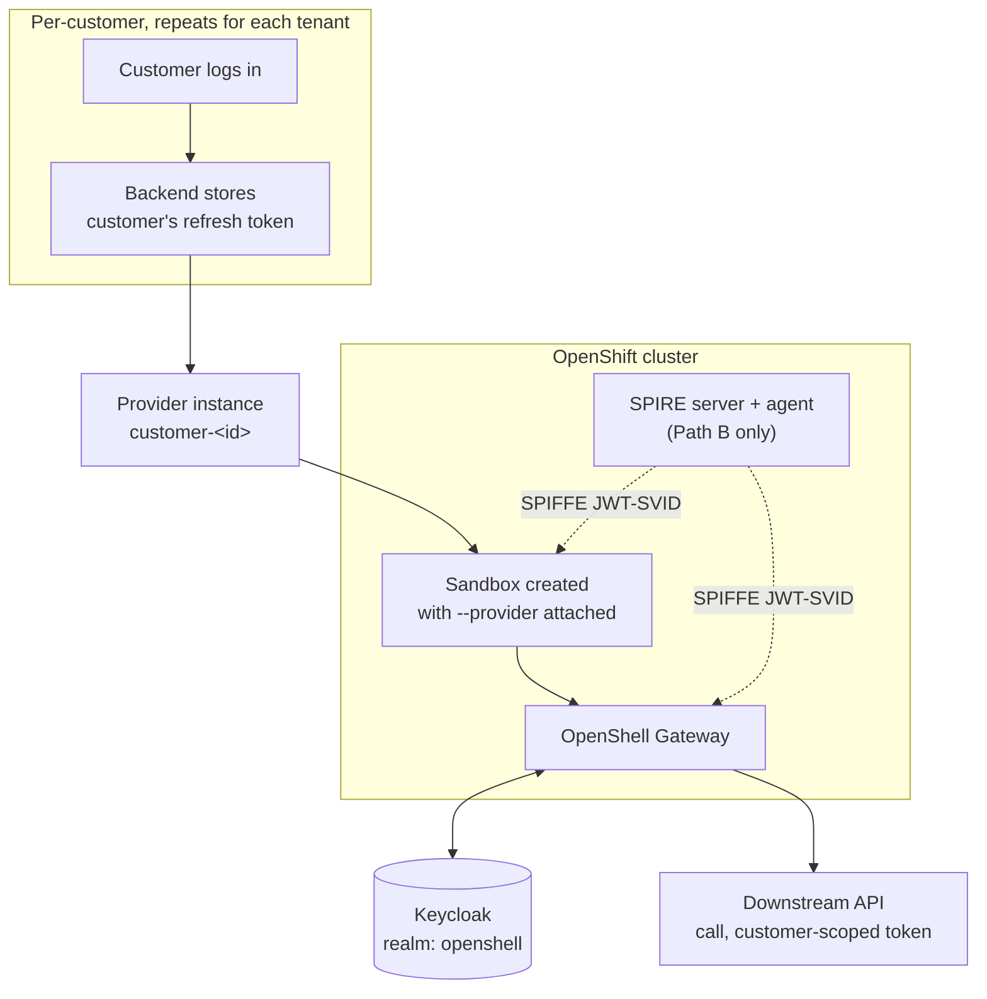
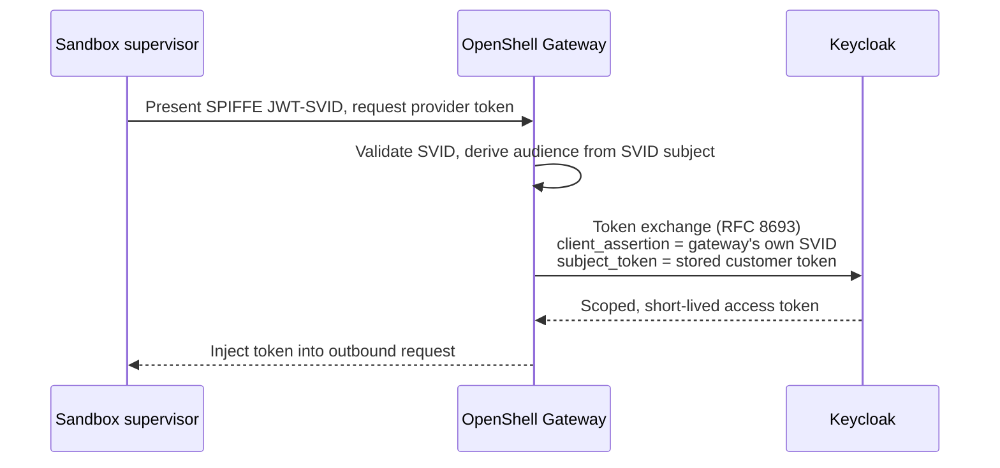

# 01 — SPIFFE token-grant demo with Keycloak, extended to per-customer credentials

Builds on a working [`base/`](../../base/README.md) install. Do not start here —
finish `base/`'s Definition of Done first.

## Purpose

Two things, layered:

- **Core demo (reproducing upstream):** OpenShell's SPIFFE-based dynamic token
  grant flow — a sandbox supervisor proves its identity with a SPIFFE JWT-SVID,
  and the gateway uses that plus a stored user OIDC token to perform an OAuth
  token exchange against Keycloak, minting a scoped credential for the
  sandbox's outbound call.
- **Extension (design work, not upstream):** the same idea made multi-tenant —
  each sandbox's outbound credential is scoped to whichever *end customer*
  that sandbox session belongs to, not one shared operator identity.

Two implementation paths for the extension, in order of maturity:

| Path | Mechanism | Maturity | Needs SPIRE? |
|---|---|---|---|
| **A — build first** | Providers v2 `oauth2_refresh_token` refresh strategy, one provider instance per customer, each storing that customer's own refresh token | Documented, stable | No |
| **B — matches upstream demo** | SPIFFE JWT-SVID token exchange (`token_grant.grant_type: token_exchange`), per-request re-exchange via the sandbox's workload identity | New — design issue is ~6 weeks old as of this writing | Yes |

Get Path A demonstrably working end to end before attempting Path B.

**Before writing or editing anything here, also read the upstream source
directly:** `git clone https://github.com/NVIDIA/OpenShell` and read
`examples/spiffe-token-grant-demo/README.md`. This demo folder was assembled
from NVIDIA's docs site and public GitHub issues, not from that README
directly — it wasn't fetchable during research. Reconcile step-by-step
details against the live repo; treat conflicts in favor of the upstream
source.

## Prerequisites beyond base

| Tool / access | Notes |
|---|---|
| A Keycloak instance (26+, or current) | Self-hosted via Helm, or existing. **[VERIFY]** minimum version for SPIFFE federated client auth if attempting Path B |
| SPIRE + SPIFFE CSI driver Helm charts | Path B only — `helm repo add spiffe https://spiffe.github.io/helm-charts-hardened/` |
| `jq`, `openssl` | Scripting, secret handling |

## What this demo adds on top of base

- `helm/values-overlay.yaml` — sets `server.oidc.*`, flips
  `server.auth.allowUnauthenticatedUsers` back to `false`, and (Path B only)
  sets `server.providerTokenGrants.spiffe.enabled=true`. Applied with:
  ```bash
  helm upgrade --install openshell oci://ghcr.io/nvidia/openshell/helm-chart \
    --version "$OPENSHELL_CHART_VERSION" --namespace "$OPENSHELL_NAMESPACE" \
    -f base/helm/values-openshift.yaml \
    -f demos/spire-spiffe-keycloak/helm/values-overlay.yaml
  ```
- A Keycloak realm (`keycloak/realm-export.template.json`) with CLI and
  gateway clients, admin/user roles, and (demo-only) a few "customer" users
- Providers v2 enabled (`providers_v2_enabled=true`)
- A per-customer provider profile and onboarding script (Path A)
- SPIRE, a token-exchange provider profile, and registration entries (Path B, stretch)

## Architecture



Token exchange sequence for one outbound call (Path B):



## Steps

### 1. Keycloak

```bash
source .env   # KEYCLOAK_HOST, KEYCLOAK_REALM, KEYCLOAK_CLIENT_SECRET, ...
./scripts/01-deploy-keycloak.sh
```

Deploys/imports the realm, roles, and clients. Manually create 2-3 demo
"customer" users with `offline_access` in scope — this script doesn't
automate that part; see the script's own comments.

### 2. Apply the OIDC overlay and enable Providers v2

```bash
source ../../.env   # OPENSHELL_NAMESPACE, OPENSHELL_CHART_VERSION
./scripts/02-apply-oidc-overlay.sh
```

Re-run `openshell status` afterward — the CLI should now be doing a real OIDC
login against Keycloak instead of `base/`'s unauthenticated fallback.

### 3. Onboard a customer (Path A)

```bash
./scripts/03-onboard-customer.sh cust-42 "<customer-42-refresh-token>"
```

How you obtain that refresh token is outside OpenShell — a standard
authorization-code login for that customer against the `openshell-gateway`
Keycloak client with `offline_access` in scope. Script your own login flow;
keep it in this script rather than the shared repo conventions.

### 4. Run the demo

```bash
./scripts/demo.sh cust-42
```

Mirrors the blocked → policy applied → allowed pattern from `base/`'s
hello-world test, extended to confirm the allowed call is scoped to customer
42's own identity. Repeat with a second customer id while the first sandbox
is still running to confirm isolation.

### 5. (Stretch) Path B — SPIRE and SPIFFE token exchange

Only attempt after step 4 works. Every command in these two scripts is
**[VERIFY]** — see [Open risks](#open-risks--things-to-verify).

```bash
./scripts/04-deploy-spire.sh
./scripts/05-register-spire-entries.sh
```

On the Keycloak side, Path B additionally requires:

- Keycloak's token-exchange feature enabled, with an exchange policy
  permitting the `openshell-gateway` client to exchange a stored customer
  token for a narrower-audience token.
- Federated client authentication configured so Keycloak trusts the
  gateway's own SPIFFE JWT-SVID as a client assertion — register your SPIRE
  trust domain's bundle endpoint with Keycloak and map the gateway's SPIFFE
  ID to its Keycloak client identity.

## Configuration reference

| Variable | Where used | Notes |
|---|---|---|
| `KEYCLOAK_HOST` | Helm overlay, provider profiles | e.g. `keycloak.apps.<cluster-domain>` |
| `KEYCLOAK_REALM` | All Keycloak-facing config | `openshell` in this demo |
| `KEYCLOAK_CLIENT_ID_CLI` | `server.oidc.audience` | must match the Keycloak client ID exactly |
| `KEYCLOAK_CLIENT_ID_GATEWAY` | Provider refresh material, Path B client auth | confidential client |
| `KEYCLOAK_CLIENT_SECRET` | Provider refresh material | never commit; inject via `.env` or a secret manager |
| `SPIRE_TRUST_DOMAIN` | SPIRE server/agent values, Path B | e.g. `openshell.demo` |

## Secrets and security notes

- Nothing under `keycloak/`, `providers/`, or `.env` should ever contain a real
  secret in git. `keycloak/realm-export.template.json` uses a placeholder that
  `scripts/01-deploy-keycloak.sh` substitutes at deploy time only.
- `openshell provider refresh configure` supports `--secret-material-key` to
  mark values as sensitive at the gateway — used for every `client_secret` and
  `refresh_token` in `scripts/03-onboard-customer.sh`.
- Each customer's provider uses a distinct name (`customer-<id>`). Providers
  v2 rejects two providers on one sandbox that expose the same credential
  environment key, which catches naming collisions — but not *misassignment*.
  OpenShell has no built-in concept of "this sandbox belongs to this
  customer"; getting the right provider attached to the right sandbox is
  entirely this demo's orchestration scripts' responsibility.
- `base/`'s gateway is plaintext HTTP by design (see its README). Once this
  demo's overlay is applied, real OIDC auth is enforced
  (`allowUnauthenticatedUsers: false`), but the transport is still plaintext
  — still evaluation-only, still never expose it to a public network.

## Definition of done

- [ ] Keycloak realm `openshell` live with CLI and gateway clients, admin/user roles
- [ ] OIDC overlay applied; `openshell status` shows the CLI authenticated against Keycloak
- [ ] RBAC mode confirmed: a user-role token cannot perform admin-only operations
- [ ] Providers v2 enabled
- [ ] At least two demo customers onboarded via Path A, each with their own provider
- [ ] Isolation test passes: customer A's sandbox cannot access customer B's data
      even when both sandboxes run concurrently
- [ ] `demo.sh` runs end to end and matches the expected blocked → allowed transition
- [ ] (Stretch) SPIRE deployed, gateway and a sandbox supervisor both obtain SVIDs
- [ ] (Stretch) Keycloak accepts the gateway's SVID as a client assertion for token exchange
- [ ] (Stretch) Path B reproduces the upstream demo's flow using a customer-scoped
      subject token instead of a single operator's token

## Open risks / things to verify

- **This README is a reconstruction, not a transcription** of NVIDIA's own
  `examples/spiffe-token-grant-demo`. Reconcile every command above against
  the real repo before running it.
- **Path B's provider profile schema is unconfirmed.** Providers v2 docs
  describe five refresh strategies (`static`, `external`,
  `oauth2_refresh_token`, `oauth2_client_credentials`,
  `google_service_account_jwt`) — `token_exchange` is not among them. The
  `token_grant.grant_type: token_exchange` field in
  `providers/token-exchange-profile.yaml` is inferred from a GitHub design
  discussion (issue #1987), not a confirmed schema. Run `openshell provider
  profile lint` against it before trusting it.
- **`--from-oidc-token` binds to the CLI's own current session**, not an
  arbitrary token you hand it. `scripts/03-onboard-customer.sh` routes around
  this using the general `--credential`/refresh-material mechanism instead —
  confirm this still holds against the CLI version you're running.
- **Keycloak's SPIFFE federated client authentication is a newer capability.**
  Confirm your Keycloak version actually has it before committing to Path B.
- **SPIRE agent SCC requirements on OpenShift are inferred, not confirmed** —
  `scripts/04-deploy-spire.sh` assumes a service account named `spire-agent`;
  verify against the actual chart before running.
- **Real customer identity federation** (brokering each customer's own IdP
  into Keycloak, rather than demo users in one realm) is a materially bigger
  project than this demo covers.

## References

- OpenShift install path: https://docs.nvidia.com/openshell/kubernetes/openshift
- Access Control / OIDC: https://docs.nvidia.com/openshell/kubernetes/access-control
- Providers v2: https://docs.nvidia.com/openshell/sandboxes/providers-v2
- Manage Providers: https://docs.nvidia.com/openshell/sandboxes/manage-providers
- Helm chart README: https://github.com/NVIDIA/OpenShell/blob/main/deploy/helm/openshell/README.md
- Dynamic token grant design discussion: https://github.com/NVIDIA/OpenShell/issues/1987
- OpenShift SCC restriction discussion: https://github.com/NVIDIA/OpenShell/issues/899
- Keycloak SPIFFE federated client auth: https://www.keycloak.org/2026/01/federated-client-authentication
- Keycloak SPIFFE playground demo: https://github.com/keycloak/keycloak-playground/tree/main/federated-client-authentication/spiffe
- SPIRE Kubernetes quickstart: https://spiffe.io/docs/latest/try/getting-started-k8s/
