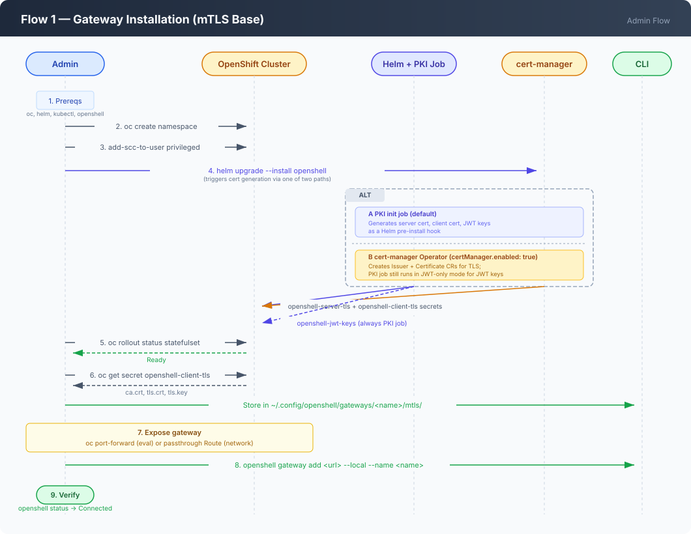
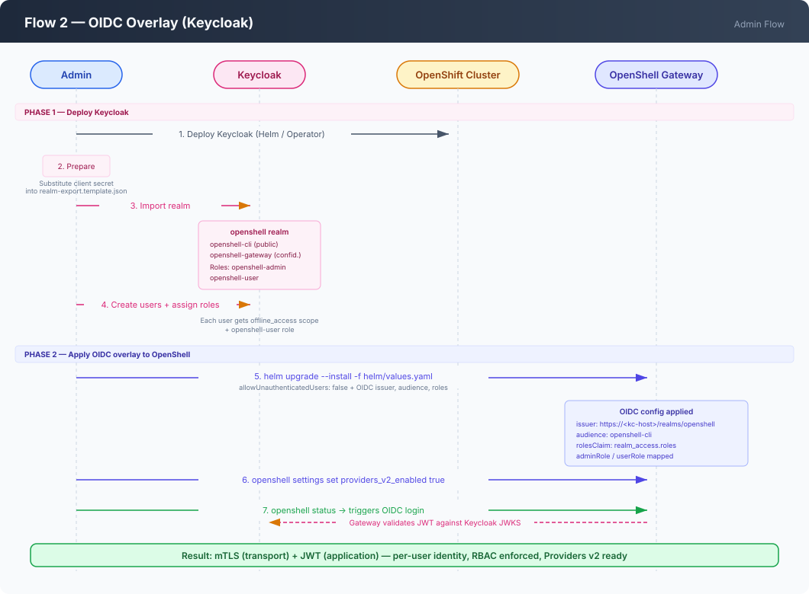
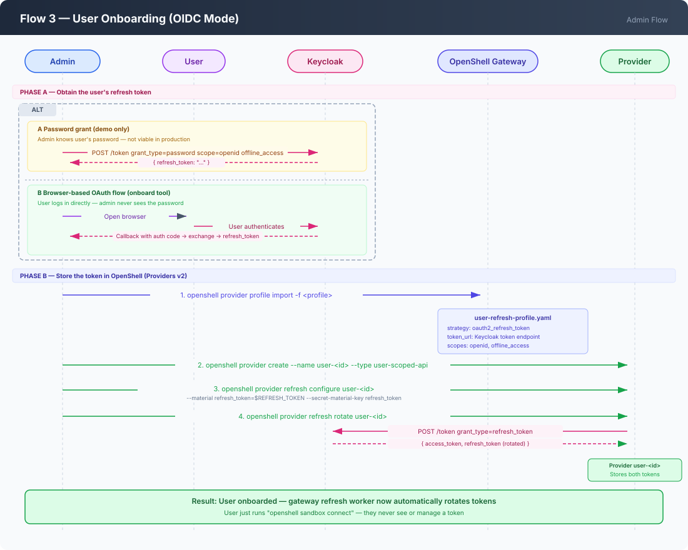
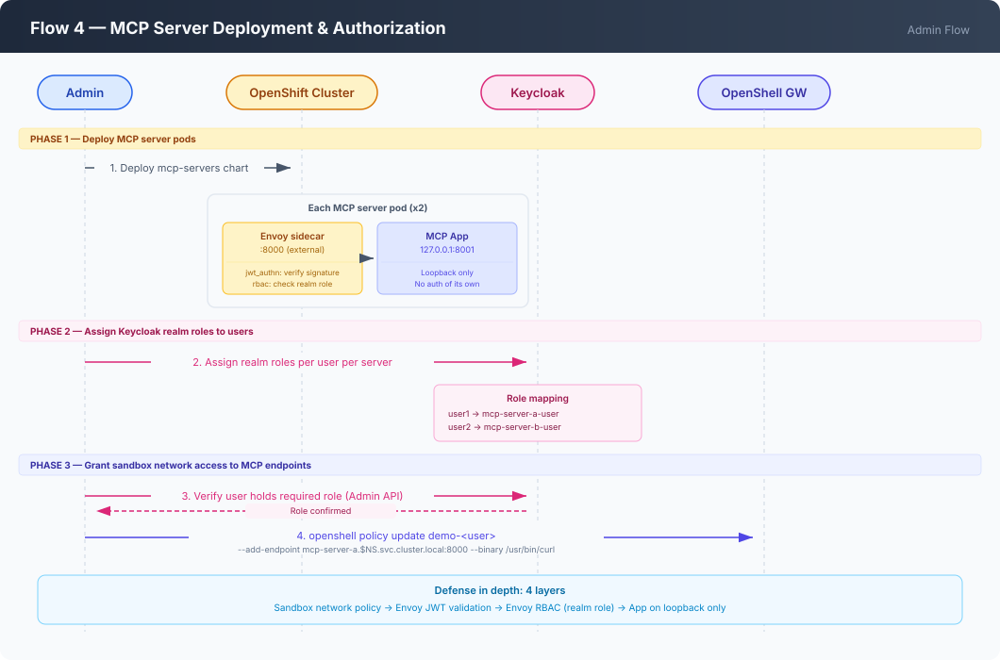
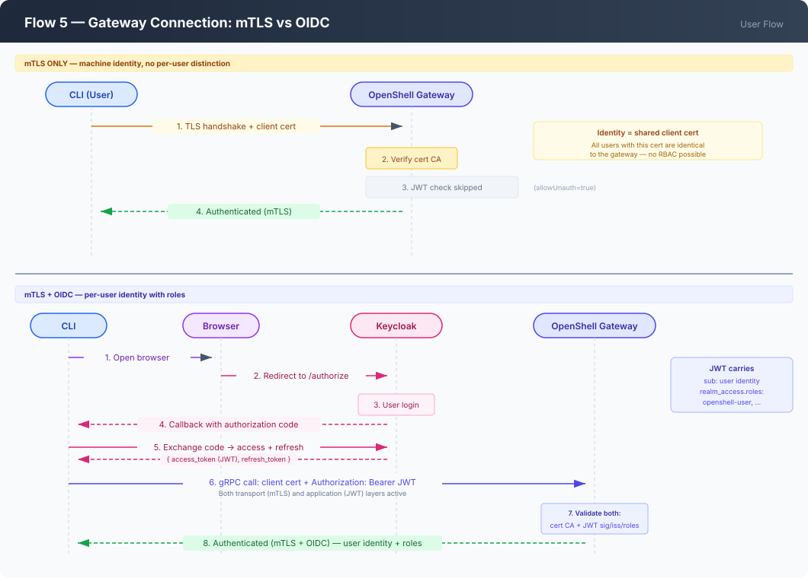
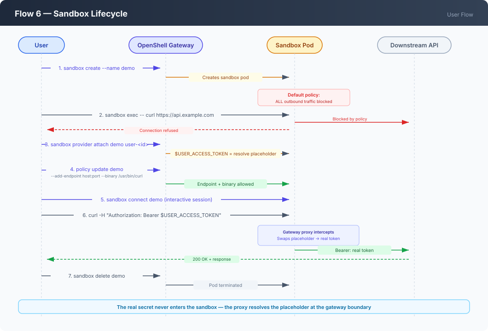
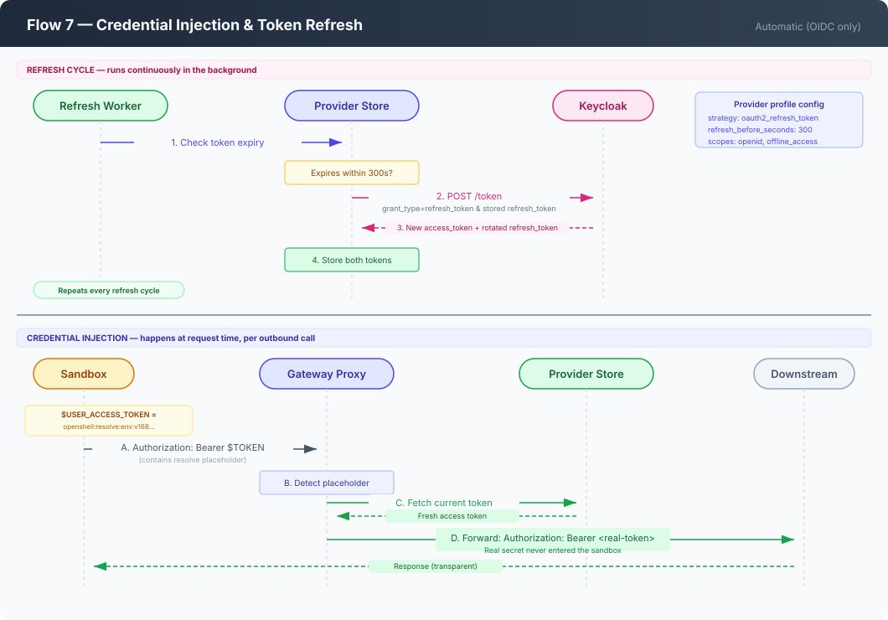
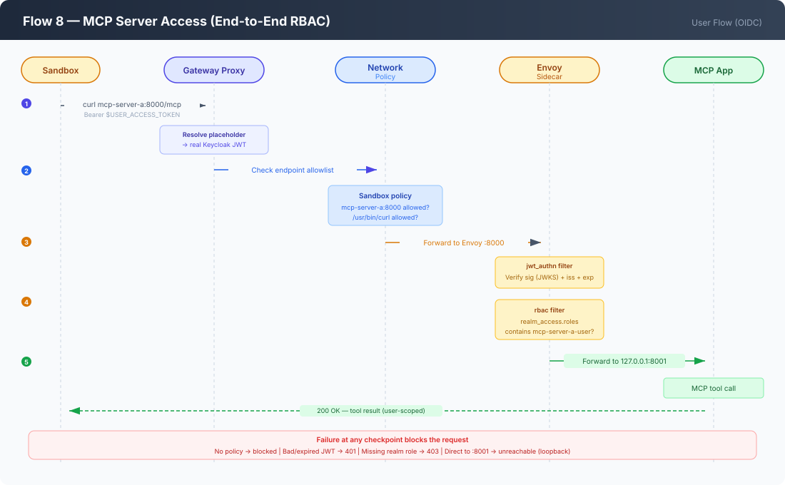

# OpenShell Operational Flows

This document describes the operational flows for deploying and using
OpenShell, organized by role (admin vs user) and authentication mode
(mTLS vs OIDC). Each flow has an accompanying SVG diagram.

---

## Admin Flows

### Flow 1 — Gateway Installation (mTLS base)

**Who:** Cluster admin  
**When:** First-time setup  
**Auth mode:** mTLS only (no OIDC)

The base install deploys the OpenShell gateway on OpenShift with mTLS as
the sole authentication mechanism. The PKI init job generates server
certificates, client certificates, and sandbox JWT signing keys
automatically.

**Steps:**

1. **Prerequisite check** — verify `oc`, `helm`, `kubectl`, `openshell` CLI
   are available and the operator is logged into the cluster. Confirm the
   Agent Sandbox controller and CRDs are installed.
2. **Create namespace** — `oc create namespace $OPENSHELL_NAMESPACE`.
3. **Grant SCC** — the `openshell-sandbox` service account needs the
   `privileged` SCC, otherwise sandbox pods won't start.
4. **Helm install** — `helm upgrade --install` with OpenShift-specific
   values (`fsGroup: null`, `runAsUser: null`). TLS certificates are
   generated by one of two mechanisms:
   - **PKI init job (default):** runs as a Helm pre-install hook and
     generates server certs, client certs, and JWT signing keys.
   - **cert-manager Operator:** when `certManager.enabled: true`, the
     chart creates `Issuer` and `Certificate` resources and cert-manager
     manages TLS. The PKI init job still runs in JWT-only mode for the
     Ed25519 sandbox signing keys.
5. **Wait for rollout** — `oc rollout status statefulset/openshell`.
6. **Extract mTLS client bundle** — copy `ca.crt`, `tls.crt`, `tls.key`
   from the `openshell-client-tls` Kubernetes secret to the local CLI config
   directory (`~/.config/openshell/gateways/<name>/mtls/`).
7. **Expose the gateway** — either `oc port-forward` (evaluation) or a
   passthrough Route (network-accessible). A passthrough Route is required
   because gRPC runs on HTTP/2, which standard edge/re-encrypt Routes break.
8. **Register the gateway** — `openshell gateway add <url> --local --name <name>`.
9. **Verify** — `openshell status` shows `Connected` and
   `Authenticated (mTLS transport)`.

**Certificate generation — two options:**

| Aspect | PKI init job (default) | cert-manager Operator |
|---|---|---|
| Server/client certs | Generated by the init job at install time | Managed by cert-manager `Certificate` resources |
| Certificate renewal | Manual — delete secrets, re-run `helm upgrade` | Automatic — cert-manager renews before expiry |
| JWT signing keys | Generated by the init job | Still generated by the init job (JWT-only mode) |
| External dependency | None | OpenShift cert-manager Operator |

When `certManager.enabled: true` is set in Helm values, the chart creates
namespaced `Issuer` and `Certificate` resources. The PKI init job still
runs but only generates the Ed25519 JWT signing keys — cert-manager
handles all TLS material. The rest of the flow (mTLS extraction, gateway
registration) is identical regardless of which option generates the certs.

**Key difference from OIDC:** No identity provider, no JWT layer, no per-user
tokens. All clients sharing the same mTLS client certificate are
indistinguishable to the gateway. Fine for single-operator evaluation, not
for multi-user production.

---

### Flow 2 — OIDC Overlay (Keycloak)

**Who:** Cluster admin  
**When:** After base install, when multi-user identity is needed  
**Auth mode:** mTLS transport + OIDC application layer

This flow layers Keycloak-based OIDC authentication on top of the mTLS
base. After applying it, every request must present both a valid client
certificate (transport) and a valid JWT (application).

**Steps:**

1. **Deploy Keycloak** — install Keycloak on the cluster (or use an
   existing instance). Prepare the realm JSON by substituting the gateway
   client secret into the template.
2. **Import the realm** — create the `openshell` realm in Keycloak with:
   - A **public** client (`openshell-cli`) for CLI/browser login flows.
   - A **confidential** client (`openshell-gateway`) for gateway-to-Keycloak
     communication.
   - Realm roles: `openshell-admin`, `openshell-user`, plus any
     service-specific roles (e.g., `mcp-server-a-user`).
3. **Create demo users** — in the Keycloak admin console, create users
   with `offline_access` in scope and assign the `openshell-user` role.
4. **Helm upgrade with OIDC values** — apply `helm/values.yaml` which sets:
   - `allowUnauthenticatedUsers: false`
   - `server.oidc.issuer` → Keycloak realm issuer URL
   - `server.oidc.audience` → `openshell-cli`
   - `server.oidc.rolesClaim` → `realm_access.roles`
   - `server.oidc.adminRole` / `userRole` → Keycloak role names
5. **Enable Providers v2** — `openshell settings set --global --key providers_v2_enabled --value true`.
6. **Verify** — `openshell status` now triggers a real OIDC login against
   Keycloak.

**What changed vs mTLS-only:**

| Aspect | mTLS only | mTLS + OIDC |
|---|---|---|
| Transport auth | Client certificate | Client certificate (unchanged) |
| Application auth | Skipped (`allowUnauthenticatedUsers: true`) | JWT required (`allowUnauthenticatedUsers: false`) |
| Identity | Anonymous — all clients share one cert | Per-user — JWT carries user identity and roles |
| RBAC | None — any authenticated client is admin | Role-based — `openshell-admin` vs `openshell-user` |
| Provider support | Static credentials only | Per-user credential isolation via Providers v2 |

---

### Flow 3 — User Onboarding (OIDC mode)

**Who:** Admin (or automated onboarding tool)  
**When:** Each time a new user needs access  
**Auth mode:** OIDC

User onboarding is a two-phase process: first **acquire** a long-lived
offline refresh token from Keycloak, then **store** it in OpenShell's
Providers v2 system so the gateway can silently mint fresh access tokens on
the user's behalf.

#### Phase A — Obtain the refresh token

Two options:

**Option A — Password grant (demo only).** The admin knows the user's
password and calls Keycloak's token endpoint directly with
`grant_type=password`, `scope=openid offline_access`. Returns a refresh
token. Not viable in production — the operator must never know user
credentials.

**Option B — Browser-based OAuth flow.** The `onboard` CLI tool opens
a browser, the user logs into Keycloak directly, the tool captures the
authorization code callback, exchanges it for a refresh token, and
proceeds to Phase B automatically. The operator never sees the user's
password.

#### Phase B — Store the token in OpenShell

1. **Import the provider profile** — the profile
   (`user-refresh-profile.yaml`) defines the credential refresh strategy:
   - Strategy: `oauth2_refresh_token`
   - Token URL: Keycloak's token endpoint
   - Scopes: `openid`, `offline_access`
   - Refresh-before-expiry: 300 seconds
2. **Create a provider instance** — `openshell provider create --name user-<id>
   --type user-scoped-api` with a placeholder credential.
3. **Configure refresh** — `openshell provider refresh configure` stores
   the refresh token (marked as secret material) and links it to the
   profile's refresh strategy.
4. **Initial rotation** — `openshell provider refresh rotate` triggers the
   first token exchange to verify the full chain works.

From this point, the gateway's refresh worker handles all token lifecycle
automatically.

---

### Flow 4 — MCP Server Deployment & Authorization

**Who:** Cluster admin  
**When:** After OIDC overlay is applied and users are onboarded  
**Auth mode:** OIDC (tokens validated by Envoy sidecar)

MCP (Model Context Protocol) servers are downstream services that the
sandbox calls on behalf of the user. Each MCP server is fronted by an
Envoy sidecar that enforces Keycloak role-based access control.

**Steps:**

1. **Deploy MCP server pods** — each pod is a two-container setup:
   - **Envoy sidecar** (port 8000) — validates the caller's JWT signature
     against Keycloak's JWKS, checks `iss`, and requires the
     `realm_access.roles` claim to contain the server-specific role.
   - **App container** (127.0.0.1:8001) — listens on loopback only,
     unreachable except from Envoy in the same pod.
2. **Assign Keycloak realm roles** — in the Keycloak admin console, grant
   each user the role for the server(s) they should access (e.g.,
   `mcp-server-a-user` for user1).
3. **Authorize via sandbox policy** — `openshell policy update` grants the
   sandbox network access to the MCP server's in-cluster endpoint. The
   `07-authorize-mcp-user.sh` script verifies the role exists in Keycloak
   before granting the policy.

**Access control layers (defense in depth):**

| Layer | Mechanism | Blocks |
|---|---|---|
| Sandbox network policy | OpenShell policy (endpoint allowlist) | Any outbound traffic not explicitly allowed |
| Envoy JWT validation | `jwt_authn` filter (signature + issuer) | Requests with no token, expired tokens, or tokens from wrong issuer |
| Envoy RBAC | `rbac` filter (realm role check) | Valid tokens lacking the required server-specific role |
| App loopback binding | App listens on 127.0.0.1 only | Direct access bypassing Envoy |

---

## User Flows

### Flow 5 — Gateway Connection: mTLS vs OIDC

**Who:** End user  
**When:** Every time the user connects to the gateway

The connection flow differs significantly depending on the authentication
mode configured by the admin.

#### mTLS Connection

1. The user must have the client mTLS bundle (ca.crt, tls.crt, tls.key)
   extracted from the Kubernetes secret and placed in the local CLI config
   directory.
2. `openshell gateway add <url> --local --name <name>` registers the
   gateway.
3. Every CLI command presents the client certificate during the TLS
   handshake. The gateway verifies it against its CA.
4. No additional authentication — `allowUnauthenticatedUsers: true` means
   the JWT layer is skipped.
5. All clients sharing the same cert are indistinguishable.

#### OIDC Connection

1. The user runs `openshell gateway login` (or any command that requires
   auth triggers it automatically).
2. The CLI opens a browser to Keycloak's authorization endpoint.
3. The user authenticates with Keycloak (username/password, SSO, etc.).
4. Keycloak redirects back with an authorization code.
5. The CLI exchanges the code for an access token + refresh token.
6. The access token (JWT) is sent as a gRPC `authorization` header on
   every subsequent request — alongside the mTLS client certificate.
7. The gateway validates both: the client cert at the transport layer,
   the JWT at the application layer.
8. The JWT carries the user's identity and roles — the gateway enforces
   RBAC based on `realm_access.roles`.

**Key difference:** mTLS identifies the *machine* (or whoever has the
cert). OIDC identifies the *user* (with roles and scopes). Multi-user
setups require OIDC.

---

### Flow 6 — Sandbox Lifecycle

**Who:** End user (with `openshell-user` role in OIDC mode)  
**When:** Every workload execution

A sandbox is an isolated execution environment. Its lifecycle follows a
strict progression from creation through policy configuration to use.

**Steps:**

1. **Create** — `openshell sandbox create --name <name> -- <command>`.
   The sandbox starts with a default policy that blocks all outbound
   network traffic.
2. **Attach provider** (OIDC mode) — `openshell sandbox provider attach
   <sandbox> <provider>`. This links the user's credential provider to the
   sandbox. The provider's credential (e.g., `USER_ACCESS_TOKEN`) becomes
   available inside the sandbox as an environment variable — but its value
   is a *resolve placeholder*, not the real token.
3. **Update policy** — `openshell policy update <sandbox>
   --add-endpoint <host:port:access:proto:enforce>
   --binary <path>`. Policies are per-sandbox and per-binary.
   Both the endpoint and the binary must be specified — adding an
   endpoint alone is not enough.
4. **Connect** — `openshell sandbox connect <name>`. Opens an interactive
   session inside the sandbox.
5. **Use** — application code uses environment variables normally
   (e.g., `Authorization: Bearer $USER_ACCESS_TOKEN`). The gateway's
   proxy intercepts the resolve placeholder in outbound requests and
   swaps in the real credential before forwarding.
6. **Delete** — `openshell sandbox delete <name>`.

---

### Flow 7 — Credential Injection & Token Refresh

**Who:** Automatic (gateway refresh worker)  
**When:** Continuously, while the provider is active  
**Auth mode:** OIDC only (mTLS has no per-user tokens)

This is the core mechanism that makes per-user credential isolation work
without requiring the user to manage tokens manually.

**The refresh cycle:**

1. The provider profile defines the refresh strategy
   (`oauth2_refresh_token`), the Keycloak token endpoint URL, the scopes,
   and a refresh-before-expiry threshold (300 seconds by default).
2. The gateway's refresh worker monitors all active providers.
3. When an access token is within 300 seconds of expiry, the worker calls
   Keycloak's token endpoint with `grant_type=refresh_token` and the
   stored refresh token.
4. Keycloak returns a new access token (and optionally a new refresh
   token — Keycloak rotates refresh tokens by default since Keycloak 25+).
5. The gateway stores the new access token and, if a new refresh token
   was returned, stores that too.
6. The next time the sandbox makes an outbound request with the resolve
   placeholder, the gateway injects the fresh access token.

**Credential injection (request-time):**

1. Inside the sandbox, `$USER_ACCESS_TOKEN` contains
   `openshell:resolve:env:v168...` — a resolve placeholder.
2. Application code puts this in the `Authorization: Bearer` header as
   normal.
3. The gateway proxy intercepts the outbound request, recognizes the
   placeholder, and swaps it for the real (freshly-rotated) access
   token.
4. The real token is forwarded to the downstream service. The actual
   secret never enters the sandbox.

**mTLS mode comparison:** In mTLS-only mode, providers can still inject
static credentials (e.g., an API key), but there is no token refresh
cycle — the credential is stored once and used as-is until manually
rotated.

---

### Flow 8 — MCP Server Access (end-to-end RBAC)

**Who:** End user from inside a sandbox  
**When:** Making tool calls to MCP servers  
**Auth mode:** OIDC

This flow shows the complete request path from a user's sandbox to an
MCP server, with every authentication and authorization checkpoint.

**Request path:**

1. **Sandbox** — the user (or an AI agent like Claude Code) calls the
   MCP server URL with `Authorization: Bearer $USER_ACCESS_TOKEN`.
2. **Gateway proxy** — intercepts the request, recognizes the resolve
   placeholder in the Bearer header, swaps it for the real Keycloak
   access token.
3. **Sandbox network policy** — the gateway checks the destination
   against the sandbox's endpoint allowlist. If the endpoint was not
   explicitly added via `openshell policy update`, the request is
   blocked.
4. **Envoy sidecar (JWT validation)** — the `jwt_authn` filter verifies:
   - Token signature against Keycloak's JWKS endpoint
   - `iss` claim matches the expected issuer
   - Token is not expired
5. **Envoy sidecar (RBAC)** — the `rbac` filter checks the decoded
   `realm_access.roles` claim for the server-specific role
   (e.g., `mcp-server-a-user`). Returns 403 if the role is missing.
6. **App container** — the request reaches the MCP server application on
   `127.0.0.1:8001`. The app processes the MCP tool call and returns
   the result.

**Isolation guarantee:** User A's sandbox carries user A's token. Even
if user A knows user B's MCP server URL, the request will be rejected at
step 5 because user A's token lacks user B's server role.

---

## Authentication Mode Comparison

| Aspect | mTLS Only | mTLS + OIDC (Keycloak) |
|---|---|---|
| **Transport security** | TLS with mutual authentication | TLS with mutual authentication |
| **Application auth** | None (skipped) | JWT in gRPC authorization header |
| **Identity model** | Machine identity (shared cert) | User identity (per-user JWT) |
| **RBAC** | No roles — all authenticated clients equal | Keycloak realm roles (admin/user/service) |
| **Credential isolation** | Static only (API keys) | Per-user refresh tokens, auto-rotated |
| **Token refresh** | N/A — no tokens | Gateway refresh worker calls Keycloak |
| **Multi-user** | Not supported (all clients identical) | Full isolation per user |
| **Sandbox credentials** | Provider injects static value | Provider injects resolve placeholder → gateway resolves to fresh token |
| **MCP server RBAC** | Not available (no JWT to validate) | Envoy validates JWT + realm role |
| **Onboarding** | Share client cert files | Obtain refresh token per user (password grant or OAuth flow) |
| **Operational complexity** | Low — just certs | Higher — Keycloak + providers + token lifecycle |
| **Use case** | Single-operator evaluation | Multi-user production |
